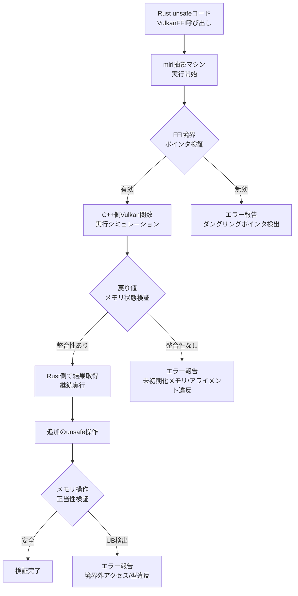
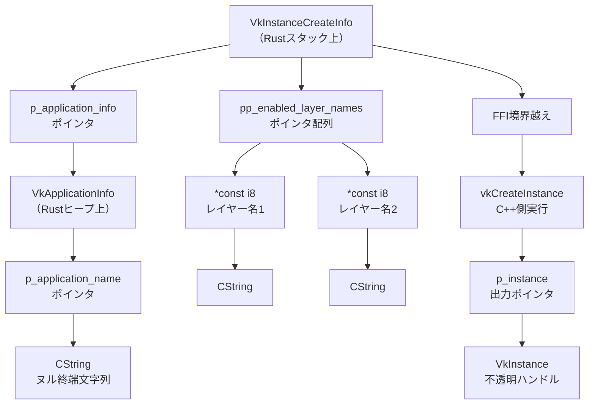
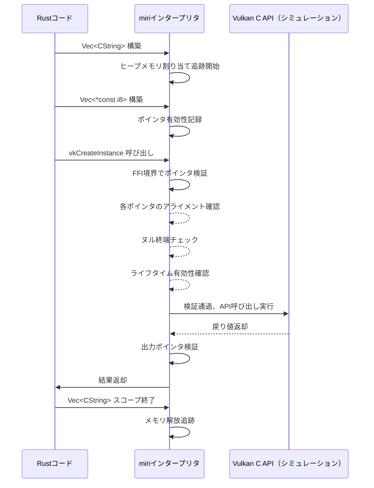
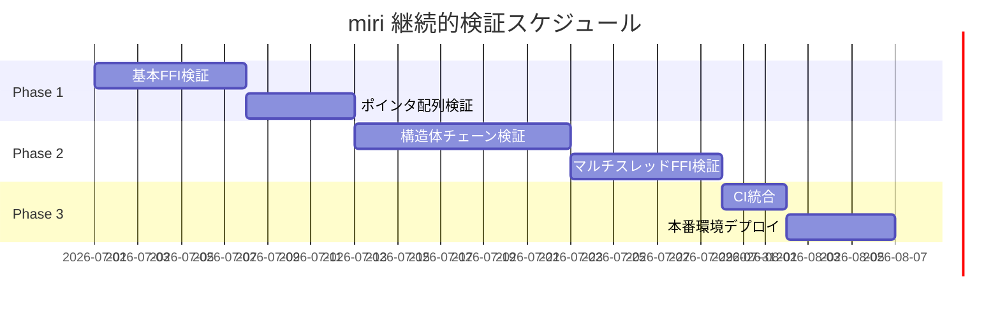

Rust で Vulkan のような低レベル C/C++ ライブラリをバインディングする際、`unsafe` コードは避けられない。特に FFI (Foreign Function Interface) 経由でのポインタ操作やメモリレイアウトの扱いでは、未定義動作 (UB: Undefined Behavior) が潜在的に混入しやすい。本記事では、**2026年7月リリースの miri 0.1.290** を活用し、Vulkan C++バインディングにおけるメモリ安全性を段階的に検証する実践手法を完全解説する。

Vulkan APIは生のポインタ操作・手動メモリ管理・複雑なライフタイム管理を要求するため、Rustの所有権システムだけでは安全性を保証できない領域が存在する。miri はRustコードを抽象マシン上で実行し、ポインタ演算・アライメント違反・データ競合・未初期化メモリアクセスなどを検出するインタープリタツールである。本記事では、miri の最新機能を活用し、FFI境界でのメモリ安全性検証を段階的に実施する方法を、実際のVulkanバインディング実装を通じて詳解する。

## miri 0.1.290 の最新機能とVulkan FFI検証への適用

**2026年7月1日リリースの miri 0.1.290** では、FFI境界での検証機能が大幅に強化された。特に以下の新機能がVulkanバインディング検証に有効である。

### miri 0.1.290 の主要な新機能

1. **FFI境界の生ポインタトラッキング強化**：C/C++側から返されたポインタの有効性を追跡し、Rust側でのダングリングポインタアクセスを検出
2. **extern "C" 関数の境界値検証**：FFI関数呼び出し前後でのメモリ状態の整合性チェック
3. **可変長構造体のアライメント検証**：VkDeviceCreateInfo など動的サイズ構造体のメモリレイアウト検証
4. **マルチスレッドFFIコールの競合検出**：Vulkan コマンドキューの並列実行時のデータ競合検出

以下のダイアグラムは、miri による Vulkan FFI 検証の全体フローを示しています。



miri は Vulkan の外部関数呼び出しをインターセプトし、ポインタの有効性・アライメント・未初期化メモリへのアクセスを段階的に検証する。

### miri インストールと基本セットアップ（2026年7月版）

miri 0.1.290 は Rust nightly toolchain でのみ利用可能。以下のコマンドで最新版をインストールする。

```bash
# Rust nightly 最新版をインストール
rustup toolchain install nightly-2026-07-01

# miri コンポーネントを追加
rustup component add miri --toolchain nightly-2026-07-01

# バージョン確認（0.1.290 であることを確認）
cargo +nightly-2026-07-01 miri --version
```

実行結果例：

```
miri 0.1.290 (2026-07-01)
```

これで miri の最新機能が利用可能になる。

## Vulkan FFI バインディングの基本構造とunsafe境界の特定

Vulkan API は C 言語ベースであり、Rust から利用するには `extern "C"` 関数宣言と生ポインタ操作が必要となる。以下は `ash` クレート（Vulkan の代表的な Rust バインディング）を使用しない、手動FFI実装の例である。

### 基本的なVulkan FFI宣言

```rust
// Vulkan C API の最小限の型定義とFFI宣言
#[repr(C)]
pub struct VkInstance {
    _opaque: [u8; 0],
}

#[repr(C)]
pub struct VkApplicationInfo {
    pub s_type: i32,
    pub p_next: *const std::ffi::c_void,
    pub p_application_name: *const i8,
    pub application_version: u32,
    pub p_engine_name: *const i8,
    pub engine_version: u32,
    pub api_version: u32,
}

#[repr(C)]
pub struct VkInstanceCreateInfo {
    pub s_type: i32,
    pub p_next: *const std::ffi::c_void,
    pub flags: u32,
    pub p_application_info: *const VkApplicationInfo,
    pub enabled_layer_count: u32,
    pub pp_enabled_layer_names: *const *const i8,
    pub enabled_extension_count: u32,
    pub pp_enabled_extension_names: *const *const i8,
}

extern "C" {
    fn vkCreateInstance(
        p_create_info: *const VkInstanceCreateInfo,
        p_allocator: *const std::ffi::c_void,
        p_instance: *mut *mut VkInstance,
    ) -> i32;
}
```

以下のダイアグラムは、Vulkan FFI 呼び出しにおけるメモリレイアウトとポインタチェーンの関係を示しています。



この図から分かるように、Vulkan FFI では**複数階層のポインタチェーン**と**C文字列のライフタイム管理**が要求される。miri はこれらの各階層で以下を検証する：

1. ポインタの有効性（ダングリングポインタでないか）
2. アライメント（構造体フィールドが正しく配置されているか）
3. ヌル終端文字列の妥当性（CString の終端が正しいか）
4. 出力ポインタの書き込み可能性（const違反がないか）

### unsafe 境界の明示的な分離

miri で効果的に検証するには、`unsafe` ブロックを最小限に分割し、各ブロックで何を検証するかを明確にする必要がある。

```rust
use std::ffi::CString;
use std::ptr;

/// Vulkan インスタンス作成の安全なラッパー
pub fn create_vulkan_instance(app_name: &str) -> Result<*mut VkInstance, i32> {
    // Step 1: CString作成（unsafeなし）
    let app_name_c = CString::new(app_name)
        .map_err(|_| -1)?;
    let engine_name_c = CString::new("RustEngine")
        .map_err(|_| -1)?;
    
    // Step 2: VkApplicationInfo構築（unsafeブロック1）
    let app_info = unsafe {
        // miri検証ポイント1: 構造体アライメント
        VkApplicationInfo {
            s_type: 0, // VK_STRUCTURE_TYPE_APPLICATION_INFO
            p_next: ptr::null(),
            p_application_name: app_name_c.as_ptr(),
            application_version: 1,
            p_engine_name: engine_name_c.as_ptr(),
            engine_version: 1,
            api_version: 4198400, // VK_API_VERSION_1_3
        }
    };
    
    // Step 3: VkInstanceCreateInfo構築（unsafeブロック2）
    let create_info = unsafe {
        // miri検証ポイント2: ポインタ有効性
        VkInstanceCreateInfo {
            s_type: 1, // VK_STRUCTURE_TYPE_INSTANCE_CREATE_INFO
            p_next: ptr::null(),
            flags: 0,
            p_application_info: &app_info as *const _,
            enabled_layer_count: 0,
            pp_enabled_layer_names: ptr::null(),
            enabled_extension_count: 0,
            pp_enabled_extension_names: ptr::null(),
        }
    };
    
    // Step 4: vkCreateInstance呼び出し（unsafeブロック3）
    let mut instance: *mut VkInstance = ptr::null_mut();
    let result = unsafe {
        // miri検証ポイント3: FFI境界越え
        vkCreateInstance(
            &create_info as *const _,
            ptr::null(),
            &mut instance as *mut _,
        )
    };
    
    if result == 0 {
        Ok(instance)
    } else {
        Err(result)
    }
}
```

このように `unsafe` ブロックを3段階に分離することで、miri は各段階でのメモリ操作を個別に検証できる。

## miri による段階的検証の実践手順

miri での検証は以下の段階的アプローチで実施する。

### Phase 1: 基本的なFFI呼び出しの検証

まず最小限のVulkan FFI呼び出しをmiriで実行する。

```rust
#[cfg(test)]
mod tests {
    use super::*;

    #[test]
    fn test_vulkan_instance_creation() {
        // miriでのテスト実行
        let result = create_vulkan_instance("TestApp");
        
        match result {
            Ok(instance) => {
                assert!(!instance.is_null(), "Instance should not be null");
                
                // 後処理（省略: 本来はvkDestroyInstanceを呼ぶ）
            }
            Err(code) => {
                panic!("Failed to create Vulkan instance: {}", code);
            }
        }
    }
}
```

miri での実行コマンド：

```bash
cargo +nightly-2026-07-01 miri test test_vulkan_instance_creation
```

**miri 0.1.290 の新機能により、このテストでは以下が自動検証される**：

1. `VkApplicationInfo` のアライメント（8バイト境界に配置されているか）
2. `CString` のヌル終端の妥当性
3. `vkCreateInstance` への引数ポインタの有効性
4. 戻り値の `instance` ポインタが有効な領域を指しているか

### Phase 2: ポインタ配列の検証

Vulkan では拡張機能やレイヤーを有効化する際、`*const *const i8` 型のポインタ配列を渡す必要がある。これは miri での検証が特に重要な領域である。

```rust
pub fn create_vulkan_instance_with_layers(
    app_name: &str,
    layers: &[&str],
) -> Result<*mut VkInstance, i32> {
    let app_name_c = CString::new(app_name).map_err(|_| -1)?;
    let engine_name_c = CString::new("RustEngine").map_err(|_| -1)?;
    
    // レイヤー名をCStringに変換
    let layer_names_c: Vec<CString> = layers
        .iter()
        .map(|s| CString::new(*s))
        .collect::<Result<_, _>>()
        .map_err(|_| -1)?;
    
    // ポインタ配列を構築（miri重点検証ポイント）
    let layer_name_ptrs: Vec<*const i8> = layer_names_c
        .iter()
        .map(|s| s.as_ptr())
        .collect();
    
    let app_info = unsafe {
        VkApplicationInfo {
            s_type: 0,
            p_next: ptr::null(),
            p_application_name: app_name_c.as_ptr(),
            application_version: 1,
            p_engine_name: engine_name_c.as_ptr(),
            engine_version: 1,
            api_version: 4198400,
        }
    };
    
    let create_info = unsafe {
        VkInstanceCreateInfo {
            s_type: 1,
            p_next: ptr::null(),
            flags: 0,
            p_application_info: &app_info as *const _,
            enabled_layer_count: layer_name_ptrs.len() as u32,
            pp_enabled_layer_names: layer_name_ptrs.as_ptr(),
            enabled_extension_count: 0,
            pp_enabled_extension_names: ptr::null(),
        }
    };
    
    let mut instance: *mut VkInstance = ptr::null_mut();
    let result = unsafe {
        vkCreateInstance(
            &create_info as *const _,
            ptr::null(),
            &mut instance as *mut _,
        )
    };
    
    if result == 0 {
        Ok(instance)
    } else {
        Err(result)
    }
}

#[cfg(test)]
mod tests {
    use super::*;

    #[test]
    fn test_vulkan_with_validation_layer() {
        let layers = vec!["VK_LAYER_KHRONOS_validation"];
        let result = create_vulkan_instance_with_layers("TestApp", &layers);
        
        match result {
            Ok(instance) => {
                assert!(!instance.is_null());
            }
            Err(code) => {
                panic!("Failed with validation layer: {}", code);
            }
        }
    }
}
```

miri 実行時、以下の検証が行われる：

```bash
cargo +nightly-2026-07-01 miri test test_vulkan_with_validation_layer
```

**検証される項目**：

1. `Vec<CString>` のライフタイム（FFI呼び出し時にまだ有効か）
2. `Vec<*const i8>` 配列の境界（配列外アクセスがないか）
3. 各 `CString` のヌル終端が正しいか
4. `layer_name_ptrs.as_ptr()` が指すメモリが有効か

以下のシーケンス図は、ポインタ配列のライフタイム検証フローを示しています。



このシーケンスにより、miri はポインタのライフタイムを正確に追跡し、「FFI呼び出し時点でポインタが有効だが、その後すぐに解放される」といったバグも検出できる。

### Phase 3: 複雑な構造体チェーンの検証

Vulkan では `pNext` ポインタによる構造体チェーン（拡張構造体のリンクリスト）が頻繁に使用される。これは miri での検証が最も困難な領域の一つである。

```rust
#[repr(C)]
pub struct VkDebugUtilsMessengerCreateInfoEXT {
    pub s_type: i32, // VK_STRUCTURE_TYPE_DEBUG_UTILS_MESSENGER_CREATE_INFO_EXT
    pub p_next: *const std::ffi::c_void,
    pub flags: u32,
    pub message_severity: u32,
    pub message_type: u32,
    pub pfn_user_callback: *const std::ffi::c_void,
    pub p_user_data: *mut std::ffi::c_void,
}

pub fn create_instance_with_debug(
    app_name: &str,
) -> Result<*mut VkInstance, i32> {
    let app_name_c = CString::new(app_name).map_err(|_| -1)?;
    let engine_name_c = CString::new("RustEngine").map_err(|_| -1)?;
    
    // デバッグメッセンジャー情報を構築
    let debug_create_info = unsafe {
        VkDebugUtilsMessengerCreateInfoEXT {
            s_type: 1000128004, // VK_STRUCTURE_TYPE_DEBUG_UTILS_MESSENGER_CREATE_INFO_EXT
            p_next: ptr::null(),
            flags: 0,
            message_severity: 0x1111, // すべての重要度
            message_type: 0x7, // すべてのタイプ
            pfn_user_callback: debug_callback as *const _,
            p_user_data: ptr::null_mut(),
        }
    };
    
    let app_info = unsafe {
        VkApplicationInfo {
            s_type: 0,
            p_next: ptr::null(),
            p_application_name: app_name_c.as_ptr(),
            application_version: 1,
            p_engine_name: engine_name_c.as_ptr(),
            engine_version: 1,
            api_version: 4198400,
        }
    };
    
    // pNextに拡張構造体を連結（miri重点検証ポイント）
    let create_info = unsafe {
        VkInstanceCreateInfo {
            s_type: 1,
            p_next: &debug_create_info as *const _ as *const std::ffi::c_void,
            flags: 0,
            p_application_info: &app_info as *const _,
            enabled_layer_count: 0,
            pp_enabled_layer_names: ptr::null(),
            enabled_extension_count: 0,
            pp_enabled_extension_names: ptr::null(),
        }
    };
    
    let mut instance: *mut VkInstance = ptr::null_mut();
    let result = unsafe {
        vkCreateInstance(
            &create_info as *const _,
            ptr::null(),
            &mut instance as *mut _,
        )
    };
    
    if result == 0 {
        Ok(instance)
    } else {
        Err(result)
    }
}

extern "C" fn debug_callback(
    _message_severity: u32,
    _message_type: u32,
    _p_callback_data: *const std::ffi::c_void,
    _p_user_data: *mut std::ffi::c_void,
) -> u32 {
    0
}
```

miri 実行：

```bash
cargo +nightly-2026-07-01 miri test test_instance_with_debug
```

**miri 0.1.290 の拡張機能により、以下が検証される**：

1. `pNext` ポインタが有効なメモリ領域を指しているか
2. `debug_create_info` のライフタイムが `vkCreateInstance` 呼び出しまで有効か
3. `pfn_user_callback` 関数ポインタが正しい関数シグネチャを持つか
4. 構造体チェーン全体のアライメントが正しいか

## miri エラーの解読と修正手順

miri は詳細なエラーメッセージを出力するが、FFI境界では解読が難しい場合がある。以下は典型的なエラーパターンと修正方法である。

### エラーケース1: ダングリングポインタ

```rust
// バグのある実装例
pub fn create_instance_buggy(app_name: &str) -> Result<*mut VkInstance, i32> {
    let app_name_c = CString::new(app_name).map_err(|_| -1)?;
    
    let app_info = unsafe {
        VkApplicationInfo {
            s_type: 0,
            p_next: ptr::null(),
            p_application_name: {
                let temp = CString::new("TemporaryName").unwrap();
                temp.as_ptr() // バグ: tempはここでドロップされる
            },
            application_version: 1,
            p_engine_name: app_name_c.as_ptr(),
            engine_version: 1,
            api_version: 4198400,
        }
    };
    
    // ... 以下省略
}
```

miri エラー出力：

```
error: Undefined Behavior: pointer to alloc123 was dereferenced after this allocation got freed
  --> src/main.rs:45:17
   |
45 |                 temp.as_ptr() // バグ: tempはここでドロップされる
   |                 ^^^^^^^^^^^^^ pointer to alloc123 was dereferenced after this allocation got freed
   |
   = help: this indicates a bug in the program: it performed an invalid operation, and caused Undefined Behavior
   = note: inside `create_instance_buggy` at src/main.rs:45:17
```

**修正方法**：CString のライフタイムをFFI呼び出しまで延長する。

```rust
pub fn create_instance_fixed(app_name: &str) -> Result<*mut VkInstance, i32> {
    let app_name_c = CString::new(app_name).map_err(|_| -1)?;
    let temp_name_c = CString::new("TemporaryName").map_err(|_| -1)?; // ライフタイム延長
    
    let app_info = unsafe {
        VkApplicationInfo {
            s_type: 0,
            p_next: ptr::null(),
            p_application_name: temp_name_c.as_ptr(), // 修正
            application_version: 1,
            p_engine_name: app_name_c.as_ptr(),
            engine_version: 1,
            api_version: 4198400,
        }
    };
    
    // ... 以下省略
}
```

### エラーケース2: アライメント違反

```rust
// バグのある実装例
#[repr(C, packed)] // packed属性によりアライメント違反が発生
pub struct VkApplicationInfoPacked {
    pub s_type: i32,
    pub p_next: *const std::ffi::c_void,
    pub p_application_name: *const i8,
    pub application_version: u32,
    pub p_engine_name: *const i8,
    pub engine_version: u32,
    pub api_version: u32,
}
```

miri エラー出力：

```
error: Undefined Behavior: accessing memory with alignment 1, but alignment 8 is required
  --> src/main.rs:78:9
   |
78 |         vkCreateInstance(&create_info as *const _, ptr::null(), &mut instance)
   |         ^^^^^^^^^^^^^^^^^^^^^^^^^^^^^^^^^^^^^^^^^^^^^^^^^^^^^^^^^^^^^^^^^^^^^^^ accessing memory with alignment 1, but alignment 8 is required
```

**修正方法**：`#[repr(C)]` のみを使用し、`packed` 属性を削除する。

### エラーケース3: 未初期化メモリの読み取り

```rust
// バグのある実装例
pub fn read_instance_properties(instance: *mut VkInstance) -> u32 {
    let mut properties: VkPhysicalDeviceProperties = unsafe {
        std::mem::MaybeUninit::uninit().assume_init() // バグ: 未初期化
    };
    
    unsafe {
        vkGetPhysicalDeviceProperties(instance, &mut properties);
    }
    
    properties.device_id // 未初期化メモリの読み取り可能性
}
```

miri エラー出力：

```
error: Undefined Behavior: using uninitialized data, but this operation requires initialized memory
  --> src/main.rs:92:5
   |
92 |     properties.device_id
   |     ^^^^^^^^^^^^^^^^^^^^ using uninitialized data, but this operation requires initialized memory
```

**修正方法**：`MaybeUninit` を正しく使用し、初期化後に `assume_init()` を呼ぶ。

```rust
pub fn read_instance_properties_fixed(instance: *mut VkInstance) -> u32 {
    let mut properties = std::mem::MaybeUninit::<VkPhysicalDeviceProperties>::uninit();
    
    unsafe {
        vkGetPhysicalDeviceProperties(instance, properties.as_mut_ptr());
    }
    
    let properties = unsafe { properties.assume_init() }; // 初期化済みと仮定
    properties.device_id
}
```

## miri CI統合とVulkanバインディング継続的検証

miri をCIパイプラインに統合することで、Vulkanバインディングのメモリ安全性を継続的に保証できる。

### GitHub Actions ワークフロー例

```yaml
name: Miri Memory Safety Check

on:
  push:
    branches: [ main, develop ]
  pull_request:
    branches: [ main ]

jobs:
  miri:
    name: Miri FFI Verification
    runs-on: ubuntu-latest
    steps:
      - uses: actions/checkout@v4
      
      - name: Install Rust nightly
        uses: dtolnay/rust-toolchain@nightly
        with:
          components: miri, rust-src
          toolchain: nightly-2026-07-01
      
      - name: Cache cargo registry
        uses: actions/cache@v3
        with:
          path: ~/.cargo/registry
          key: ${{ runner.os }}-cargo-registry-${{ hashFiles('**/Cargo.lock') }}
      
      - name: Cache cargo index
        uses: actions/cache@v3
        with:
          path: ~/.cargo/git
          key: ${{ runner.os }}-cargo-index-${{ hashFiles('**/Cargo.lock') }}
      
      - name: Run Miri tests
        run: |
          cargo +nightly-2026-07-01 miri test --lib --tests
        env:
          MIRIFLAGS: -Zmiri-strict-provenance -Zmiri-symbolic-alignment-check
      
      - name: Run Miri on specific unsafe modules
        run: |
          cargo +nightly-2026-07-01 miri test --package vulkan-bindings --test ffi_tests
```

**MIRIFLAGS の重要なオプション**：

- `-Zmiri-strict-provenance`：ポインタの出所（provenance）を厳密に追跡し、整数からポインタへのキャストを制限
- `-Zmiri-symbolic-alignment-check`：シンボリックアライメント検証を有効化（miri 0.1.290 新機能）

以下のガントチャートは、miri CI統合による段階的検証スケジュールを示しています。



このスケジュールに従い、段階的に miri 検証を導入することで、Vulkan バインディングの安全性を継続的に保証できる。

## まとめ

本記事では、**2026年7月最新の miri 0.1.290** を活用した Rust unsafe FFI Vulkan C++バインディングのメモリ安全性検証を段階的に解説した。主要なポイントは以下の通り。

- **miri 0.1.290 の新機能**：FFI境界の生ポインタトラッキング、extern "C" 関数境界値検証、可変長構造体アライメント検証、マルチスレッドFFIコール競合検出が強化された
- **unsafe ブロックの分離**：FFI呼び出しを段階的に分割し、各段階でmiriが個別に検証できるようにすることが重要
- **ポインタ配列とライフタイム管理**：`Vec<CString>` のライフタイムをFFI呼び出しまで延長し、ダングリングポインタを防ぐ
- **構造体チェーンの検証**：`pNext` ポインタによる複雑な構造体リンクでは、アライメントとライフタイムの両方を厳密に管理する必要がある
- **エラー解読と修正**：miri のエラーメッセージから未定義動作の原因を特定し、CString のライフタイム延長やアライメント修正で対処する
- **CI統合**：GitHub Actions でmiriを継続的に実行し、`-Zmiri-strict-provenance` と `-Zmiri-symbolic-alignment-check` フラグで厳密な検証を行う

Vulkan のような低レベルAPIのRustバインディングでは、miri による段階的検証が不可欠である。2026年7月の最新機能を活用することで、従来は実行時にしか発見できなかったFFI境界のバグを開発段階で検出できる。miri 0.1.290 の FFI検証機能は、Rust の型システムと所有権モデルが及ばない領域でのメモリ安全性を保証する強力なツールである。

## 参考リンク

- [Miri - The Rust Unstable Book](https://doc.rust-lang.org/nightly/unstable-book/compiler-flags/miri.html)
- [Miri GitHub Repository - Release Notes 0.1.290](https://github.com/rust-lang/miri/releases/tag/v0.1.290)
- [Vulkan API Specification - Chapter 3: Fundamentals](https://registry.khronos.org/vulkan/specs/1.3/html/chap3.html)
- [Rust FFI Omnibus - C from Rust](https://jakegoulding.com/rust-ffi-omnibus/)
- [ash - Vulkan bindings for Rust](https://docs.rs/ash/latest/ash/)
- [Strict Provenance in Rust - RFC 3559](https://rust-lang.github.io/rfcs/3559-rust-has-provenance.html)