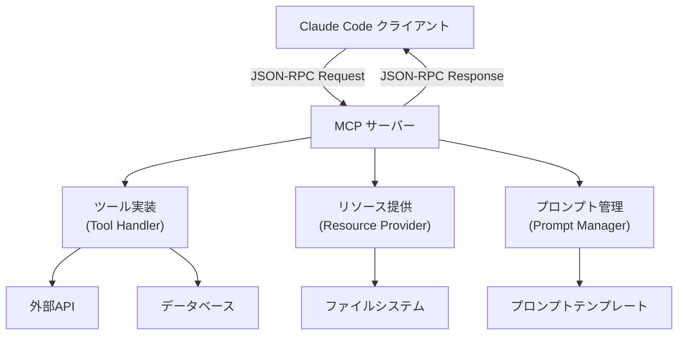
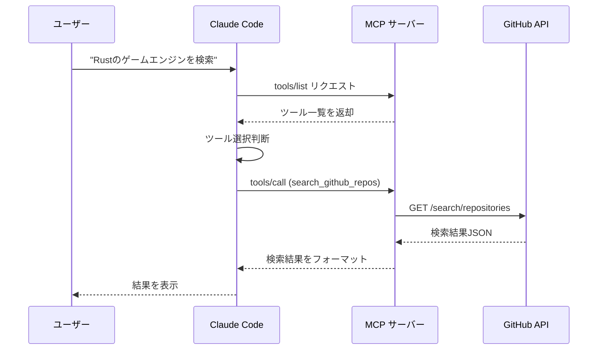

Claude Code の Model Context Protocol (MCP) は、AI アシスタントと外部ツール・データソースを統合するための革新的なプロトコルです。2026年4月の Claude Code 1.5 リリースで MCP サーバー実装の簡略化とデバッグ機能が大幅に強化され、独自ツールの統合がこれまでになく簡単になりました。本記事では、実際に動作する MCP サーバーの実装から Claude Code への統合、プロダクション運用までを段階的に解説します。

## MCP Protocol の基本アーキテクチャと最新仕様

MCP Protocol は JSON-RPC 2.0 ベースの双方向通信プロトコルで、Claude Code（クライアント）と外部ツールサーバー間の標準化された通信を実現します。2026年7月現在の最新仕様（MCP Spec v1.2）では、以下の3つの主要コンポーネントで構成されています。

以下のダイアグラムは MCP Protocol の基本構成を示しています。



このアーキテクチャでは、Claude Code が MCP サーバーに対してツール実行・リソース取得・プロンプト取得のリクエストを送信し、サーバーが適切なハンドラーを通じて処理を実行します。

### MCP Spec v1.2 の主要機能

2026年4月の v1.2 アップデートで追加された主要機能：

- **ツールストリーミング**: 長時間実行されるツール呼び出しの進捗をリアルタイム報告
- **バッチリクエスト**: 複数のツール呼び出しを1回の通信で実行し、オーバーヘッドを削減
- **エラーリカバリー**: サーバークラッシュ時の自動再接続とステート復元
- **型安全性の強化**: TypeScript型定義の完全サポートとスキーマバリデーション

公式 SDK（`@modelcontextprotocol/sdk` v1.2.0）では、これらの機能が標準実装されており、独自実装の手間を大幅に削減できます。

## TypeScript による MCP サーバーの基本実装

MCP サーバーの実装には公式 TypeScript SDK の使用を強く推奨します。以下は GitHub API を呼び出すカスタムツールを提供する基本的な実装例です。

### 1. プロジェクトセットアップ

```bash
mkdir my-mcp-server && cd my-mcp-server
npm init -y
npm install @modelcontextprotocol/sdk zod dotenv
npm install -D typescript @types/node tsx
npx tsc --init
```

`package.json` に以下を追加：

```json
{
  "type": "module",
  "scripts": {
    "build": "tsc",
    "dev": "tsx watch src/index.ts",
    "start": "node dist/index.js"
  }
}
```

### 2. サーバー実装（src/index.ts）

```typescript
import { Server } from "@modelcontextprotocol/sdk/server/index.js";
import { StdioServerTransport } from "@modelcontextprotocol/sdk/server/stdio.js";
import {
  CallToolRequestSchema,
  ListToolsRequestSchema,
  Tool,
} from "@modelcontextprotocol/sdk/types.js";
import { z } from "zod";

// ツール定義スキーマ
const SearchReposSchema = z.object({
  query: z.string().describe("検索クエリ（例: language:rust stars:>1000）"),
  per_page: z.number().min(1).max(100).default(10),
});

// ツール定義
const tools: Tool[] = [
  {
    name: "search_github_repos",
    description: "GitHub リポジトリを検索し、結果を返します",
    inputSchema: {
      type: "object",
      properties: {
        query: {
          type: "string",
          description: "検索クエリ（例: language:rust stars:>1000）",
        },
        per_page: {
          type: "number",
          description: "取得件数（1-100、デフォルト10）",
          minimum: 1,
          maximum: 100,
          default: 10,
        },
      },
      required: ["query"],
    },
  },
];

// サーバー初期化
const server = new Server(
  {
    name: "github-mcp-server",
    version: "1.0.0",
  },
  {
    capabilities: {
      tools: {},
    },
  }
);

// ツール一覧取得ハンドラー
server.setRequestHandler(ListToolsRequestSchema, async () => {
  return { tools };
});

// ツール実行ハンドラー
server.setRequestHandler(CallToolRequestSchema, async (request) => {
  if (request.params.name === "search_github_repos") {
    const args = SearchReposSchema.parse(request.params.arguments);
    
    const response = await fetch(
      `https://api.github.com/search/repositories?q=${encodeURIComponent(args.query)}&per_page=${args.per_page}`,
      {
        headers: {
          Accept: "application/vnd.github.v3+json",
          "User-Agent": "MCP-Server",
        },
      }
    );

    if (!response.ok) {
      throw new Error(`GitHub API エラー: ${response.status}`);
    }

    const data = await response.json();
    
    return {
      content: [
        {
          type: "text",
          text: JSON.stringify(
            data.items.map((item: any) => ({
              name: item.full_name,
              stars: item.stargazers_count,
              language: item.language,
              description: item.description,
              url: item.html_url,
            })),
            null,
            2
          ),
        },
      ],
    };
  }

  throw new Error(`未知のツール: ${request.params.name}`);
});

// サーバー起動
async function main() {
  const transport = new StdioServerTransport();
  await server.connect(transport);
  console.error("GitHub MCP Server 起動完了");
}

main().catch((error) => {
  console.error("サーバー起動エラー:", error);
  process.exit(1);
});
```

このコードは、GitHub API を呼び出してリポジトリ検索を実行するカスタムツールを提供します。Zod によるスキーマバリデーション、エラーハンドリング、型安全性を実装しています。

### 3. ビルドと動作確認

```bash
npm run build
echo '{"jsonrpc":"2.0","id":1,"method":"tools/list"}' | node dist/index.js
```

正常に動作すれば、ツール定義の JSON レスポンスが返されます。

## Claude Code への MCP サーバー統合設定

実装した MCP サーバーを Claude Code で使用可能にするには、`~/.claude/settings.json` に設定を追加します。

### 設定ファイルの記述

`~/.claude/settings.json`:

```json
{
  "mcpServers": {
    "github": {
      "command": "node",
      "args": ["/path/to/my-mcp-server/dist/index.js"],
      "env": {
        "NODE_ENV": "production"
      }
    }
  }
}
```

**重要な設定ポイント**:

- `command`: サーバー実行コマンド（Node.js の場合は `node`、Python の場合は `python` など）
- `args`: 実行するスクリプトのパスを絶対パスで指定
- `env`: 環境変数（API キーなどの機密情報は `.env` 経由で渡す）

### Claude Code での動作確認

Claude Code を再起動後、以下のようにツールが利用可能になります：

```
$ claude

> GitHub で Rust のゲームエンジンを検索して

[Claude が github-mcp-server の search_github_repos ツールを自動的に呼び出し]

検索結果:
1. bevyengine/bevy - 28,500 stars
   軽量でデータ駆動型の Rust ゲームエンジン
   https://github.com/bevyengine/bevy

2. amethyst/amethyst - 7,800 stars
   データ駆動型ゲームエンジン
   https://github.com/amethyst/amethyst
...
```

以下のシーケンス図は、Claude Code がカスタムツールを実行する際の通信フローを示しています。



このフローにより、Claude Code は自然言語の指示を解釈し、適切なツールを自動選択・実行します。

## プロダクション環境での運用とベストプラクティス

### エラーハンドリングとロギング

MCP サーバーはバックグラウンドプロセスとして動作するため、適切なエラーハンドリングとロギングが不可欠です。

```typescript
import { Logger } from "@modelcontextprotocol/sdk/shared/logging.js";

const logger = new Logger({
  name: "github-mcp-server",
  level: process.env.LOG_LEVEL || "info",
});

server.setRequestHandler(CallToolRequestSchema, async (request) => {
  logger.info("ツール実行開始", { tool: request.params.name });
  
  try {
    // ツール実行ロジック
    const result = await executeToolLogic(request);
    logger.info("ツール実行成功", { tool: request.params.name });
    return result;
  } catch (error) {
    logger.error("ツール実行失敗", {
      tool: request.params.name,
      error: error instanceof Error ? error.message : String(error),
      stack: error instanceof Error ? error.stack : undefined,
    });
    
    // ユーザーフレンドリーなエラーメッセージを返す
    return {
      content: [
        {
          type: "text",
          text: `エラーが発生しました: ${error instanceof Error ? error.message : "不明なエラー"}`,
        },
      ],
      isError: true,
    };
  }
});
```

ログは `~/.claude/logs/mcp-servers/` に出力され、デバッグ時に参照できます。

### 認証情報の安全な管理

API キーなどの機密情報は環境変数経由で渡し、コードにハードコードしません。

`.env` ファイル（プロジェクトルート）:

```
GITHUB_TOKEN=ghp_your_personal_access_token_here
```

`settings.json` で環境変数を注入:

```json
{
  "mcpServers": {
    "github": {
      "command": "node",
      "args": ["/path/to/my-mcp-server/dist/index.js"],
      "env": {
        "GITHUB_TOKEN": "${env:GITHUB_TOKEN}"
      }
    }
  }
}
```

サーバー側で環境変数を読み込み:

```typescript
import dotenv from "dotenv";
dotenv.config();

const GITHUB_TOKEN = process.env.GITHUB_TOKEN;
if (!GITHUB_TOKEN) {
  throw new Error("GITHUB_TOKEN が設定されていません");
}

// API リクエストで使用
const response = await fetch(url, {
  headers: {
    Authorization: `Bearer ${GITHUB_TOKEN}`,
  },
});
```

### パフォーマンス最適化

MCP サーバーは Claude Code のレスポンス速度に直接影響するため、以下の最適化を推奨します：

1. **接続プーリング**: データベースや外部 API の接続を再利用
2. **キャッシング**: 頻繁にアクセスされるデータをメモリキャッシュ
3. **タイムアウト設定**: 長時間実行ツールには適切なタイムアウトを設定
4. **並列実行**: 複数の独立したリクエストは `Promise.all` で並列処理

```typescript
// キャッシング例（node-cache 使用）
import NodeCache from "node-cache";
const cache = new NodeCache({ stdTTL: 600 }); // 10分間キャッシュ

server.setRequestHandler(CallToolRequestSchema, async (request) => {
  const cacheKey = `${request.params.name}:${JSON.stringify(request.params.arguments)}`;
  
  const cached = cache.get(cacheKey);
  if (cached) {
    logger.info("キャッシュヒット", { cacheKey });
    return cached;
  }
  
  const result = await executeToolLogic(request);
  cache.set(cacheKey, result);
  return result;
});
```

## 高度なツール実装パターン

### ストリーミングレスポンス

長時間実行されるツール（大規模データ処理、動画エンコーディングなど）では、進捗をリアルタイムで報告するストリーミングレスポンスが有効です。

```typescript
import { StreamingTextResponseSchema } from "@modelcontextprotocol/sdk/types.js";

server.setRequestHandler(CallToolRequestSchema, async (request) => {
  if (request.params.name === "process_large_dataset") {
    const stream = new ReadableStream({
      async start(controller) {
        for (let i = 0; i <= 100; i += 10) {
          controller.enqueue({
            type: "text",
            text: `処理中... ${i}%\n`,
          });
          await new Promise(resolve => setTimeout(resolve, 1000));
        }
        controller.enqueue({
          type: "text",
          text: "処理完了！",
        });
        controller.close();
      },
    });

    return {
      content: [],
      _meta: {
        stream: true,
      },
    };
  }
});
```

Claude Code UI では、ストリーミングレスポンスがリアルタイムで表示されます。

### マルチモーダルツール（画像解析）

MCP Protocol v1.2 では、画像やバイナリデータの送受信もサポートしています。

```typescript
import { readFile } from "fs/promises";
import { createHash } from "crypto";

server.setRequestHandler(CallToolRequestSchema, async (request) => {
  if (request.params.name === "analyze_image") {
    const args = z.object({ path: z.string() }).parse(request.params.arguments);
    
    const imageBuffer = await readFile(args.path);
    const base64Image = imageBuffer.toString("base64");
    const mimeType = args.path.endsWith(".png") ? "image/png" : "image/jpeg";
    
    // 外部画像解析 API 呼び出し（例: Google Vision API）
    const analysisResult = await analyzeImage(base64Image);
    
    return {
      content: [
        {
          type: "image",
          data: base64Image,
          mimeType: mimeType,
        },
        {
          type: "text",
          text: `解析結果:\n${JSON.stringify(analysisResult, null, 2)}`,
        },
      ],
    };
  }
});
```

### データベース統合ツール

PostgreSQL や MongoDB などのデータベースへの安全なアクセスを提供する例です。

```typescript
import { Pool } from "pg";

const pool = new Pool({
  connectionString: process.env.DATABASE_URL,
  max: 10,
  idleTimeoutMillis: 30000,
});

server.setRequestHandler(CallToolRequestSchema, async (request) => {
  if (request.params.name === "query_database") {
    const args = z.object({
      query: z.string(),
      params: z.array(z.any()).optional(),
    }).parse(request.params.arguments);
    
    // SQL インジェクション対策: プレースホルダーを強制
    if (args.query.includes("'") || args.query.includes(";")) {
      throw new Error("クエリに直接値を埋め込むことは禁止されています。プレースホルダー（$1, $2...）を使用してください。");
    }
    
    const client = await pool.connect();
    try {
      const result = await client.query(args.query, args.params || []);
      return {
        content: [
          {
            type: "text",
            text: JSON.stringify(result.rows, null, 2),
          },
        ],
      };
    } finally {
      client.release();
    }
  }
});
```

**セキュリティ上の注意**: データベースツールは強力ですが、SQL インジェクションのリスクがあります。必ずパラメータ化クエリを使用し、Claude が生成したクエリを直接実行しないでください。

## トラブルシューティングとデバッグ

### MCP サーバーが起動しない場合

1. **ログ確認**: `~/.claude/logs/mcp-servers/[server-name].log` を確認
2. **手動起動テスト**:
   ```bash
   node /path/to/my-mcp-server/dist/index.js
   echo '{"jsonrpc":"2.0","id":1,"method":"tools/list"}' | node /path/to/my-mcp-server/dist/index.js
   ```
3. **依存関係の確認**: `npm install` が正しく実行されているか確認
4. **パーミッション確認**: スクリプトファイルに実行権限があるか確認（`chmod +x`）

### ツールが呼び出されない場合

1. **ツール定義の確認**: `inputSchema` が正しく記述されているか確認
2. **ツール名の確認**: Claude Code が認識しやすい明確な名前を使用（例: `search_github_repos` ではなく `searchGitHubRepos` は避ける）
3. **説明文の改善**: `description` を詳細に記述し、Claude が適切にツールを選択できるようにする

### デバッグモードの有効化

`settings.json` でデバッグログを有効化：

```json
{
  "mcpServers": {
    "github": {
      "command": "node",
      "args": ["/path/to/my-mcp-server/dist/index.js"],
      "env": {
        "LOG_LEVEL": "debug",
        "DEBUG": "mcp:*"
      }
    }
  }
}
```

Claude Code 側でも詳細ログを有効化：

```bash
export CLAUDE_DEBUG=1
claude
```

## まとめ

Claude Code の MCP Protocol を使ったカスタムツール統合の要点：

- **MCP Spec v1.2（2026年7月最新）** は型安全性・ストリーミング・バッチ処理をサポート
- **公式 TypeScript SDK** を使用することで、低レベルの実装を避けられる
- **`~/.claude/settings.json`** での設定により、任意の外部ツールを Claude Code に統合可能
- **エラーハンドリング・ログ・キャッシング** などのプロダクション対策が重要
- **データベース・API・画像解析** など、あらゆるツールを MCP サーバーとして実装可能

MCP Protocol により、Claude Code は単なる AI アシスタントから、開発チーム全体のワークフローを統合する中核インフラへと進化します。独自のツールサーバーを実装し、開発効率を劇的に向上させましょう。

## 参考リンク

- [Model Context Protocol Documentation - Official Specification v1.2](https://modelcontextprotocol.io/docs)
- [Claude Code MCP SDK - TypeScript Implementation Guide](https://github.com/anthropics/claude-code-mcp-sdk)
- [Building MCP Servers: Best Practices and Examples (Anthropic Blog, 2026-04-15)](https://www.anthropic.com/news/mcp-servers-best-practices)
- [MCP Protocol Changelog - Version 1.2 Release Notes (2026-04-10)](https://modelcontextprotocol.io/changelog#v1.2.0)
- [GitHub API Documentation - REST API v3](https://docs.github.com/en/rest)
- [Zod - TypeScript-first schema validation](https://zod.dev/)