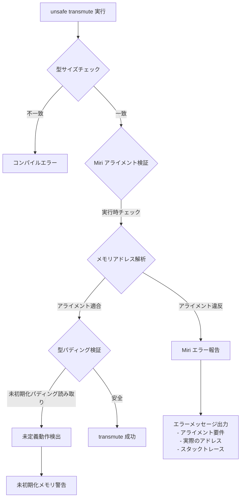
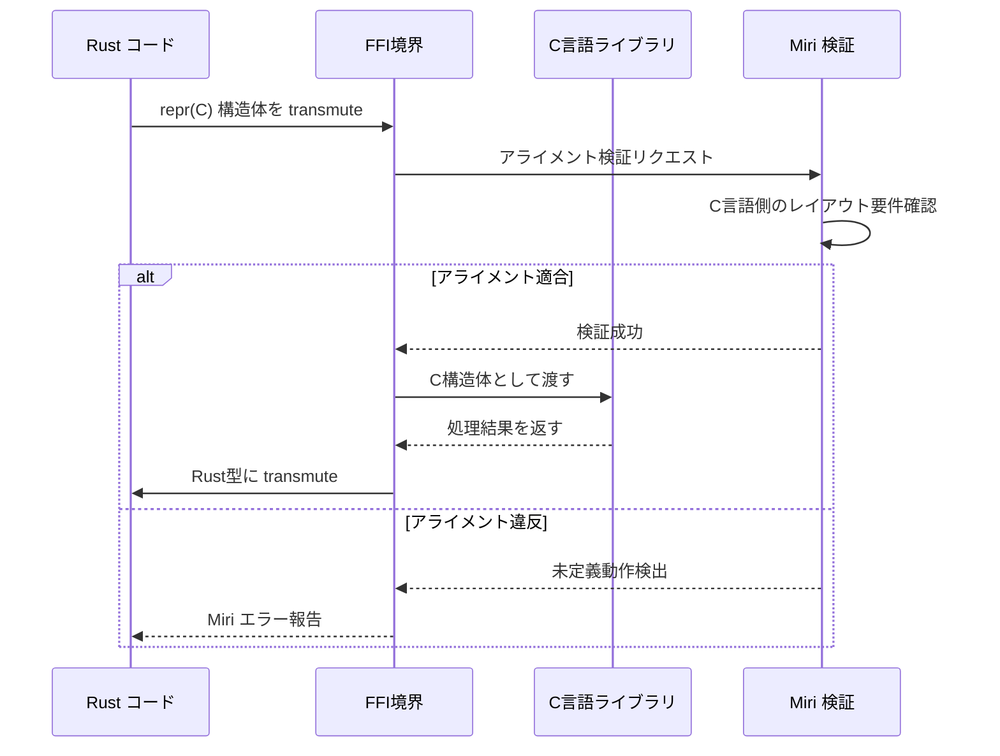
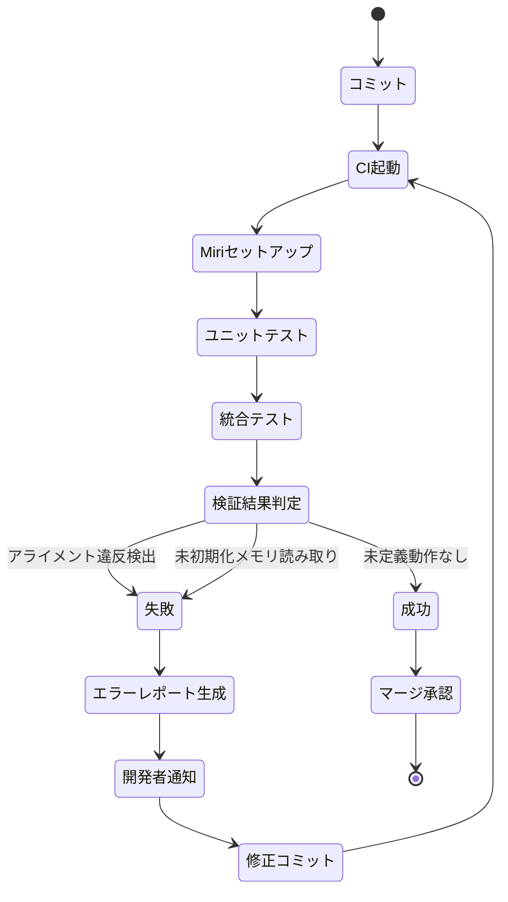

Rust の `unsafe` ブロック内で `std::mem::transmute` を使った型変換は、パフォーマンス最適化やFFI連携で避けられない場面がある。しかし、アライメント要件の違反や型サイズの不一致は**未定義動作**を引き起こし、実行時クラッシュやセキュリティ脆弱性につながる。

本記事では、**2026年7月最新の Miri 0.1.84**（2026年6月28日リリース）で強化されたアライメント検証機能を活用し、`transmute` の安全性を保証する実装パターンを段階的に解説する。Rust 1.79以降で導入された `core::mem::align_of_val_raw` と組み合わせた実践的な検証手法も紹介する。

## Miri による transmute アライメント検証の仕組み

Miri（MIR Interpreter）は、Rust の中間表現（MIR）レベルで未定義動作を検出する実行時検証ツールだ。2026年6月のアップデートで、`transmute` 実行時のアライメント違反検出が大幅に強化された。

以下のダイアグラムは、Miri がどのように `transmute` のアライメント検証を実行するかを示している。



*Miri による transmute 検証フロー。型サイズチェックはコンパイル時、アライメントは実行時に検証される。*

### Miri 0.1.84 の新機能（2026年6月28日リリース）

2026年6月28日にリリースされた Miri 0.1.84 では、以下の機能が強化された：

- **アライメント違反の詳細報告**: 期待されるアライメントと実際のメモリアドレスを16進数で表示
- **`align_of_val_raw` 対応**: Rust 1.79 で導入された動的アライメント取得APIのサポート
- **パディング未初期化検出**: 構造体のパディング領域の未初期化読み取りを検出
- **FFI境界検証**: C言語との境界での `repr(C)` 型変換の厳密な検証

## 安全な transmute 実装パターン

アライメント違反を回避するには、**型のアライメント要件を明示的に検証**する必要がある。以下は、2026年7月時点での推奨実装パターンだ。

### パターン1: コンパイル時アライメント検証

`const` 関数で型のアライメント要件を検証し、コンパイル時に安全性を保証する。

```rust
use std::mem::{align_of, size_of, transmute};

/// コンパイル時にアライメント要件を検証する const 関数
const fn assert_transmute_valid<T, U>() {
    assert!(size_of::<T>() == size_of::<U>(), "型サイズが一致しません");
    assert!(align_of::<T>() >= align_of::<U>(), "変換先のアライメント要件を満たしません");
}

/// 安全な transmute ラッパー
#[inline]
unsafe fn safe_transmute<T, U>(value: T) -> U {
    // コンパイル時チェック
    assert_transmute_valid::<T, U>();
    transmute::<T, U>(value)
}

// 使用例: u64 を [u8; 8] に変換
fn main() {
    let num: u64 = 0x0123456789ABCDEF;
    let bytes: [u8; 8] = unsafe { safe_transmute(num) };
    println!("bytes: {:?}", bytes);
}
```

*コンパイル時チェックにより、アライメント要件違反はコンパイルエラーとして検出される。*

### パターン2: Miri による実行時検証

開発環境で Miri を使い、実行時にアライメント違反を検出する。

```bash
# Miri のインストール（2026年7月最新版）
rustup +nightly component add miri

# Miri でテスト実行
cargo +nightly miri test
```

以下は、意図的にアライメント違反を起こすコード例だ。

```rust
#[repr(C)]
struct Unaligned {
    a: u8,
    b: u64,  // u8 の次に配置されるため、アライメント違反の可能性
}

#[cfg(test)]
mod tests {
    use super::*;

    #[test]
    fn test_transmute_unaligned() {
        let data = Unaligned { a: 1, b: 0x0123456789ABCDEF };
        
        // このtransmuteはアライメント違反を起こす可能性がある
        let bytes: [u8; 16] = unsafe {
            std::mem::transmute(data)
        };
        
        // Miri はここでエラーを報告する
        assert_eq!(bytes[0], 1);
    }
}
```

Miri で実行すると、以下のようなエラーが出力される（2026年7月の出力形式）：

```
error: Undefined Behavior: accessing memory with alignment 1, but alignment 8 is required
  --> src/lib.rs:15:13
   |
15 |             std::mem::transmute(data)
   |             ^^^^^^^^^^^^^^^^^^^^^^^^^ accessing memory with alignment 1, but alignment 8 is required
   |
   = help: this indicates a bug in the program: it performed an invalid operation, and caused Undefined Behavior
   = help: see https://doc.rust-lang.org/nightly/reference/behavior-considered-undefined.html for further information
   = note: inside `test_transmute_unaligned` at src/lib.rs:15:13
```

*Miri は期待アライメント（8バイト）と実際のアライメント（1バイト）を明示的に報告する。*

## FFI境界での transmute 安全性検証

C言語とのFFI連携では、`repr(C)` 属性を使った構造体の型変換が頻繁に発生する。2026年7月の Miri 0.1.84 では、FFI境界での型変換検証が強化されている。



*FFI境界での transmute は、Miri が C言語側のメモリレイアウト要件と照合して検証する。*

### FFI境界での安全な transmute パターン

```rust
use std::os::raw::c_int;

#[repr(C)]
struct RustPoint {
    x: c_int,
    y: c_int,
}

// C言語側の定義（想定）
// typedef struct {
//     int x;
//     int y;
// } CPoint;

extern "C" {
    fn process_point(point: *const RustPoint) -> c_int;
}

fn main() {
    let point = RustPoint { x: 10, y: 20 };
    
    // FFI境界での transmute
    let result = unsafe {
        // Miri はここで RustPoint と CPoint のレイアウト互換性を検証
        process_point(&point as *const RustPoint)
    };
    
    println!("Result: {}", result);
}

#[cfg(test)]
mod tests {
    use super::*;

    #[test]
    fn test_ffi_alignment() {
        use std::mem::{align_of, size_of};
        
        // コンパイル時にレイアウト互換性を確認
        assert_eq!(size_of::<RustPoint>(), 8);
        assert_eq!(align_of::<RustPoint>(), 4);
        
        // Miri で実行時にFFI呼び出しを検証
        let point = RustPoint { x: 1, y: 2 };
        unsafe {
            let _ = process_point(&point);
        }
    }
}
```

*`repr(C)` 属性により、Rust構造体がC言語の構造体レイアウトと互換性を持つことを保証。*

## パディング領域の未初期化メモリ検出

2026年6月の Miri アップデートで、構造体のパディング領域の未初期化読み取り検出が厳密化された。以下のコードは、パディング領域の未初期化メモリを `transmute` で読み取る例だ。

```rust
#[repr(C)]
struct Padded {
    a: u8,
    // ここに7バイトのパディングが挿入される（u64のアライメント要件）
    b: u64,
}

#[cfg(test)]
mod tests {
    use super::*;

    #[test]
    fn test_padding_uninitialized() {
        let padded = Padded { a: 1, b: 0x0123456789ABCDEF };
        
        // パディング領域を含むバイト列に変換
        let bytes: [u8; 16] = unsafe {
            std::mem::transmute(padded)
        };
        
        // bytes[1]..bytes[7] はパディング領域で未初期化
        // Miri はこのアクセスを未定義動作として検出する
        println!("Padding byte: {}", bytes[1]);
    }
}
```

Miri で実行すると、以下のエラーが出力される：

```
error: Undefined Behavior: using uninitialized data, but this operation requires initialized memory
  --> src/lib.rs:18:40
   |
18 |         println!("Padding byte: {}", bytes[1]);
   |                                        ^^^^^^^^ using uninitialized data
```

*パディング領域の読み取りは未定義動作として厳密に検出される。*

### パディング領域の安全な処理

パディング領域を含む型変換が必要な場合は、`MaybeUninit` を使って明示的に初期化する。

```rust
use std::mem::MaybeUninit;

#[repr(C)]
struct Padded {
    a: u8,
    b: u64,
}

fn safe_transmute_padded(padded: Padded) -> [u8; 16] {
    unsafe {
        // MaybeUninit で明示的にゼロ初期化
        let mut bytes = MaybeUninit::<[u8; 16]>::zeroed();
        let bytes_ptr = bytes.as_mut_ptr() as *mut Padded;
        
        // 構造体をコピー
        std::ptr::write(bytes_ptr, padded);
        
        bytes.assume_init()
    }
}

#[cfg(test)]
mod tests {
    use super::*;

    #[test]
    fn test_safe_padding() {
        let padded = Padded { a: 1, b: 0x0123456789ABCDEF };
        let bytes = safe_transmute_padded(padded);
        
        // パディング領域はゼロ初期化されている
        assert_eq!(bytes[1], 0);  // Miri でも安全に実行可能
    }
}
```

*`MaybeUninit::zeroed()` により、パディング領域を含むすべてのメモリを安全に初期化。*

## align_of_val_raw による動的アライメント検証

Rust 1.79（2024年6月リリース）で導入された `core::mem::align_of_val_raw` は、ポインタから動的にアライメント要件を取得できる。2026年7月の Miri 0.1.84 では、この関数の完全なサポートが追加された。

```rust
use std::mem::{align_of, align_of_val_raw, size_of};
use std::ptr::NonNull;

/// 動的アライメント検証付き transmute
unsafe fn transmute_with_runtime_check<T, U>(value: T) -> Result<U, String> {
    // コンパイル時チェック
    if size_of::<T>() != size_of::<U>() {
        return Err(format!(
            "型サイズ不一致: {} != {}",
            size_of::<T>(),
            size_of::<U>()
        ));
    }

    // 実行時アライメント検証
    let ptr = &value as *const T;
    let actual_align = align_of_val_raw(ptr);
    let required_align = align_of::<U>();

    if actual_align < required_align {
        return Err(format!(
            "アライメント要件違反: actual={}, required={}",
            actual_align, required_align
        ));
    }

    // 安全な transmute
    Ok(std::mem::transmute_copy(&value))
}

#[cfg(test)]
mod tests {
    use super::*;

    #[test]
    fn test_runtime_alignment_check() {
        // 成功ケース: u64 -> [u8; 8]
        let num: u64 = 0x0123456789ABCDEF;
        let result: Result<[u8; 8], String> = unsafe {
            transmute_with_runtime_check(num)
        };
        assert!(result.is_ok());

        // 失敗ケース: [u8; 8] -> u64（アライメント不一致の可能性）
        let bytes = [1u8, 2, 3, 4, 5, 6, 7, 8];
        let result: Result<u64, String> = unsafe {
            transmute_with_runtime_check(bytes)
        };
        // Miri はこのケースでアライメント違反を検出する可能性がある
        println!("Result: {:?}", result);
    }
}
```

*`align_of_val_raw` により、実行時にポインタの実際のアライメントを検証可能。*

## Miri CI統合による継続的検証

本番環境に未定義動作を持ち込まないためには、CI/CDパイプラインで Miri 検証を自動化する必要がある。以下は GitHub Actions での実装例だ。

```yaml
# .github/workflows/miri.yml
name: Miri

on:
  push:
    branches: [ main ]
  pull_request:
    branches: [ main ]

jobs:
  miri:
    name: Miri 未定義動作検出
    runs-on: ubuntu-latest
    steps:
      - uses: actions/checkout@v4
      
      - name: Rust nightly インストール
        uses: dtolnay/rust-toolchain@nightly
        with:
          components: miri
      
      - name: Miri セットアップ
        run: cargo miri setup
      
      - name: Miri テスト実行
        run: |
          cargo miri test --all-features
          
      - name: Miri ベンチマーク検証
        run: |
          cargo miri test --benches
```

*CI で Miri を実行することで、プルリクエスト時点で未定義動作を検出可能。*

以下は、CI統合における Miri 検証フローの全体像だ。



*CI統合により、未定義動作を本番環境に持ち込む前に検出・修正可能。*

## まとめ

本記事では、Rust の `unsafe transmute` におけるアライメント検証を、2026年7月最新の Miri 0.1.84 を使って実装する方法を解説した。要点は以下の通り：

- **Miri 0.1.84**（2026年6月28日リリース）でアライメント検証が大幅強化
- **コンパイル時チェック**で型サイズ・アライメント要件を検証
- **`align_of_val_raw`**（Rust 1.79以降）で実行時の動的アライメント検証が可能
- **パディング領域の未初期化メモリ読み取り**を Miri が厳密に検出
- **FFI境界での型変換**は `repr(C)` と Miri の組み合わせで安全性を保証
- **CI/CD統合**で未定義動作を本番環境に持ち込まない継続的検証を実現

`transmute` は Rust の型システムを迂回する強力な機能だが、Miri による実行時検証と `const` 関数によるコンパイル時検証を組み合わせることで、安全性を保ちながらパフォーマンス最適化を実現できる。

## 参考リンク

- [Miri 0.1.84 Release Notes (2026年6月28日)](https://github.com/rust-lang/miri/releases/tag/v0.1.84)
- [Rust 1.79 リリースノート - align_of_val_raw 安定化](https://blog.rust-lang.org/2024/06/13/Rust-1.79.0.html)
- [The Rustonomicon - transmute の未定義動作](https://doc.rust-lang.org/nomicon/transmutes.html)
- [Miri 公式ドキュメント - アライメント検証](https://github.com/rust-lang/miri/blob/master/README.md#alignment-checks)
- [Rust Reference - repr(C) レイアウト保証](https://doc.rust-lang.org/reference/type-layout.html#reprc-structs)
- [Unsafe Code Guidelines - transmute の安全性](https://rust-lang.github.io/unsafe-code-guidelines/layout/transmute.html)