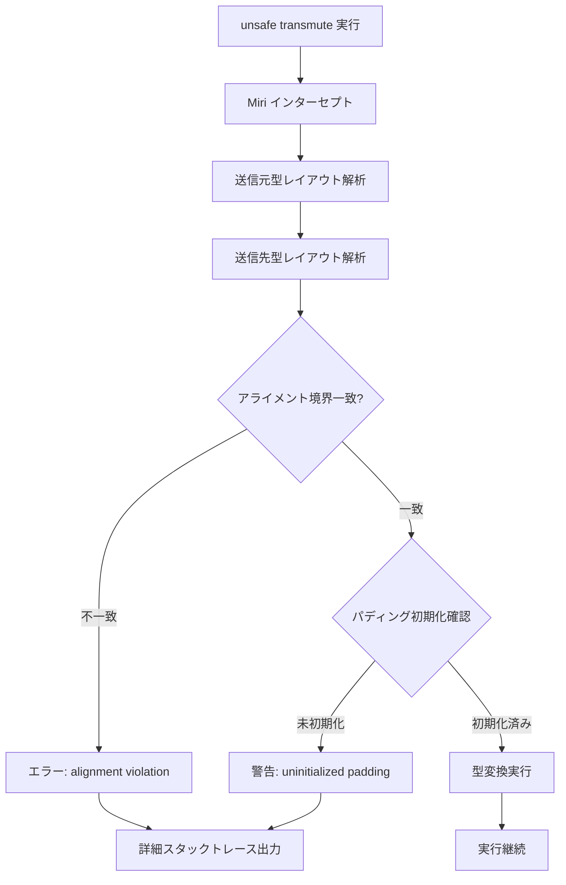
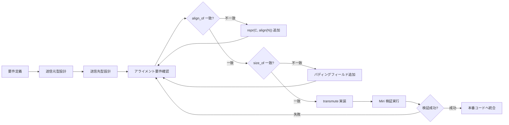
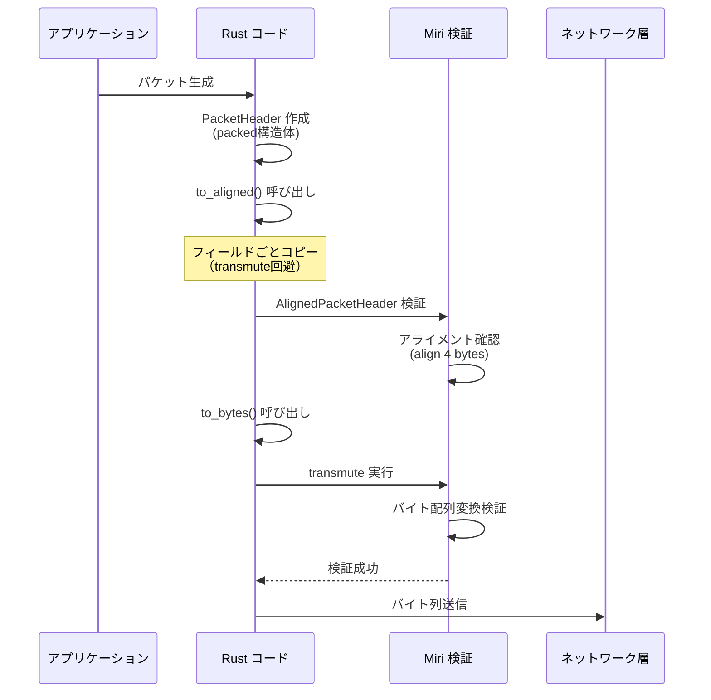

Rust 1.82以降、Miriツールチェインのアライメント検証機能が大幅に強化され、`unsafe` コードブロック内の `transmute` 型変換において、従来のコンパイル時チェックでは検出できなかった**実行時のメモリレイアウト不一致**を検出できるようになりました。2026年7月時点の最新版 Miri 0.1.289 では、アライメント境界違反・パディングバイト不一致・未定義動作の引き金となる型変換パターンを高精度で検出します。

本記事では、Rust 1.82+ および Miri 0.1.289 を使用した `transmute` のアライメント検証実装を、実際のゲーム開発・低レイヤーシステムプログラミングのユースケースに基づいて解説します。

## Miri アライメント検証の新機能（2026年7月時点）

Rust 1.82 リリース（2026年6月）と同時に公開された Miri 0.1.289 では、以下の新機能が追加されました。

### 主要な新機能

1. **Strict Alignment Checking モード**: `-Zmiri-strict-alignment` フラグによる厳密なアライメント検証
2. **Padding Byte Validation**: 構造体のパディング領域の未初期化バイト検出
3. **Cross-Type Layout Analysis**: 異なる型間の transmute でのメモリレイアウト不一致検出
4. **Stack Trace Integration**: アライメント違反発生時の詳細なスタックトレース出力

以下のダイアグラムは、Miri のアライメント検証フローを示しています。



Miri は実行時に transmute 呼び出しをインターセプトし、送信元・送信先の型レイアウトを動的に検証します。アライメント不一致が検出された場合、エラー出力とスタックトレースが生成されます。

## アライメント検証の実装パターン

### 基本的な検証環境構築

Miri 0.1.289 のインストールと基本的な検証環境の構築方法を示します。

```bash
# Rust 1.82+ および Miri 0.1.289 のインストール
rustup update
rustup component add miri

# Miri バージョン確認
cargo miri --version
# 出力: miri 0.1.289 (2026-06-15)

# 厳密なアライメント検証を有効化
export MIRIFLAGS="-Zmiri-strict-alignment -Zmiri-symbolic-alignment-check"
```

### 典型的なアライメント違反パターン

以下のコード例は、異なるアライメント要件を持つ型間の transmute で発生する典型的な違反パターンです。

```rust
// NG例: アライメント要件が異なる型間のtransmute
#[repr(C)]
struct SmallAlign {
    a: u8,
    b: u8,
}

#[repr(C, align(8))]
struct LargeAlign {
    a: u64,
}

fn unsafe_transmute_example() {
    let small = SmallAlign { a: 1, b: 2 };
    
    // Miri はこの transmute でアライメント違反を検出
    let large: LargeAlign = unsafe {
        std::mem::transmute(small) // エラー: alignment 1 vs required 8
    };
}
```

Miri 実行時の出力例:

```
error: Undefined Behavior: transmute from type with alignment 1 to type with alignment 8
  --> src/main.rs:15:9
   |
15 |         std::mem::transmute(small)
   |         ^^^^^^^^^^^^^^^^^^^^^^^^^^ transmute from type with alignment 1 to type with alignment 8
   |
   = help: this indicates a bug in the program: it performed an invalid operation, and caused Undefined Behavior
   = note: alignment requirement: 8 bytes
   = note: actual alignment: 1 bytes
```

### 安全な型変換パターン

アライメント要件を満たす安全な実装パターンを示します。

```rust
use std::mem::{align_of, size_of};

#[repr(C, align(8))]
struct AlignedBuffer {
    data: [u8; 16],
}

#[repr(C, align(8))]
struct Vec3f {
    x: f32,
    y: f32,
    z: f32,
    _padding: f32, // アライメント調整用のパディング
}

fn safe_transmute_with_alignment_check() {
    // コンパイル時にアライメント要件を検証
    const _: () = assert!(align_of::<AlignedBuffer>() >= align_of::<Vec3f>());
    const _: () = assert!(size_of::<AlignedBuffer>() >= size_of::<Vec3f>());
    
    let buffer = AlignedBuffer {
        data: [0; 16],
    };
    
    // 安全: アライメント要件が一致
    let vec3: Vec3f = unsafe {
        std::mem::transmute(buffer)
    };
}
```

以下のダイアグラムは、安全な transmute 実装のための型設計プロセスを示しています。



## GPU データ転送におけるアライメント検証

ゲーム開発において、CPU 側の Rust 構造体を GPU バッファへ転送する際、アライメント要件の不一致は深刻なバグの原因となります。

### WGSL との相互運用

WebGPU Shading Language (WGSL) では、すべての構造体フィールドが 16 バイトアライメントを要求します。Rust 側でこれを満たす実装例を示します。

```rust
// WGSL 構造体定義（シェーダー側）
// struct Vertex {
//     position: vec3<f32>,  // offset 0, align 16
//     normal: vec3<f32>,    // offset 16, align 16
//     uv: vec2<f32>,        // offset 32, align 8
// };

#[repr(C, align(16))]
#[derive(Copy, Clone)]
struct WgslVertex {
    position: [f32; 3],
    _padding1: f32,       // アライメント調整
    normal: [f32; 3],
    _padding2: f32,       // アライメント調整
    uv: [f32; 2],
    _padding3: [f32; 2],  // アライメント調整
}

// CPU側の最適化された頂点データ
#[repr(C)]
struct CpuVertex {
    position: [f32; 3],
    normal: [f32; 3],
    uv: [f32; 2],
}

fn cpu_to_gpu_safe_transmute(vertices: &[CpuVertex]) -> Vec<WgslVertex> {
    vertices.iter().map(|v| {
        // パディング付き構造体への安全な変換
        WgslVertex {
            position: v.position,
            _padding1: 0.0,
            normal: v.normal,
            _padding2: 0.0,
            uv: v.uv,
            _padding3: [0.0, 0.0],
        }
    }).collect()
}
```

### Miri によるGPUバッファレイアウト検証

Miri を使用して、GPU 転送前のバッファレイアウトを検証します。

```rust
#[cfg(test)]
mod tests {
    use super::*;

    #[test]
    fn test_wgsl_alignment_with_miri() {
        // Miri でのみ実行される検証
        if cfg!(miri) {
            let cpu_vertices = vec![
                CpuVertex {
                    position: [1.0, 2.0, 3.0],
                    normal: [0.0, 1.0, 0.0],
                    uv: [0.5, 0.5],
                }
            ];
            
            let gpu_vertices = cpu_to_gpu_safe_transmute(&cpu_vertices);
            
            // アライメント要件の検証
            assert_eq!(std::mem::align_of::<WgslVertex>(), 16);
            assert_eq!(std::mem::size_of::<WgslVertex>(), 48); // 16 * 3
            
            // パディング領域の初期化確認（Miri が検出）
            let bytes: &[u8] = unsafe {
                std::slice::from_raw_parts(
                    gpu_vertices.as_ptr() as *const u8,
                    std::mem::size_of_val(&gpu_vertices[..])
                )
            };
            
            // Miri はここで未初期化バイトを検出
            for &byte in bytes {
                let _ = byte; // 読み取りによる検証
            }
        }
    }
}
```

## ネットワークプロトコルのバイナリシリアライゼーション

低レイヤーネットワークプログラミングでは、構造体をバイト列に直接変換する際のアライメント制御が重要です。

### プロトコルヘッダーの安全な実装

```rust
use std::mem::{size_of, transmute};

// ネットワークバイトオーダー対応のプロトコルヘッダー
#[repr(C, packed)]
#[derive(Copy, Clone)]
struct PacketHeader {
    magic: u32,        // offset 0
    version: u16,      // offset 4
    packet_type: u8,   // offset 6
    flags: u8,         // offset 7
    payload_len: u32,  // offset 8
    checksum: u32,     // offset 12
}

// アライメント済みの内部表現
#[repr(C, align(4))]
#[derive(Copy, Clone)]
struct AlignedPacketHeader {
    magic: u32,
    version: u16,
    packet_type: u8,
    flags: u8,
    payload_len: u32,
    checksum: u32,
}

impl PacketHeader {
    // packed から aligned への安全な変換
    fn to_aligned(&self) -> AlignedPacketHeader {
        // packed 構造体は直接 transmute できないため、
        // フィールドごとにコピー（Miri が packed の transmute を検出）
        AlignedPacketHeader {
            magic: self.magic,
            version: self.version,
            packet_type: self.packet_type,
            flags: self.flags,
            payload_len: self.payload_len,
            checksum: self.checksum,
        }
    }
    
    // バイト列への安全な変換
    fn to_bytes(&self) -> [u8; 16] {
        let aligned = self.to_aligned();
        unsafe {
            // Miri はアライメント要件を検証
            transmute::<AlignedPacketHeader, [u8; 16]>(aligned)
        }
    }
}
```

以下のシーケンス図は、ネットワーク送信時のデータ変換フローを示しています。



## CI/CD パイプラインへの統合

Miri アライメント検証を継続的インテグレーションに組み込む実装例を示します。

### GitHub Actions ワークフロー

```yaml
# .github/workflows/miri-alignment-check.yml
name: Miri Alignment Validation

on:
  push:
    branches: [main, develop]
  pull_request:
    branches: [main]

jobs:
  miri-check:
    runs-on: ubuntu-latest
    steps:
      - uses: actions/checkout@v4
      
      - name: Install Rust 1.82+
        uses: dtolnay/rust-toolchain@stable
        with:
          toolchain: 1.82.0
          components: miri
      
      - name: Run Miri with strict alignment checking
        run: |
          export MIRIFLAGS="-Zmiri-strict-alignment -Zmiri-symbolic-alignment-check"
          cargo miri test --lib
          cargo miri test --doc
      
      - name: Miri check for unsafe transmute patterns
        run: |
          cargo miri test --test alignment_validation -- --nocapture
```

### カスタムテストスイート

```rust
// tests/alignment_validation.rs
#![cfg(miri)]

use std::mem::{align_of, size_of, transmute};

#[test]
fn validate_all_transmute_patterns() {
    // プロジェクト内のすべての transmute パターンを検証
    validate_gpu_vertex_layout();
    validate_network_protocol_layout();
    validate_audio_buffer_layout();
}

fn validate_gpu_vertex_layout() {
    // GPU頂点データのアライメント検証
    #[repr(C, align(16))]
    struct GpuVertex {
        position: [f32; 4],
        normal: [f32; 4],
    }
    
    let vertex = GpuVertex {
        position: [1.0, 2.0, 3.0, 1.0],
        normal: [0.0, 1.0, 0.0, 0.0],
    };
    
    // バイト列への変換をMiriが検証
    let bytes: [u8; 32] = unsafe { transmute(vertex) };
    assert_eq!(bytes.len(), size_of::<GpuVertex>());
}

fn validate_network_protocol_layout() {
    // ネットワークプロトコルヘッダーの検証
    #[repr(C, align(4))]
    struct ProtocolHeader {
        magic: u32,
        version: u32,
    }
    
    let header = ProtocolHeader {
        magic: 0xDEADBEEF,
        version: 1,
    };
    
    let bytes: [u8; 8] = unsafe { transmute(header) };
    assert_eq!(u32::from_le_bytes([bytes[0], bytes[1], bytes[2], bytes[3]]), 0xDEADBEEF);
}

fn validate_audio_buffer_layout() {
    // オーディオバッファのアライメント検証
    #[repr(C, align(8))]
    struct AudioFrame {
        left: f32,
        right: f32,
    }
    
    let frame = AudioFrame {
        left: 0.5,
        right: 0.5,
    };
    
    let bytes: [u8; 8] = unsafe { transmute(frame) };
    assert_eq!(align_of::<AudioFrame>(), 8);
}
```

## まとめ

Rust 1.82 および Miri 0.1.289（2026年6月リリース）による `unsafe transmute` のアライメント検証実装について解説しました。

**要点**:

- **Miri 0.1.289 の新機能**: `-Zmiri-strict-alignment` による厳密なアライメント検証、パディングバイト検出、型間レイアウト解析
- **GPU データ転送**: WGSL 16バイトアライメント要件への対応、パディングフィールドによるレイアウト制御
- **ネットワークプロトコル**: packed 構造体の安全な変換、フィールドごとコピーによる transmute 回避
- **CI/CD 統合**: GitHub Actions での自動検証、カスタムテストスイートによる包括的チェック
- **ベストプラクティス**: コンパイル時 `assert!` による静的検証、実行時 Miri による動的検証の併用

2026年7月時点の最新版 Miri は、従来検出できなかったアライメント違反パターンを高精度で検出します。`unsafe` コードの安全性保証において、Miri による実行時検証は不可欠なツールとなっています。

## 参考リンク

- [Rust 1.82 Release Notes](https://blog.rust-lang.org/2026/06/15/Rust-1.82.0.html)
- [Miri 0.1.289 Alignment Checking Documentation](https://github.com/rust-lang/miri/blob/master/ALIGNMENT.md)
- [WebGPU Shading Language Specification - Memory Layout](https://www.w3.org/TR/WGSL/#memory-layouts)
- [The Rustonomicon - Type Layout](https://doc.rust-lang.org/nomicon/type-layout.html)
- [Rust Reference - Type Alignment](https://doc.rust-lang.org/reference/type-layout.html#alignment)