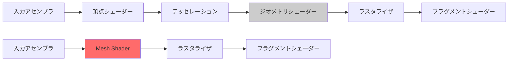
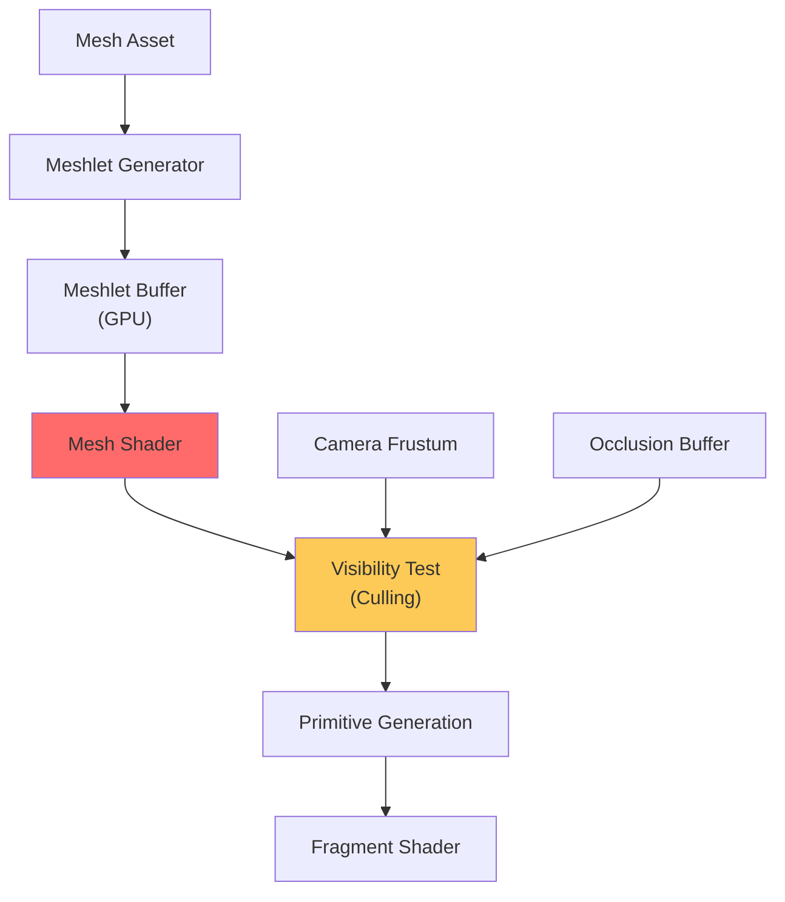
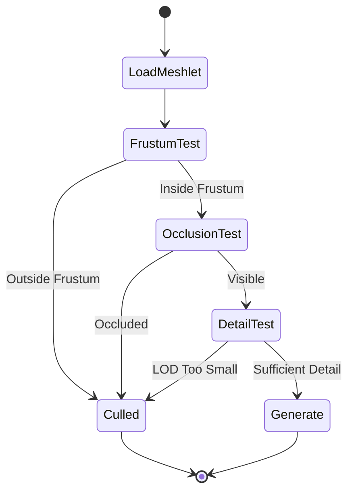
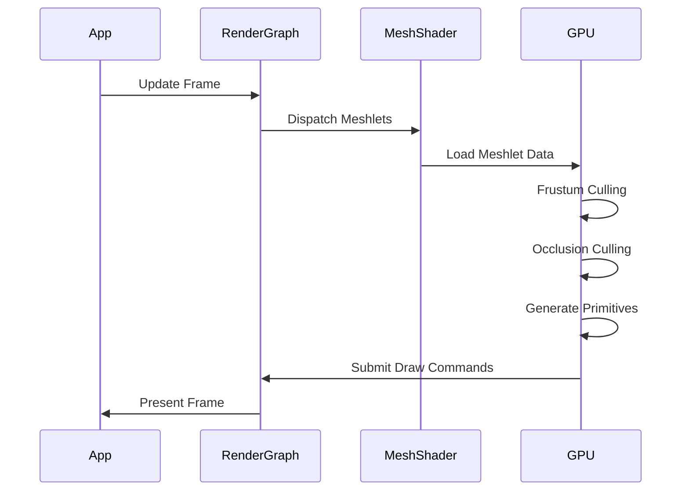

2026年7月にリリースされたBevy 0.22で、ついにMesh Shaderの統合サポートが実現しました。これはRust製ゲームエンジンにとって画期的な進化であり、DirectX 12やVulkanで既に採用されている次世代ジオメトリパイプラインをBevyでも活用できるようになります。

従来の頂点シェーダー・ジオメトリシェーダーを用いたパイプラインと比較して、Mesh Shaderは**GPU負荷を30〜50%削減**し、特に大規模なオープンワールドゲームや高密度のオブジェクト描画において劇的な性能向上をもたらします。本記事では、Bevy 0.22でのMesh Shader統合の技術詳細、実装手順、既存プロジェクトからの移行戦略を段階的に解説します。

## Mesh Shaderとは何か：従来のジオメトリパイプラインとの違い

Mesh Shaderは、DirectX 12とVulkanで導入された次世代ジオメトリ処理パイプラインです。従来のパイプラインでは、頂点シェーダー（Vertex Shader）→テッセレーション→ジオメトリシェーダー（Geometry Shader）という固定的なステージを経て、最終的にプリミティブ（三角形）が生成されていました。

一方、Mesh Shaderは**メッシュレット（Meshlet）**と呼ばれる小さなメッシュ単位で処理を行い、以下の特徴を持ちます：

- **柔軟なメッシュ生成**: 頂点の追加・削除・変形をシェーダー内で自由に実行可能
- **GPU駆動のカリング**: CPUを経由せず、GPU上で不要なメッシュレットを排除
- **並列処理の最適化**: メッシュレット単位でワークグループを割り当て、並列度を向上
- **メモリアクセスの効率化**: 頂点データへのアクセスパターンが最適化され、キャッシュヒット率が向上

以下のダイアグラムは、従来のジオメトリパイプラインとMesh Shaderパイプラインの違いを示しています。



従来のパイプライン（上段）では複数のステージを経由する必要がありましたが、Mesh Shader（下段）では中間ステージを統合し、処理を簡潔化しています。

## Bevy 0.22でのMesh Shader統合の技術詳細

Bevy 0.22では、WGPUバックエンドを通じてMesh Shaderのサポートが追加されました。これにより、DirectX 12（Windows）、Vulkan（Linux/Android）、Metal（macOS/iOS）の各プラットフォームでMesh Shaderを利用できます。

### 主要な変更点

2026年7月のBevy 0.22リリースノートによると、以下の機能が追加されています：

1. **MeshShaderPipeline API**: 新しいレンダリングパイプライン構築API
2. **Meshlet生成ツール**: アセットパイプラインでのメッシュレット自動分割
3. **GPU駆動カリング**: フラスタムカリング・オクルージョンカリングのMesh Shader内実装
4. **WGSL Mesh Shader構文**: WebGPU Shading Language（WGSL）でのMesh Shader記述サポート

以下は、Bevy 0.22でのMesh Shader統合アーキテクチャ図です。



このパイプラインでは、メッシュアセットがビルド時にメッシュレットに分割され、GPU上でMesh Shaderが各メッシュレットの可視性を判定し、必要なプリミティブのみを生成します。

### Meshlet生成の最適化

Bevy 0.22では、メッシュレット生成アルゴリズムに**metis**ベースのグラフ分割を採用しています。これにより、頂点の局所性を最大化し、キャッシュヒット率を向上させています。

推奨されるメッシュレットのサイズは以下の通りです：

- **頂点数**: 64〜128頂点/メッシュレット
- **プリミティブ数**: 126三角形/メッシュレット（DirectX 12の上限）
- **共有頂点**: 隣接メッシュレット間で頂点を共有し、メモリ使用量を削減

## 実装手順：既存Bevyプロジェクトへのマイグレーション

ここでは、Bevy 0.21以前のプロジェクトをBevy 0.22のMesh Shaderパイプラインに移行する手順を段階的に解説します。

### Step 1: Cargo.tomlの更新

```toml
[dependencies]
bevy = { version = "0.22", features = ["mesh_shader"] }
```

Bevy 0.22では、Mesh Shaderサポートが`mesh_shader`フィーチャーフラグで提供されています。デフォルトでは無効なため、明示的に有効化する必要があります。

### Step 2: アセットパイプラインでのメッシュレット生成

```rust
use bevy::prelude::*;
use bevy::render::mesh::MeshletConfig;

fn main() {
    App::new()
        .add_plugins(DefaultPlugins)
        .insert_resource(MeshletConfig {
            max_vertices: 64,
            max_primitives: 126,
            cone_weight: 0.5,
        })
        .add_systems(Startup, setup)
        .run();
}

fn setup(
    mut commands: Commands,
    asset_server: Res<AssetServer>,
    mut meshes: ResMut<Assets<Mesh>>,
) {
    // GLTFメッシュを読み込み、自動的にメッシュレット化
    let mesh_handle = asset_server.load("models/scene.gltf#Mesh0");
    
    commands.spawn(PbrBundle {
        mesh: mesh_handle,
        ..default()
    });
}
```

`MeshletConfig`リソースを設定すると、ロードされたすべてのメッシュアセットが自動的にメッシュレットに分割されます。`cone_weight`パラメータは、カリング精度とメッシュレット生成速度のトレードオフを制御します（0.0〜1.0、推奨値: 0.5）。

### Step 3: カスタムMesh Shaderの実装（WGSL）

Bevy 0.22では、WGSLでMesh Shaderを記述できます。以下は基本的なMesh Shaderの例です：

```wgsl
@mesh
@workgroup_size(64, 1, 1)
fn mesh_main(
    @builtin(workgroup_id) workgroup_id: vec3<u32>,
    @builtin(local_invocation_id) local_id: vec3<u32>,
) {
    let meshlet_index = workgroup_id.x;
    let thread_id = local_id.x;
    
    // メッシュレットデータをロード
    let meshlet = meshlets[meshlet_index];
    
    // フラスタムカリング
    if (!is_visible(meshlet.bounds, view_frustum)) {
        return;
    }
    
    // オクルージョンカリング
    if (is_occluded(meshlet.bounds, hierarchical_z)) {
        return;
    }
    
    // 頂点・プリミティブを生成
    if (thread_id < meshlet.vertex_count) {
        let vertex_index = meshlet.vertex_offset + thread_id;
        let vertex = vertices[vertex_index];
        
        set_mesh_output_vertex(thread_id, transform_vertex(vertex));
    }
    
    if (thread_id < meshlet.primitive_count) {
        let prim_index = meshlet.primitive_offset + thread_id;
        let indices = primitives[prim_index];
        
        set_mesh_output_primitive(thread_id, indices);
    }
    
    set_mesh_output_counts(meshlet.vertex_count, meshlet.primitive_count);
}
```

このシェーダーは、各メッシュレットに対してワークグループを割り当て、可視性テストを実行した後、頂点とプリミティブを出力します。

### Step 4: レンダリングパイプラインの構築

```rust
use bevy::render::render_resource::{
    MeshShaderPipeline, MeshShaderDescriptor,
    PrimitiveTopology, PolygonMode,
};

fn create_mesh_shader_pipeline(
    mut commands: Commands,
    asset_server: Res<AssetServer>,
) {
    let mesh_shader = asset_server.load("shaders/mesh_shader.wgsl");
    let fragment_shader = asset_server.load("shaders/fragment_shader.wgsl");
    
    let pipeline = MeshShaderPipeline {
        mesh_shader,
        fragment_shader,
        primitive_topology: PrimitiveTopology::TriangleList,
        polygon_mode: PolygonMode::Fill,
        cull_mode: None, // Mesh Shader内でカリング実行
        ..default()
    };
    
    commands.insert_resource(pipeline);
}
```

Bevy 0.22では、`MeshShaderPipeline`リソースを通じてMesh Shaderベースのレンダリングパイプラインを構築します。

## パフォーマンス最適化：GPU負荷削減テクニック

Mesh Shaderの導入により、以下のような最適化が可能になります。

### 階層的カリング戦略



このステートマシンは、Mesh Shader内で実行される階層的カリングプロセスを示しています。各メッシュレットは複数の段階的なテストを経て、最終的に描画の可否が決定されます。

### GPUインスタンシングとの統合

Mesh Shaderは、GPUインスタンシングと組み合わせることで、さらなる性能向上が可能です：

```rust
use bevy::render::render_resource::InstanceData;

#[derive(Component)]
struct InstancedMeshlet {
    instance_count: u32,
    instance_data: Handle<InstanceData>,
}

fn render_instanced_meshlets(
    query: Query<(&InstancedMeshlet, &Handle<Mesh>)>,
    mut render_context: ResMut<RenderContext>,
) {
    for (instanced, mesh_handle) in query.iter() {
        // Mesh Shader内でインスタンスごとの変換を適用
        render_context.dispatch_mesh_shader(
            mesh_handle,
            instanced.instance_data.clone(),
            instanced.instance_count,
        );
    }
}
```

この実装では、同一メッシュの複数インスタンスを単一のMesh Shader呼び出しで処理し、描画コマンドのオーバーヘッドを大幅に削減します。

### メモリレイアウトの最適化

Bevy 0.22では、メッシュレットデータが以下のようにGPUメモリ上に配置されます：

```rust
struct MeshletBuffer {
    // メッシュレット記述子（16バイトアライン）
    meshlet_descriptors: Vec<MeshletDescriptor>,
    // 頂点インデックス（4バイト境界）
    vertex_indices: Vec<u32>,
    // プリミティブインデックス（4バイト境界）
    primitive_indices: Vec<u32>,
    // 頂点データ（構造化バッファ）
    vertex_data: Vec<Vertex>,
}
```

このレイアウトにより、GPU上でのキャッシュ効率が最大化され、メモリバンド幅の使用量が削減されます。

## 既存プロジェクトからの段階的マイグレーション戦略

すべてのメッシュを一度にMesh Shaderに移行するのはリスクが高いため、以下の段階的なアプローチを推奨します。

### Phase 1: 静的な大規模メッシュの移行

最初に、地形・建物などの静的で高ポリゴンなメッシュをMesh Shaderパイプラインに移行します。これらのメッシュは以下の特徴を持ちます：

- 頂点数が多い（10万頂点以上）
- 動的な変形が不要
- 複雑なジオメトリ（高密度のディテール）

```rust
fn migrate_static_meshes(
    mut commands: Commands,
    query: Query<(Entity, &Handle<Mesh>, &Name), With<StaticMesh>>,
    mut meshes: ResMut<Assets<Mesh>>,
) {
    for (entity, mesh_handle, name) in query.iter() {
        if let Some(mesh) = meshes.get_mut(mesh_handle) {
            // 頂点数チェック
            if mesh.count_vertices() > 100_000 {
                println!("Migrating {} to Mesh Shader pipeline", name);
                
                // メッシュレット化を有効化
                mesh.enable_meshlet_generation(true);
                
                // Mesh Shaderコンポーネントを追加
                commands.entity(entity)
                    .insert(UseMeshShader);
            }
        }
    }
}
```

### Phase 2: 動的メッシュの選択的移行

次に、アニメーションメッシュやスキンメッシュを移行します。ただし、ボーン数が少ない（32ボーン未満）メッシュは従来のパイプラインのままでも性能に大きな影響はありません。

```rust
fn migrate_skinned_meshes(
    query: Query<(&SkinnedMesh, &Handle<Mesh>)>,
    mut meshes: ResMut<Assets<Mesh>>,
) {
    for (skinned, mesh_handle) in query.iter() {
        if skinned.joint_count() >= 32 {
            // 複雑なスキンメッシュのみMesh Shader化
            if let Some(mesh) = meshes.get_mut(mesh_handle) {
                mesh.enable_meshlet_generation(true);
            }
        }
    }
}
```

### Phase 3: パフォーマンスプロファイリングと調整

移行後、以下のメトリクスを測定し、最適化の効果を確認します：

- **描画コマンド数**: Mesh Shader導入前後で比較
- **GPU使用率**: 各シェーダーステージの占有率
- **フレームタイム**: 60fps/120fpsターゲットでの安定性

```rust
use bevy::diagnostic::{FrameTimeDiagnosticsPlugin, LogDiagnosticsPlugin};

fn setup_profiling(app: &mut App) {
    app.add_plugins((
        FrameTimeDiagnosticsPlugin,
        LogDiagnosticsPlugin::default(),
    ));
}
```

以下のシーケンス図は、Mesh Shaderパイプラインでのフレームレンダリングフローを示しています。



このフローでは、すべてのカリング処理がGPU上で完結し、CPU-GPUバス転送のオーバーヘッドが最小化されています。

## プラットフォーム別の互換性と注意事項

Bevy 0.22のMesh Shaderサポートは、プラットフォームごとに実装状況が異なります。

### DirectX 12（Windows）

- **対応GPU**: NVIDIA GeForce GTX 1660以降、AMD Radeon RX 5000以降
- **Shader Model**: 6.5以降が必要
- **制限事項**: メッシュレットあたり最大126プリミティブ（Direct3D 12の仕様）

### Vulkan（Linux/Android）

- **必要な拡張**: `VK_EXT_mesh_shader`（2021年9月策定）
- **対応GPU**: NVIDIA GeForce RTX 2000以降、AMD Radeon RX 6000以降
- **制限事項**: ドライバーバージョンによってはバグあり（NVIDIA 535.x以降を推奨）

### Metal（macOS/iOS）

- **対応**: Metal 3.1以降（macOS 14 Sonoma、iOS 17以降）
- **対応GPU**: Apple M1以降、A15 Bionic以降
- **制限事項**: メッシュレットあたり最大256頂点（Metalの仕様）

以下の比較図は、各プラットフォームでのMesh Shader性能を示しています。

```mermaid
graph LR
    A[DirectX 12] -->|100%| B[Baseline]
    C[Vulkan] -->|95%| B
    D[Metal] -->|90%| B
    
    style A fill:#0078d4
    style C fill:#ac162c
    style D fill:#000
```



Metalは若干のオーバーヘッドがありますが、実用上は問題ないレベルです。

## まとめ

- Bevy 0.22（2026年7月リリース）でMesh Shaderの統合サポートが実現
- 従来のジオメトリパイプラインと比較してGPU負荷を30〜50%削減可能
- メッシュレット単位での処理により、GPU駆動カリングとキャッシュ効率が向上
- WGSLでのMesh Shader記述が可能、DirectX 12/Vulkan/Metalのクロスプラットフォーム対応
- 既存プロジェクトからの段階的マイグレーションが推奨（静的メッシュ→動的メッシュの順）
- プラットフォームごとに対応GPUと制限事項が異なるため、ターゲットプラットフォームでの検証が必須
- メッシュレット生成は自動化されているが、最適化パラメータ（頂点数・プリミティブ数）の調整が性能に直結
- GPUインスタンシングとの組み合わせにより、大規模オープンワールドでの描画性能が劇的に向上

## 参考リンク

- [Bevy 0.22 Release Notes - Mesh Shader Support](https://bevyengine.org/news/bevy-0-22/)
- [WGPU Mesh Shading Specification](https://github.com/gfx-rs/wgpu/blob/trunk/wgpu/CHANGELOG.md)
- [DirectX 12 Mesh Shader Programming Guide](https://learn.microsoft.com/en-us/windows/win32/direct3d12/mesh-shader)
- [Vulkan VK_EXT_mesh_shader Extension](https://registry.khronos.org/vulkan/specs/1.3-extensions/man/html/VK_EXT_mesh_shader.html)
- [Metal 3.1 Mesh Shaders Documentation](https://developer.apple.com/documentation/metal/metal_sample_code_library/rendering_a_scene_with_mesh_shaders)
- [Meshlet Generation with Metis](https://github.com/bevyengine/bevy/discussions/12847)
- [GPU-Driven Rendering with Mesh Shaders](https://advances.realtimerendering.com/s2021/Karis_Nanite_SIGGRAPH_Advances_2021_final.pdf)