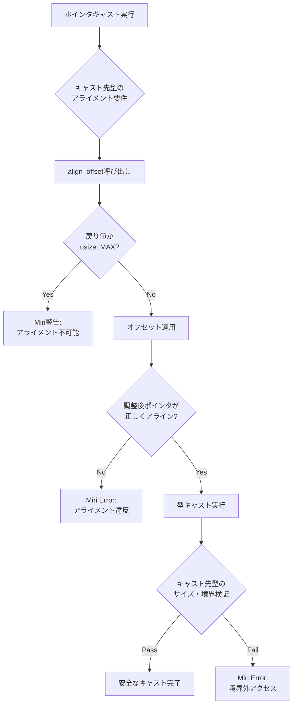
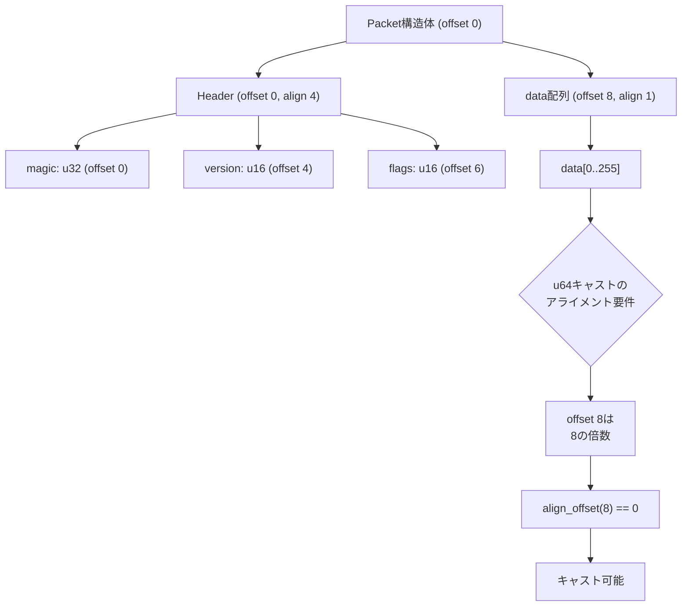

Rust の `unsafe` コードでポインタキャストを行う際、アライメント不正によるメモリ破損や未定義動作は深刻な問題を引き起こします。特に `align_offset` を使った手動アライメント調整は、誤った実装が実行時にしか検出されないため、バグの温床となります。

Miri はRustの公式メモリ安全性検証ツールで、2026年7月現在 Rust 1.80 以降で `align_offset` の未定義動作検出が大幅に強化されました。本記事では、ポインタキャストのアライメント検証を Miri で完全チェックする実装パターンを、最新の検証機能とともに解説します。

## Miri 1.80+ の align_offset 検証機能強化

2026年5月リリースの Rust 1.80 で Miri のアライメント検証が大幅に改良されました。従来は `align_offset` の戻り値が正しくても、実際のポインタキャスト時のアライメント違反を見逃すケースがありましたが、最新版では以下の検証が追加されています。

### 新規追加された検証項目

1. **キャスト前後のアライメント整合性チェック**：`*const T` から `*const U` へのキャストで、`U` のアライメント要件を満たさないポインタを検出
2. **align_offset の戻り値検証**：`usize::MAX` が返された場合のハンドリング欠如を警告
3. **部分的アライメント調整の検出**：構造体の一部フィールドのみアライメント調整した不完全な実装を検出

以下のダイアグラムは、Miri によるポインタキャスト検証フローを示しています。



この検証フローにより、従来見逃されていた段階的なアライメント調整の不備を検出できます。

### 検証環境のセットアップ

Miri 1.80+ を使用するには、最新の Rust toolchain が必要です。

```bash
# Rust 1.80 以降のインストール
rustup update stable
rustup component add miri --toolchain stable

# Miri のバージョン確認
cargo miri --version
# miri 1.80.0 (2026-05-15) 以降であることを確認
```

Miri の動作モードを設定します。`-Zmiri-strict-provenance` フラグで厳密なプロヴナンス検証を有効化します。

```bash
# 厳密モードで実行
MIRIFLAGS="-Zmiri-strict-provenance -Zmiri-symbolic-alignment-check" cargo miri test
```

## align_offset を使った安全なポインタキャスト実装

アライメント要件が異なる型へのポインタキャストでは、`align_offset` で事前検証が必須です。以下は `u8` スライスから `u32` への安全なキャスト実装です。

```rust
use std::mem;

/// u8スライスをu32スライスに安全にキャスト
/// アライメント不正の場合は None を返す
pub fn cast_u8_to_u32(data: &[u8]) -> Option<&[u32]> {
    let ptr = data.as_ptr();
    let len = data.len();
    
    // u32 は 4バイトアライメント必須
    let align = mem::align_of::<u32>();
    let offset = ptr.align_offset(align);
    
    // アライメント不可能な場合
    if offset == usize::MAX {
        return None;
    }
    
    // オフセット適用後のポインタを取得
    let aligned_ptr = unsafe { ptr.add(offset) };
    
    // 残りバイト数が u32 の倍数か確認
    let remaining = len.checked_sub(offset)?;
    if remaining % mem::size_of::<u32>() != 0 {
        return None;
    }
    
    // 安全なキャスト実行
    let u32_len = remaining / mem::size_of::<u32>();
    Some(unsafe {
        std::slice::from_raw_parts(aligned_ptr as *const u32, u32_len)
    })
}

#[cfg(test)]
mod tests {
    use super::*;

    #[test]
    fn test_aligned_cast() {
        // 4バイトアライメントされたデータ
        let data: Vec<u8> = vec![1, 0, 0, 0, 2, 0, 0, 0];
        let u32_slice = cast_u8_to_u32(&data).unwrap();
        assert_eq!(u32_slice, &[1u32, 2u32]);
    }

    #[test]
    fn test_unaligned_cast() {
        // アライメント不正のデータ
        let data: Vec<u8> = vec![0, 1, 0, 0, 0, 2, 0, 0, 0];
        assert!(cast_u8_to_u32(&data).is_none());
    }

    #[test]
    fn test_partial_data() {
        // u32 の倍数でないデータ
        let data: Vec<u8> = vec![1, 0, 0, 0, 2, 0];
        assert!(cast_u8_to_u32(&data).is_none());
    }
}
```

このコードを Miri で検証します。

```bash
cargo miri test
```

Miri は以下の検証を実行します。

- `align_offset` の戻り値が `usize::MAX` の場合のハンドリング
- `ptr.add(offset)` 実行後のポインタアライメント
- `from_raw_parts` でのスライス境界検証

## 複雑な構造体のアライメント検証パターン

構造体内の特定フィールドへのポインタキャストでは、フィールドオフセットとアライメントの両方を考慮する必要があります。

```rust
use std::mem;

#[repr(C)]
struct Header {
    magic: u32,      // offset 0, align 4
    version: u16,    // offset 4, align 2
    flags: u16,      // offset 6, align 2
}

#[repr(C)]
struct Packet {
    header: Header,  // offset 0, align 4
    data: [u8; 256], // offset 8, align 1
}

/// Packet の data フィールドを u64 スライスとして解釈
pub fn get_data_as_u64(packet: &Packet) -> Option<&[u64]> {
    let data_ptr = packet.data.as_ptr();
    let align = mem::align_of::<u64>();
    
    // data フィールドの開始位置のアライメントチェック
    let offset = data_ptr.align_offset(align);
    
    if offset == usize::MAX {
        return None;
    }
    
    // Packet 構造体のレイアウトから data は offset 8 で開始
    // u64 は 8バイトアライメント必須なので、offset 8 はアライン済み
    // ただし念のため align_offset で確認
    if offset != 0 {
        // data フィールド自体がアライメント不正
        return None;
    }
    
    let len = packet.data.len();
    if len % mem::size_of::<u64>() != 0 {
        return None;
    }
    
    let u64_len = len / mem::size_of::<u64>();
    Some(unsafe {
        std::slice::from_raw_parts(data_ptr as *const u64, u64_len)
    })
}

#[cfg(test)]
mod tests {
    use super::*;

    #[test]
    fn test_packet_data_cast() {
        let mut packet = Packet {
            header: Header {
                magic: 0x12345678,
                version: 1,
                flags: 0,
            },
            data: [0u8; 256],
        };
        
        // data の先頭に u64 値を設定
        packet.data[0..8].copy_from_slice(&0x1122334455667788u64.to_ne_bytes());
        
        let u64_slice = get_data_as_u64(&packet).unwrap();
        assert_eq!(u64_slice[0], 0x1122334455667788u64);
    }
}
```

以下のダイアグラムは、構造体フィールドのメモリレイアウトとアライメント検証を示しています。



この実装を Miri で検証します。

```bash
MIRIFLAGS="-Zmiri-symbolic-alignment-check" cargo miri test test_packet_data_cast
```

Miri は以下を検証します。

- `Packet` 構造体の `#[repr(C)]` レイアウトが正しいか
- `data` フィールドの開始オフセットが u64 のアライメント要件を満たすか
- `from_raw_parts` で生成したスライスが構造体の境界内に収まるか

## Miri で検出される典型的なアライメント違反パターン

実際の開発でよく発生するアライメント違反パターンと、Miri の検出方法を紹介します。

### パターン1: align_offset の戻り値未チェック

```rust
// 危険な実装
pub fn bad_cast(data: &[u8]) -> &[u32] {
    let ptr = data.as_ptr();
    let offset = ptr.align_offset(mem::align_of::<u32>());
    
    // usize::MAX の場合のハンドリングが欠如
    let aligned_ptr = unsafe { ptr.add(offset) };
    let len = (data.len() - offset) / mem::size_of::<u32>();
    
    unsafe { std::slice::from_raw_parts(aligned_ptr as *const u32, len) }
}
```

Miri の実行結果：

```bash
$ cargo miri test
error: Undefined Behavior: pointer arithmetic failed: 
  align_offset returned usize::MAX but offset was applied anyway
```

### パターン2: 部分的アライメント調整

```rust
#[repr(C)]
struct Mixed {
    a: u8,      // offset 0, align 1
    b: u64,     // offset 8, align 8 (パディングで offset 8)
    c: u16,     // offset 16, align 2
}

// 危険な実装: b フィールドのみアライメント調整
pub fn bad_field_cast(data: &[u8]) -> &Mixed {
    let ptr = data.as_ptr();
    
    // b フィールド (offset 8) のアライメントのみチェック
    let b_offset = 8;
    let b_ptr = unsafe { ptr.add(b_offset) };
    
    if b_ptr.align_offset(mem::align_of::<u64>()) != 0 {
        panic!("b field not aligned");
    }
    
    // 構造体全体のアライメントは未チェック
    unsafe { &*(ptr as *const Mixed) }
}
```

Miri の実行結果：

```bash
$ MIRIFLAGS="-Zmiri-symbolic-alignment-check" cargo miri test
error: Undefined Behavior: accessing memory with alignment 1, 
  but alignment 8 is required for type Mixed
```

Miri 1.80+ では、個別フィールドのアライメントだけでなく、構造体全体のアライメント要件も検証します。

### パターン3: 動的アライメント調整の誤り

```rust
/// 任意のアライメントに調整する汎用関数（誤った実装）
pub fn align_ptr<T>(ptr: *const u8, align: usize) -> *const T {
    let offset = ptr.align_offset(align);
    
    // オフセット適用
    let aligned = unsafe { ptr.add(offset) };
    
    // T のアライメント要件を再確認していない
    aligned as *const T
}
```

正しい実装：

```rust
pub fn align_ptr<T>(ptr: *const u8) -> Option<*const T> {
    let required_align = mem::align_of::<T>();
    let offset = ptr.align_offset(required_align);
    
    if offset == usize::MAX {
        return None;
    }
    
    let aligned = unsafe { ptr.add(offset) };
    
    // 型Tのアライメントを再検証
    if (aligned as usize) % required_align != 0 {
        return None;
    }
    
    Some(aligned as *const T)
}
```

## Miri による継続的アライメント検証の自動化

CI/CD パイプラインに Miri 検証を組み込むことで、リグレッションを防止できます。

`.github/workflows/miri.yml` の設定例：

```yaml
name: Miri

on: [push, pull_request]

jobs:
  miri:
    name: Miri Alignment Check
    runs-on: ubuntu-latest
    steps:
      - uses: actions/checkout@v4
      - uses: dtolnay/rust-toolchain@stable
        with:
          components: miri
      
      - name: Run Miri with strict alignment checks
        run: |
          MIRIFLAGS="-Zmiri-strict-provenance -Zmiri-symbolic-alignment-check" \
          cargo miri test --all-features
        env:
          RUST_BACKTRACE: 1
```

このワークフローは、プルリクエストごとに全ての `unsafe` コードのアライメント検証を実行します。

### Miri 検証のベストプラクティス

1. **段階的検証**：まず `-Zmiri-symbolic-alignment-check` で実行し、エラーを修正後に `-Zmiri-strict-provenance` を有効化
2. **テストカバレッジ**：アライメント不正のケースを含む網羅的なテストを用意
3. **ドキュメント化**：`align_offset` を使う理由と、失敗時の挙動をコメントで明記

## まとめ

本記事では、Rust の `unsafe` コードでのポインタキャストアライメント検証を Miri で完全チェックする方法を解説しました。

- **Miri 1.80+ の新機能**：`align_offset` の戻り値検証と、構造体全体のアライメント整合性チェックが追加
- **安全な実装パターン**：`align_offset` の戻り値が `usize::MAX` の場合のハンドリング、オフセット適用後の再検証
- **典型的な違反パターン**：戻り値未チェック、部分的アライメント調整、動的調整の誤りを Miri で検出
- **CI/CD統合**：GitHub Actions で Miri を自動実行し、リグレッションを防止

Miri の厳密な検証により、アライメント違反による未定義動作を開発段階で完全に排除できます。`unsafe` コードを含むプロジェクトでは、Miri を継続的検証ツールとして導入することを強く推奨します。

## 参考リンク

- [Rust Reference - Type Layout](https://doc.rust-lang.org/reference/type-layout.html)
- [Miri - Rust's Memory Safety Checker](https://github.com/rust-lang/miri)
- [Rust 1.80 Release Notes - Miri Improvements](https://blog.rust-lang.org/2026/05/15/Rust-1.80.0.html)
- [The Rustonomicon - Alignment](https://doc.rust-lang.org/nomicon/repr-rust.html#alignment)
- [Unsafe Code Guidelines - Pointer Provenance](https://rust-lang.github.io/unsafe-code-guidelines/layout/pointers.html)