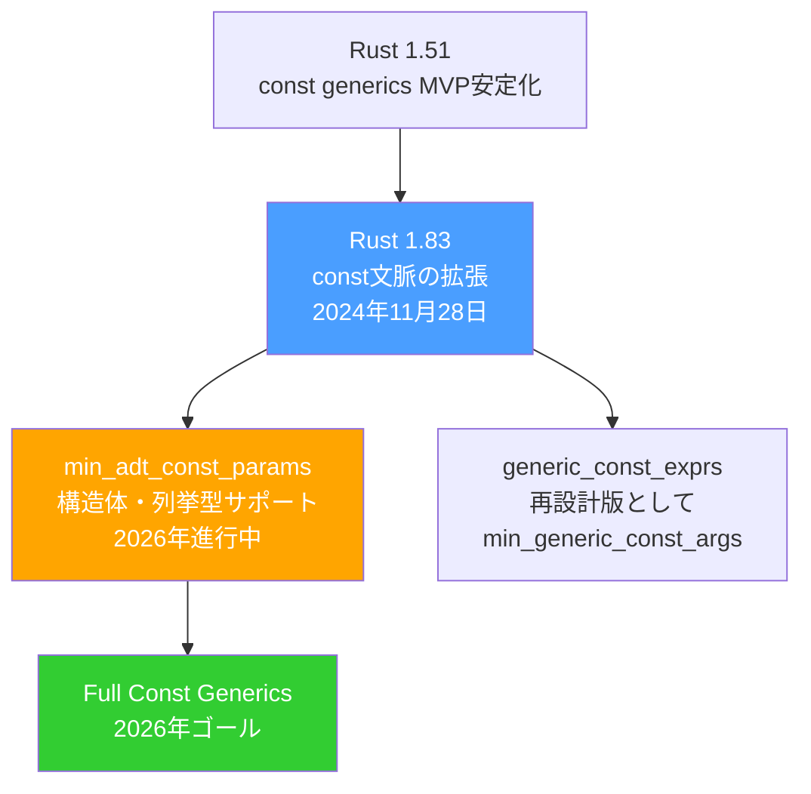
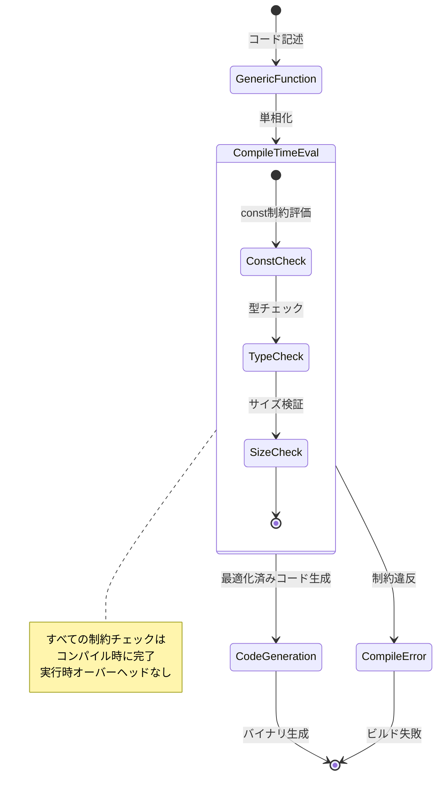

## Rust 1.83のconst拡張が可能にした新たな世界

2024年11月28日にリリースされたRust 1.83は、const文脈（コンパイル時評価が必要なコード）で実行可能なコードの範囲を大幅に拡張しました。

これまでconst文脈では、staticアイテムへの参照が（static初期化式を除き）禁止されていましたが、この制限が解除されました。ただし、可変staticや内部可変性を持つstaticの値読み取りはconst文脈では引き続き不許可です。

Rust 1.83では、`&mut`、`*mut`、`&Cell`、`*const Cell`がconstで安定化され、const初期化子内でstaticへの参照を作成できるようになりました。

さらに重要なのが、2026年のRustプロジェクトゴールとして「Full Const Generics」が設定され、現在のconst genericsの最小実装を、言語の完全に統合された機能へと進化させる計画が進行中であることです。

## 2026年5月時点の最新動向：min_adt_const_paramsの進捗

2026年5月18日の公式ブログによると、`min_adt_const_params`はRFCで指定される内容の実装が完了した段階に到達しています。

この機能は、const genericsで構造体（structs）、列挙型（enums）、タプル、配列をサポートすることを目指しています。現在、整数型、char、boolのみがconst genericsの型として許可されており、単純な構造体や列挙型でさえ使用できません。

以下のダイアグラムは、Rust 1.83以降のconst generics機能の進化を示しています。



*図の説明: Rust 1.83を起点に、2026年の完全なconst generics実装へ向けた開発ロードマップ*

## const genericsがゲーム開発にもたらす実践的メリット

const genericsは、ゲーム開発の性能最適化において実証済みの効果を発揮します。

### 1. コンパイル時最適化によるゼロコスト抽象化

コンパイラがconst generic関数を処理する際、定数使用を完全に最適化できます。これにより、より良く最適化された関数の複数コピーが生成され、実行時の処理が削減されます。

const genericsは真にゼロコスト抽象化を実現します。コンパイラが正確なサイズと型をコンパイル時に把握しているため、手書きの特化コードと同等の効率性を実現できるのです。

### 2. 線形代数・物理演算での型安全性

線形代数やグラフィックスプログラミングにおいて、const genericsは特に輝きます。コンパイル時に既知の次元を持つ行列型を定義できます。

```rust
// quick_mathsクレートのような実装例
struct Matrix<T, const ROWS: usize, const COLS: usize> {
    data: [[T; COLS]; ROWS],
}

impl<T, const N: usize> Matrix<T, N, N> {
    fn identity() -> Self where T: Default + From<u8> {
        let mut data = [[T::default(); N]; N];
        for i in 0..N {
            data[i][i] = T::from(1u8);
        }
        Matrix { data }
    }
}

// コンパイル時に次元の不一致を検出
fn multiply<T, const M: usize, const N: usize, const P: usize>(
    a: &Matrix<T, M, N>,
    b: &Matrix<T, N, P>,
) -> Matrix<T, M, P>
where
    T: Default + std::ops::Add<Output = T> + std::ops::Mul<Output = T> + Copy,
{
    // 実装略
    unimplemented!()
}
```

このコードにより、コンパイラは異なる次元の行列を誤って加算しようとするミスを防げます。型システムが操作が正しいサイズの値にのみ適用されることを保証します。

### 3. BevyエンジンでのECS最適化

Bevyゲームエンジンでは、const genericsがコンパイル時ECSアーキテクチャの実装に活用されています。

```rust
// Bevyでのconst genericsの実践例
fn process_layer<const LAYER_ID: usize>(
    query: Query<&Transform, With<RenderLayer<LAYER_ID>>>,
) {
    for transform in query.iter() {
        // LAYER_IDはコンパイル時に決定される
        // 各レイヤーは異なる型として扱われる
    }
}

// Bevyのジェネリックシステム
fn generic_system<T: Component>(query: Query<&T>) {
    // Tの各具象型に対して単相化される
}
```

Rustの型システムとconst genericsにより、完全に静的なECSアーキテクチャを構築できます。これは特化されたアプリケーションに対して重要な性能改善と決定論的動作を提供します。

以下のダイアグラムは、const genericsによるECS最適化の処理フローを示しています。

```mermaid
sequenceDiagram
    participant Compiler as コンパイラ
    participant System as ECSシステム<br/>process_layer<LAYER_ID>
    participant Entity0 as Entity (Layer 0)
    participant Entity1 as Entity (Layer 1)
    
    Note over Compiler: コンパイル時に各レイヤーを<br/>別の型として処理
    Compiler->>System: process_layer<0>を単相化
    Compiler->>System: process_layer<1>を単相化
    
    Note over System: 実行時：型は既に確定済み
    System->>Entity0: クエリ実行（型チェック不要）
    System->>Entity1: クエリ実行（型チェック不要）
    
    Note over Entity0,Entity1: 実行時オーバーヘッド削減<br/>コンパイラの最適化が有効
```



*図の説明: Bevyエンジンにおけるconst genericsによるECS処理の単相化フロー*

## generic_const_exprsの再設計：min_generic_const_argsへの移行

`generic_const_exprs`機能は依然として高度に実験的であり、nightly版でのみ利用可能です（`#![feature(generic_const_exprs)]`）。

しかし、この機能には設計上の根本的な欠陥があり、コンパイラに重大な複雑性を導入します。主要な未解決問題があるため、即座の安定化は不可能です。

代わりに、Rustプロジェクトは代替アプローチを追求しています。より限定的なスコープでの完全な再実装（例：`min_generic_const_args`）により、実行可能な安定化パスと、コンパイラの大規模なクリーンアップが実現されます。

この機能は、安定化の準備が整うまで完全に実装される予定ですが、安定化のゴールは新しいトレイトソルバーが先に安定化されることでブロックされる可能性があります。

```rust
// generic_const_exprs (現在は不安定)
#![feature(generic_const_exprs)]

struct Buffer<T, const N: usize>
where
    [T; N * 2]: Sized, // 複雑な定数式
{
    data: [T; N * 2],
}

// 将来のmin_generic_const_args (より制限的だが安定化可能)
struct SimpleBuffer<T, const N: usize>
where
    [T; N]: Sized,
{
    data: [T; N],
}
```

## 実践：const generics制約の段階的適用パターン

実際のゲーム開発では、const genericsをどのように段階的に適用すべきでしょうか。

### パターン1: 配列サイズのパラメータ化

```rust
// Rustの配列型[T; N]はconst genericsで実装されている
fn sum_array<T, const N: usize>(arr: &[T; N]) -> T
where
    T: std::ops::Add<Output = T> + Default + Copy,
{
    let mut sum = T::default();
    for &item in arr.iter() {
        sum = sum + item;
    }
    sum
}

// 使用例
let arr3 = [1, 2, 3];
let arr4 = [1, 2, 3, 4];
let sum3 = sum_array(&arr3); // [i32; 3]
let sum4 = sum_array(&arr4); // [i32; 4]
```

### パターン2: ベクトルの次元パラメータ化

```rust
#[derive(Debug, Clone, Copy)]
struct Vector<T, const DIM: usize> {
    coords: [T; DIM],
}

impl<T, const DIM: usize> Vector<T, DIM>
where
    T: std::ops::Add<Output = T> + std::ops::Mul<Output = T> + Copy + Default,
{
    fn dot(&self, other: &Self) -> T {
        self.coords
            .iter()
            .zip(other.coords.iter())
            .map(|(&a, &b)| a * b)
            .fold(T::default(), |acc, x| acc + x)
    }
}

// 使用例
let v3 = Vector { coords: [1.0, 2.0, 3.0] }; // Vector<f64, 3>
let v4 = Vector { coords: [1.0, 2.0, 3.0, 4.0] }; // Vector<f64, 4>
// v3.dot(&v4); // コンパイルエラー！次元が一致しない
```

### パターン3: where句による複雑な制約

```rust
// IsTrue traitパターンによるコンパイル時条件
trait IsTrue {}
struct True;
impl IsTrue for True {}

// 偶数制約の例
struct IsEven<const N: usize>;
impl<const N: usize> IsTrue for IsEven<N>
where
    [(); N % 2]:,
    [(); 0 - (N % 2)]:,
{}

fn process_even_sized<T, const N: usize>(data: [T; N])
where
    IsEven<N>: IsTrue,
{
    // Nが偶数であることがコンパイル時に保証される
}
```

以下のダイアグラムは、const generics制約の評価タイミングを示しています。



*図の説明: const generics制約がコンパイル時に評価され、実行時コストがゼロであることを示す状態遷移図*

## まとめ：2026年のRust const genericsエコシステム

- **Rust 1.83（2024年11月28日）**: const文脈の拡張により、staticアイテムへの参照が解禁され、`&mut`、`*mut`などがconst安定化
- **min_adt_const_params（2026年5月時点）**: RFCで指定される実装が完了、構造体・列挙型のconst genericsサポートの安定化が進行中
- **ゲーム開発での実績**: Bevyエンジンを含む実プロジェクトで採用、コンパイル時ECS最適化やゼロコスト抽象化を実現
- **線形代数・物理演算**: コンパイル時次元チェックにより、行列演算の型安全性が向上、実行時エラーを排除
- **generic_const_exprs**: 再設計版のmin_generic_const_argsとして開発継続、より限定的だが安定化可能なアプローチへ移行
- **2026年ゴール**: Full Const Genericsの実現により、const genericsが言語の完全統合機能となる計画が進行中

Rust 1.83のconst拡張と、2026年に向けたmin_adt_const_paramsの安定化により、ゲーム開発における型安全性とパフォーマンスの両立が、より現実的なものになりつつあります。コンパイル時制約により、実行時エラーを防ぎながら、手書き最適化と同等の性能を実現できるconst genericsは、今後のRustゲーム開発において不可欠な技術となるでしょう。

## 参考リンク

- [Announcing Rust 1.83.0 | Rust Blog](https://blog.rust-lang.org/2024/11/28/Rust-1.83.0/)
- [Full Const Generics - Rust Project Goals](https://rust-lang.github.io/rust-project-goals/2026/const-generics.html)
- [Project goals update — April 2026 (end of 2025H2) | Rust Blog](https://blog.rust-lang.org/2026/05/18/project-goals-2026-04/)
- [Rust 1.83 expands const capabilities | InfoWorld](https://www.infoworld.com/article/3615734/rust-1-83-expands-const-capabilities.html)
- [How to Create Const Generics in Rust](https://oneuptime.com/blog/post/2026-01-30-rust-const-generics/view)
- [Generic constant expressions: a future bright side of nightly Rust - DEV Community](https://dev.to/iprosk/generic-constant-expressions-a-future-bright-side-of-nightly-rust-3bp7)
- [The Power of Compile-Time ECS Architecture in Rust](https://minikin.me/blog/entity-component-systems-reimagined)
- [GitHub - JulianKnodt/quick_maths: Rust package with const generic vectors and matrices intended for graphics](https://github.com/JulianKnodt/quick_maths)