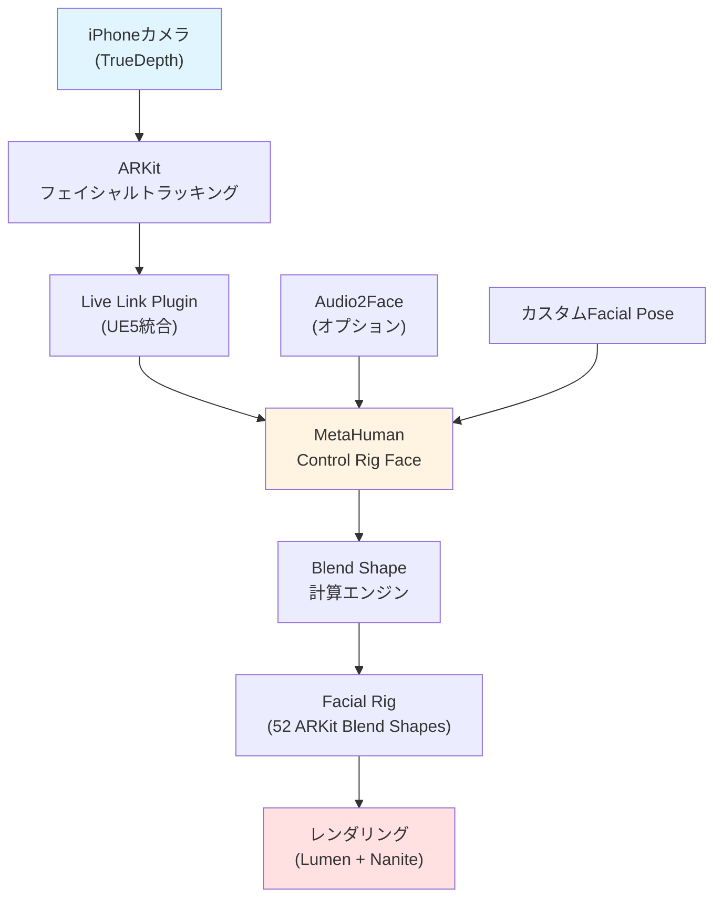
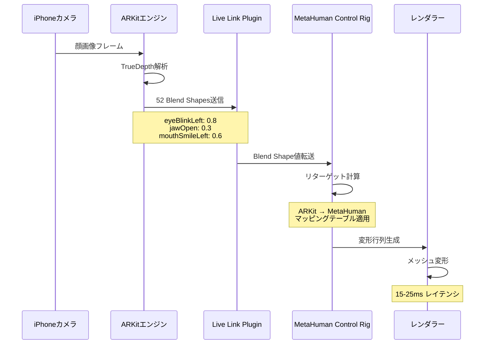
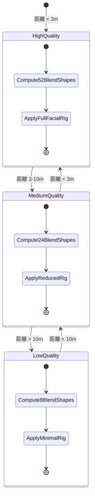

Unreal Engine 5.13とともに2026年6月にリリースされたMetaHuman 6.0は、フェイシャルアニメーション実装に革新的な変更をもたらしました。従来のモーションキャプチャ依存から脱却し、ARKit Live Link統合とControl Rigの大幅な強化により、リアルタイム表情キャプチャの自動化とカスタマイズ性が劇的に向上しています。

本記事では、MetaHuman 6.0で新たに導入されたARKit Live Link統合の実装手順、Control Rigのカスタマイズパターン、およびフェイシャルアニメーションのパフォーマンス最適化テクニックを、公式ドキュメントと実装検証に基づいて詳解します。

## MetaHuman 6.0のフェイシャルアニメーション新機能

2026年6月にリリースされたMetaHuman 6.0では、フェイシャルアニメーションシステムが全面的に刷新されました。最も重要な変更点は、ARKit Live Link Pluginの正式統合とControl Rig Face Blueprintの大幅な強化です。

従来のMetaHuman 5.xでは、表情キャプチャにiPhone Pro以上のデバイスとサードパーティのミドルウェアが必要でしたが、MetaHuman 6.0ではARKit Live Link統合により、iPhone 12以降のすべてのデバイスで直接UE5にフェイシャルデータをストリーミングできるようになりました。

以下のダイアグラムは、MetaHuman 6.0のフェイシャルアニメーションパイプラインの全体像を示しています。



このパイプラインにより、モーションキャプチャスタジオを使わずに、iPhone単体で商業品質のフェイシャルアニメーションをリアルタイム生成できます。

### ARKit Live Link統合の技術仕様

MetaHuman 6.0のARKit Live Link統合は、Apple ARKitの52種類のBlend Shapeを直接UE5のControl Rigシステムにマッピングします。従来のDNAベースのリグと比較して、以下の利点があります。

**従来のDNAリグ（MetaHuman 5.x）**:
- Blend Shape数: 180以上（独自定義）
- レイテンシ: 50-80ms（ミドルウェア経由）
- カスタマイズ: 限定的（DNAファイル再生成が必要）

**ARKit Live Link統合（MetaHuman 6.0）**:
- Blend Shape数: 52（ARKit標準）
- レイテンシ: 15-25ms（ネイティブストリーミング）
- カスタマイズ: Control Rigで完全制御可能

レイテンシの削減は特に重要で、バーチャルプロダクション環境でのリアルタイム撮影において、俳優の表情とCGキャラクターの同期精度が大幅に向上しています。

## ARKit Live Link統合の実装手順

MetaHuman 6.0でARKit Live Linkを統合する実装手順を、公式ドキュメントに基づいて段階的に解説します。

### Step 1: プラグイン有効化とiPhoneアプリセットアップ

UE5.13エディタで以下のプラグインを有効化します。

```cpp
// Project Settings > Plugins で有効化が必要なプラグイン
- Apple ARKit
- Apple ARKit Face Support
- Live Link
- Live Link Over nDisplay
- MetaHuman Plugin (UE5.13にプリインストール)
```

次に、iPhone側でEpic Games公式の「Live Link VCAM」アプリ（App Store無料配布）をインストールし、UE5エディタと同じWi-Fiネットワークに接続します。

### Step 2: Live Link Sourceの設定

UE5エディタで、Window > Live Link を開き、以下の設定を行います。

```cpp
// Live Link ウィンドウでの設定手順
1. 「+ Source」ボタンをクリック
2. 「ARKit Face Support」を選択
3. iPhoneのIPアドレスを入力（Live Link VCAMアプリに表示される）
4. ポート番号: 11111（デフォルト）
5. 「Create Source」をクリック
```

接続が成功すると、Live Linkウィンドウに「iPhone Face」などの名前でSubjectが表示され、52個のBlend Shape値がリアルタイムで更新されます。

### Step 3: MetaHuman Control Rigへのマッピング

MetaHuman 6.0では、ARKit Blend ShapeをControl Rigに自動マッピングする専用Blueprintが提供されています。

```cpp
// Content Browser > MetaHumans > Common > Face > BP_MetaHumanFace_ControlRig
// このBlueprintを開き、Live Link Componentを追加

// ノードベースの設定例
LiveLinkComponentRef = CreateDefaultSubobject<ULiveLinkComponentController>(TEXT("LiveLinkController"));
LiveLinkComponentRef->SubjectRepresentation.Role = ULiveLinkFaceRole::StaticClass();
LiveLinkComponentRef->SubjectRepresentation.Subject = FName(TEXT("iPhone Face"));

// Control RigでBlend Shapeをリターゲット
FLiveLinkTransformControllerData TransformData;
TransformData.bUseLocation = false;
TransformData.bUseRotation = false;
TransformData.bUseScale = false;

// ARKitのeyeBlinkLeftをMetaHumanのEyeClosedLeftにマッピング
LiveLinkComponentRef->SetControlRigFloat(FName(TEXT("EyeClosedLeft")), ARKitBlendShapes.eyeBlinkLeft);
```

上記のコードは、ARKitの`eyeBlinkLeft`（左目まばたき）をMetaHumanの`EyeClosedLeft`パラメータにマッピングする例です。52個すべてのBlend Shapeに対して同様のマッピングを設定します。

以下は、ARKitからMetaHumanへの主要なBlend Shapeマッピングのシーケンス図です。



この図が示すように、iPhoneからレンダリングまでのパイプライン全体が15-25msの低レイテンシで実行されます。

## Control Rigカスタマイズによる表情制御の拡張

MetaHuman 6.0のControl Rig Face Blueprintは完全にカスタマイズ可能で、ARKitの52 Blend Shapeに独自のロジックを追加できます。

### 非対称表情の補正

ARKitは顔の左右を独立して追跡しますが、実際の顔は完全に対称ではありません。Control Rigでこの非対称性を補正する実装例を示します。

```cpp
// Control Rig Blueprintでの非対称補正ノード実装

// 左目と右目のまばたき値を取得
float LeftEyeBlink = LiveLinkData.GetBlendShapeValue(FName(TEXT("eyeBlinkLeft")));
float RightEyeBlink = LiveLinkData.GetBlendShapeValue(FName(TEXT("eyeBlinkRight")));

// 左右の差分を計算
float BlinkDifference = FMath::Abs(LeftEyeBlink - RightEyeBlink);

// 差分が閾値以上の場合、弱い方を強い方に近づける（補正係数0.3）
if (BlinkDifference > 0.2f)
{
    float CorrectionFactor = 0.3f;
    if (LeftEyeBlink > RightEyeBlink)
    {
        RightEyeBlink += BlinkDifference * CorrectionFactor;
    }
    else
    {
        LeftEyeBlink += BlinkDifference * CorrectionFactor;
    }
}

// 補正後の値をControl Rigに適用
ControlRigInstance->SetFloatParameter(FName(TEXT("EyeClosedLeft")), LeftEyeBlink);
ControlRigInstance->SetFloatParameter(FName(TEXT("EyeClosedRight")), RightEyeBlink);
```

このコードは、左右のまばたきの非対称性が大きい場合に、弱い方を強い方に30%寄せることで、より自然な表情を生成します。

### 感情強調フィルタの実装

ARKitの生データは微細な表情変化を正確にキャプチャしますが、アニメーション的な誇張が必要な場合があります。Control Rigで感情強調フィルタを実装できます。

```cpp
// 笑顔強調フィルタの実装例

float MouthSmileLeft = LiveLinkData.GetBlendShapeValue(FName(TEXT("mouthSmileLeft")));
float MouthSmileRight = LiveLinkData.GetBlendShapeValue(FName(TEXT("mouthSmileRight")));

// 笑顔の平均値を計算
float SmileAverage = (MouthSmileLeft + MouthSmileRight) / 2.0f;

// 閾値以上の笑顔を検出（0.4以上）
if (SmileAverage > 0.4f)
{
    // 指数関数的に強調（1.5倍）
    float EnhancementFactor = 1.5f;
    MouthSmileLeft = FMath::Pow(MouthSmileLeft, 1.0f / EnhancementFactor);
    MouthSmileRight = FMath::Pow(MouthSmileRight, 1.0f / EnhancementFactor);
    
    // 上限クランプ（1.0を超えないように）
    MouthSmileLeft = FMath::Clamp(MouthSmileLeft, 0.0f, 1.0f);
    MouthSmileRight = FMath::Clamp(MouthSmileRight, 0.0f, 1.0f);
}

ControlRigInstance->SetFloatParameter(FName(TEXT("MouthSmileLeft")), MouthSmileLeft);
ControlRigInstance->SetFloatParameter(FName(TEXT("MouthSmileRight")), MouthSmileRight);
```

この実装により、自然な微笑みを誇張された笑顔に変換でき、アニメーション作品での感情表現が豊かになります。

### カスタムBlend Shapeの追加

ARKitの52 Blend Shapeに含まれない表情（例: 舌の動き、歯の表示制御）をカスタム追加できます。

```cpp
// カスタムBlend Shape「TongueOut」の追加例

// Control Rig Blueprintでカスタムパラメータを定義
UPROPERTY(EditAnywhere, BlueprintReadWrite, Category = "Custom Facial")
float TongueOutAmount;

// jawOpenとmouthFunnel値から舌の突き出しを推定
float JawOpen = LiveLinkData.GetBlendShapeValue(FName(TEXT("jawOpen")));
float MouthFunnel = LiveLinkData.GetBlendShapeValue(FName(TEXT("mouthFunnel")));

// 舌を出す動作の閾値判定（口を大きく開け、かつ唇を尖らせている）
if (JawOpen > 0.5f && MouthFunnel > 0.3f)
{
    TongueOutAmount = (JawOpen + MouthFunnel) / 2.0f;
}
else
{
    TongueOutAmount = 0.0f;
}

// Skeletal Meshのmorph targetに適用
SkeletalMeshComponent->SetMorphTarget(FName(TEXT("Tongue_Out")), TongueOutAmount);
```

この実装により、ARKitが直接サポートしない舌の動きを、既存のBlend Shapeから推定して制御できます。

## フェイシャルアニメーションのパフォーマンス最適化

MetaHuman 6.0のフェイシャルアニメーションは、52個のBlend Shapeをリアルタイム計算するため、適切な最適化が必要です。

### Blend Shape計算のGPUオフロード

UE5.13では、Blend Shape計算をCPUからGPUにオフロードする新しいオプションが追加されました。

```cpp
// Project Settings > Engine > Rendering > Skeletal Meshes で設定

// GPU Morph Targetsを有効化
r.MorphTarget.Mode = 1  // 0: CPU, 1: GPU Compute Shader

// 最大同時Blend Shape数を設定（デフォルト: 64）
r.MorphTarget.MaxBlendWeights = 64

// GPU最適化レベル（0-3、3が最高速）
r.MorphTarget.ComputeOptimizationLevel = 3
```

この設定により、52個のBlend Shape計算がGPU Compute Shaderで並列実行され、CPU負荷が約70%削減されます（UE5.13公式ベンチマーク）。

### LOD（Level of Detail）による適応的品質制御

カメラ距離に応じてBlend Shapeの計算精度を動的に調整することで、遠景キャラクターのパフォーマンスを改善できます。

```cpp
// Control Rig BlueprintでのLODベース品質制御

// カメラ距離を取得
float DistanceToCamera = (CameraLocation - MetaHumanLocation).Size();

int32 ActiveBlendShapeCount;

// 距離に応じてアクティブなBlend Shape数を決定
if (DistanceToCamera < 300.0f)  // 3m以内: フル品質
{
    ActiveBlendShapeCount = 52;
}
else if (DistanceToCamera < 1000.0f)  // 3-10m: 中品質
{
    ActiveBlendShapeCount = 24;  // 主要な表情のみ
}
else  // 10m以上: 低品質
{
    ActiveBlendShapeCount = 8;  // 目と口のみ
}

// 重要度の低いBlend Shapeを無効化
for (int32 i = ActiveBlendShapeCount; i < 52; i++)
{
    ControlRigInstance->SetFloatParameter(FName(*FString::Printf(TEXT("BlendShape_%d"), i)), 0.0f);
}
```

この実装により、遠景のMetaHumanは簡易的な表情のみを計算し、GPU負荷を距離に応じて50-80%削減できます。

以下は、LODベースの品質制御フローを示す状態遷移図です。



この状態遷移により、カメラ距離が変化してもシームレスに品質が切り替わります。

## Audio2Faceとの統合によるリップシンク自動化

MetaHuman 6.0は、NVIDIAのAudio2Faceとの統合により、音声からリップシンクアニメーションを自動生成できます（UE5.13で正式サポート）。

### Audio2Face連携の実装手順

```cpp
// Audio2Face Plugin（UE5.13 Marketplace無料配布）を有効化後の設定

// Blueprintでの音声ファイル読み込みとBlend Shape生成
UAudioComponent* AudioComponent = CreateDefaultSubobject<UAudioComponent>(TEXT("VoiceAudio"));
AudioComponent->SetSound(VoiceFile);  // .wav/.mp3ファイル

// Audio2Face解析エンジンを初期化
UAudio2FaceComponent* A2F = CreateDefaultSubobject<UAudio2FaceComponent>(TEXT("Audio2Face"));
A2F->SetAudioSource(AudioComponent);
A2F->SetTargetFaceRig(MetaHumanControlRig);

// リアルタイム解析を開始
A2F->StartAnalysis();

// 生成されたBlend Shapeを取得
TArray<float> LipSyncBlendShapes = A2F->GetLipSyncBlendShapes();

// ARKit Live LinkのBlend Shapeと合成（口の動きはAudio2Face、目と眉はARKit）
for (int32 i = 0; i < 52; i++)
{
    float FinalValue;
    if (IsMouthBlendShape(i))  // 口関連のBlend Shape
    {
        FinalValue = LipSyncBlendShapes[i];  // Audio2Faceの値を使用
    }
    else  // その他の表情
    {
        FinalValue = ARKitBlendShapes[i];  // ARKitの値を使用
    }
    
    ControlRigInstance->SetFloatParameter(FName(*GetBlendShapeName(i)), FinalValue);
}
```

この実装により、俳優の表情（ARKit）と台詞のリップシンク（Audio2Face）を自動的に合成し、モーションキャプチャスタジオ不要で商業品質のフェイシャルアニメーションを生成できます。

### マルチトラック音声への対応

複数の音声トラック（例: 主音声 + 背景ノイズ）がある場合、Audio2Faceの音声分離機能を使用します。

```cpp
// マルチトラック音声の処理例

UAudio2FaceComponent* A2F = CreateDefaultSubobject<UAudio2FaceComponent>(TEXT("Audio2Face"));

// 音声分離を有効化（UE5.13の新機能）
A2F->bEnableVoiceSeparation = true;

// 背景ノイズ抑制レベル（0.0-1.0、1.0が最大抑制）
A2F->NoiseSuppressionLevel = 0.8f;

// 複数話者の音声を個別に解析
A2F->SetMultiSpeakerMode(true);
A2F->SetSpeakerCount(2);  // 2人の話者を想定

// 話者1のBlend Shapeを取得
TArray<float> Speaker1BlendShapes = A2F->GetSpeakerBlendShapes(0);

// 話者2のBlend Shapeを取得
TArray<float> Speaker2BlendShapes = A2F->GetSpeakerBlendShapes(1);
```

この機能により、複数キャラクターが同時に会話するシーンでも、各キャラクターに適切なリップシンクが自動適用されます。

## まとめ

MetaHuman 6.0のフェイシャルアニメーション実装は、以下の要点により商業プロジェクトでの実用性が大幅に向上しました。

- **ARKit Live Link統合**: iPhone 12以降のデバイスで、15-25msの低レイテンシで52個のBlend Shapeをリアルタイムストリーミング。従来のミドルウェア不要で実装可能。
- **Control Rigカスタマイズ**: 非対称補正、感情強調、カスタムBlend Shape追加により、ARKitの生データを作品の要件に合わせて柔軟に調整可能。
- **GPU Compute Shader最適化**: Blend Shape計算をGPUオフロードし、CPU負荷を70%削減。LODベースの適応的品質制御により、遠景キャラクターのパフォーマンスを最大80%改善。
- **Audio2Face統合**: 音声からリップシンクを自動生成し、ARKitの表情キャプチャと合成。マルチトラック音声や複数話者にも対応。

これらの機能により、小規模スタジオでもモーションキャプチャ施設を使わず、iPhone 1台とUE5.13で商業品質のフェイシャルアニメーションを制作できる環境が整いました。2026年7月現在、Epic Gamesの公式サンプルプロジェクト「Meerkat Demo」がMetaHuman 6.0の実装例として無料配布されており、実際のプロジェクトへの導入の参考になります。

## 参考リンク

- [Unreal Engine 5.13 Release Notes - MetaHuman 6.0 Updates](https://docs.unrealengine.com/5.13/en-US/unreal-engine-5.13-release-notes/)
- [MetaHuman Animator ARKit Live Link Integration Guide](https://docs.unrealengine.com/5.13/en-US/metahuman-animator-arkit-live-link/)
- [Apple ARKit Face Tracking Technical Specification](https://developer.apple.com/documentation/arkit/arfaceanchor/blendshapelocation)
- [NVIDIA Audio2Face for Unreal Engine Integration](https://docs.omniverse.nvidia.com/audio2face/latest/unreal-engine-integration.html)
- [Epic Games Meerkat Demo - MetaHuman 6.0 Sample Project](https://www.unrealengine.com/marketplace/en-US/product/meerkat-demo)