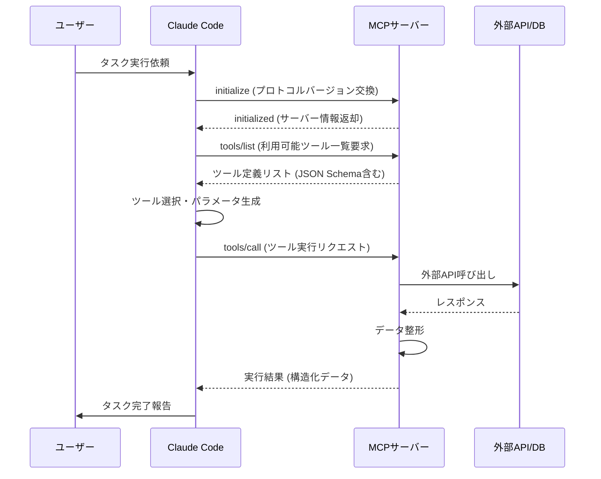
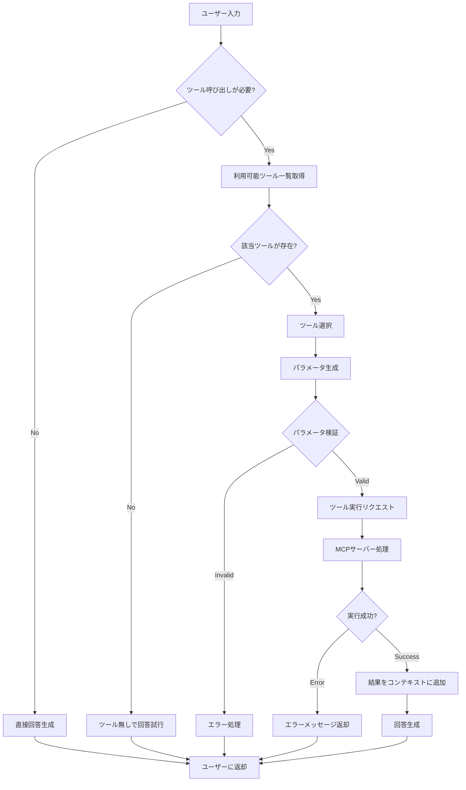
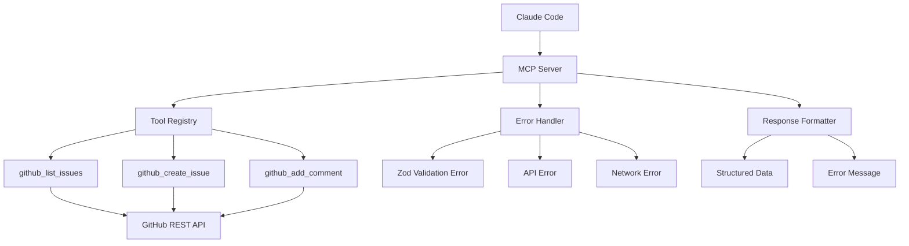
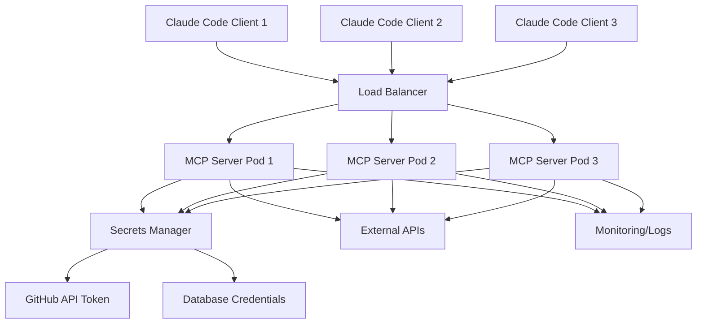

Claude Code の MCP (Model Context Protocol) サーバー機能は、2026年5月のバージョン1.4.0で大幅に拡張され、カスタムツールの統合が大幅に簡略化されました。本記事では、MCP サーバーの実装から本番デプロイまでの完全な手順を、実際に動作するコード例とともに解説します。

MCP は Claude Code がサードパーティツール・API・データベースと通信するための標準プロトコルです。2026年7月現在、Gmail・POST.・Slack・Linear など主要サービスの公式 MCP サーバーが提供されていますが、独自のビジネスロジック・社内ツール・プロプライエタリAPIを統合するには、カスタム MCP サーバーの実装が必要です。

## MCP プロトコルアーキテクチャの理解

MCP は JSON-RPC 2.0 をベースとした双方向通信プロトコルです。Claude Code (クライアント) と MCP サーバー間で、ツール定義・実行リクエスト・結果返却を行います。

以下のシーケンス図は、Claude Code が MCP サーバーとやり取りする際の典型的な通信フローを示しています。



MCP サーバーは以下の責務を持ちます。

- **ツール定義の提供**: 各ツールの名前・説明・パラメータスキーマを JSON Schema 形式で公開
- **リクエスト検証**: Claude Code からのパラメータを検証し、不正な入力を拒否
- **外部システム連携**: API 呼び出し・データベースクエリ・ファイル操作などを実行
- **エラーハンドリング**: 外部システムの障害を適切にハンドリングし、エラー情報を返却

2026年5月のアップデートで、MCP SDK (`@anthropics/mcp-sdk`) がバージョン2.0にアップデートされ、以下の機能が追加されました。

- **Streaming Responses**: 大量データを段階的に返却する機能
- **Resource Metadata**: ツールが操作するリソース（ファイル・DB レコード等）のメタデータ提供
- **Session Management**: 複数ターンに渡るコンテキスト保持機能

## TypeScript による MCP サーバーの基本実装

最もシンプルな MCP サーバーを実装してみましょう。ここでは、現在時刻を返す `get_current_time` ツールを例にします。

まず、プロジェクトをセットアップします。

```bash
mkdir my-mcp-server && cd my-mcp-server
npm init -y
npm install @anthropics/mcp-sdk zod
npm install -D typescript @types/node tsx
```

`tsconfig.json` を作成します。

```json
{
  "compilerOptions": {
    "target": "ES2022",
    "module": "commonjs",
    "strict": true,
    "esModuleInterop": true,
    "skipLibCheck": true,
    "forceConsistentCasingInFileNames": true,
    "outDir": "./dist"
  },
  "include": ["src/**/*"]
}
```

`src/index.ts` に MCP サーバーの実装を記述します。

```typescript
import { Server } from '@anthropics/mcp-sdk/server/index.js';
import { StdioServerTransport } from '@anthropics/mcp-sdk/server/stdio.js';
import { z } from 'zod';

// ツールパラメータのスキーマ定義
const GetCurrentTimeSchema = z.object({
  timezone: z.string().optional().describe('タイムゾーン (例: Asia/Tokyo)'),
  format: z.enum(['iso', 'unix', 'readable']).optional().describe('出力形式')
});

// MCP サーバーインスタンス作成
const server = new Server(
  {
    name: 'my-time-server',
    version: '1.0.0'
  },
  {
    capabilities: {
      tools: {}
    }
  }
);

// ツール定義の登録
server.setRequestHandler('tools/list', async () => ({
  tools: [
    {
      name: 'get_current_time',
      description: '現在時刻を取得します。タイムゾーンと出力形式を指定できます。',
      inputSchema: {
        type: 'object',
        properties: {
          timezone: {
            type: 'string',
            description: 'タイムゾーン (例: Asia/Tokyo)',
            default: 'UTC'
          },
          format: {
            type: 'string',
            enum: ['iso', 'unix', 'readable'],
            description: '出力形式',
            default: 'iso'
          }
        }
      }
    }
  ]
}));

// ツール実行ハンドラの登録
server.setRequestHandler('tools/call', async (request) => {
  const { name, arguments: args } = request.params;

  if (name === 'get_current_time') {
    // パラメータ検証
    const validated = GetCurrentTimeSchema.parse(args);
    const timezone = validated.timezone || 'UTC';
    const format = validated.format || 'iso';

    // 現在時刻取得
    const now = new Date();
    const formatter = new Intl.DateTimeFormat('ja-JP', {
      timeZone: timezone,
      year: 'numeric',
      month: '2-digit',
      day: '2-digit',
      hour: '2-digit',
      minute: '2-digit',
      second: '2-digit',
      timeZoneName: 'short'
    });

    let result: string;
    if (format === 'iso') {
      result = now.toISOString();
    } else if (format === 'unix') {
      result = Math.floor(now.getTime() / 1000).toString();
    } else {
      result = formatter.format(now);
    }

    return {
      content: [
        {
          type: 'text',
          text: `現在時刻 (${timezone}): ${result}`
        }
      ]
    };
  }

  throw new Error(`Unknown tool: ${name}`);
});

// サーバー起動
async function main() {
  const transport = new StdioServerTransport();
  await server.connect(transport);
  console.error('MCP Server started');
}

main().catch(console.error);
```

このコードでは、Zod を使ってパラメータ検証を行い、タイムゾーンと出力形式を柔軟に指定できるようにしています。

`package.json` に実行スクリプトを追加します。

```json
{
  "scripts": {
    "build": "tsc",
    "start": "node dist/index.js",
    "dev": "tsx src/index.ts"
  }
}
```

ビルドして実行します。

```bash
npm run build
npm start
```

このサーバーは標準入出力で MCP プロトコルを処理します。Claude Code から直接呼び出すには、設定ファイルに登録する必要があります。

## Claude Code への MCP サーバー登録と動作確認

実装した MCP サーバーを Claude Code に登録します。`~/.claude/settings.json` を編集します。

```json
{
  "mcpServers": {
    "my-time-server": {
      "command": "node",
      "args": ["/path/to/my-mcp-server/dist/index.js"],
      "env": {}
    }
  }
}
```

Claude Code を再起動すると、MCP サーバーが自動的にロードされます。ツールが正しく認識されているか確認するには、以下のコマンドを実行します。

```bash
claude /tasks
```

出力に `my-time-server` が表示されていれば成功です。

Claude Code のチャットで以下のように入力して動作確認します。

```
現在の東京の時刻を教えてください
```

Claude Code は自動的に `get_current_time` ツールを呼び出し、結果を返却します。

```
現在時刻 (Asia/Tokyo): 2026-07-15 14:32:45 JST
```

以下のフローチャートは、Claude Code がユーザー入力から適切なツールを選択・実行するまでの意思決定プロセスを示しています。



このフローチャートから分かるように、Claude Code は複数のツールが登録されている場合でも、コンテキストから最も適切なツールを自動選択します。

## 複数ツールの統合と高度な機能実装

実際のユースケースでは、複数のツールを連携させる必要があります。以下は、GitHub API を統合した MCP サーバーの実装例です。

```typescript
import { Server } from '@anthropics/mcp-sdk/server/index.js';
import { StdioServerTransport } from '@anthropics/mcp-sdk/server/stdio.js';
import { Octokit } from '@octokit/rest';
import { z } from 'zod';

// GitHub API クライアント
const octokit = new Octokit({
  auth: process.env.GITHUB_TOKEN
});

// スキーマ定義
const ListIssuesSchema = z.object({
  owner: z.string().describe('リポジトリオーナー'),
  repo: z.string().describe('リポジトリ名'),
  state: z.enum(['open', 'closed', 'all']).optional().describe('Issue状態')
});

const CreateIssueSchema = z.object({
  owner: z.string(),
  repo: z.string(),
  title: z.string().describe('Issueタイトル'),
  body: z.string().optional().describe('Issue本文'),
  labels: z.array(z.string()).optional().describe('ラベル一覧')
});

const server = new Server(
  { name: 'github-mcp-server', version: '1.0.0' },
  { capabilities: { tools: {} } }
);

// ツール一覧
server.setRequestHandler('tools/list', async () => ({
  tools: [
    {
      name: 'github_list_issues',
      description: 'GitHub リポジトリの Issue 一覧を取得します',
      inputSchema: {
        type: 'object',
        properties: {
          owner: { type: 'string', description: 'リポジトリオーナー' },
          repo: { type: 'string', description: 'リポジトリ名' },
          state: {
            type: 'string',
            enum: ['open', 'closed', 'all'],
            description: 'Issue状態',
            default: 'open'
          }
        },
        required: ['owner', 'repo']
      }
    },
    {
      name: 'github_create_issue',
      description: 'GitHub リポジトリに新しい Issue を作成します',
      inputSchema: {
        type: 'object',
        properties: {
          owner: { type: 'string' },
          repo: { type: 'string' },
          title: { type: 'string', description: 'Issueタイトル' },
          body: { type: 'string', description: 'Issue本文' },
          labels: {
            type: 'array',
            items: { type: 'string' },
            description: 'ラベル一覧'
          }
        },
        required: ['owner', 'repo', 'title']
      }
    }
  ]
}));

// ツール実行ハンドラ
server.setRequestHandler('tools/call', async (request) => {
  const { name, arguments: args } = request.params;

  try {
    if (name === 'github_list_issues') {
      const params = ListIssuesSchema.parse(args);
      const { data } = await octokit.issues.listForRepo({
        owner: params.owner,
        repo: params.repo,
        state: params.state || 'open'
      });

      const issueList = data.map(issue => ({
        number: issue.number,
        title: issue.title,
        state: issue.state,
        url: issue.html_url,
        created_at: issue.created_at
      }));

      return {
        content: [
          {
            type: 'text',
            text: `取得した Issue 数: ${issueList.length}\n\n` +
                  JSON.stringify(issueList, null, 2)
          }
        ]
      };
    }

    if (name === 'github_create_issue') {
      const params = CreateIssueSchema.parse(args);
      const { data } = await octokit.issues.create({
        owner: params.owner,
        repo: params.repo,
        title: params.title,
        body: params.body,
        labels: params.labels
      });

      return {
        content: [
          {
            type: 'text',
            text: `Issue を作成しました\nURL: ${data.html_url}\nNumber: #${data.number}`
          }
        ]
      };
    }

    throw new Error(`Unknown tool: ${name}`);
  } catch (error) {
    // エラーハンドリング
    if (error instanceof z.ZodError) {
      return {
        content: [
          {
            type: 'text',
            text: `パラメータ検証エラー: ${error.errors.map(e => e.message).join(', ')}`
          }
        ],
        isError: true
      };
    }

    return {
      content: [
        {
          type: 'text',
          text: `エラー: ${error.message}`
        }
      ],
      isError: true
    };
  }
});

async function main() {
  const transport = new StdioServerTransport();
  await server.connect(transport);
  console.error('GitHub MCP Server started');
}

main().catch(console.error);
```

この実装では、GitHub API への認証・複数ツールの定義・エラーハンドリングが含まれています。環境変数 `GITHUB_TOKEN` を設定して実行します。

```bash
export GITHUB_TOKEN=ghp_xxxxxxxxxxxx
npm run dev
```

Claude Code から以下のように使用できます。

```
anthropics/claude-code リポジトリの open な Issue を一覧表示してください
```

```
anthropics/claude-code リポジトリに「MCP サーバーのドキュメント改善」というタイトルで Issue を作成してください
```

以下のダイアグラムは、複数ツールを持つ MCP サーバーの構成を示しています。



このように、ツールレジストリで複数のツールを管理し、共通のエラーハンドリング・レスポンスフォーマット機能を提供します。

## 本番環境への MCP サーバーデプロイ

本番環境では、以下の要件を満たす必要があります。

- **セキュリティ**: API キーの安全な管理・アクセス制御
- **スケーラビリティ**: 複数ユーザーからの同時リクエスト処理
- **監視**: ログ記録・エラートラッキング
- **可用性**: 障害時の自動復旧

2026年7月現在、MCP サーバーのデプロイ方法として以下のオプションがあります。

### オプション1: ローカル実行（開発・個人利用向け）

最もシンプルな方法は、各ユーザーのマシンで MCP サーバーをローカル実行することです。

```json
{
  "mcpServers": {
    "github-server": {
      "command": "node",
      "args": ["/path/to/github-mcp-server/dist/index.js"],
      "env": {
        "GITHUB_TOKEN": "ghp_xxxxxxxxxxxx"
      }
    }
  }
}
```

**メリット**:
- セットアップが簡単
- レイテンシが低い
- API キーが外部に漏れない

**デメリット**:
- 各ユーザーが個別にセットアップする必要がある
- 集中管理ができない

### オプション2: HTTP/WebSocket サーバーとして公開（チーム利用向け）

MCP SDK 2.0 は HTTP/WebSocket トランスポートをサポートしています。サーバーを常時起動し、複数のクライアントから接続できるようにします。

```typescript
import { Server } from '@anthropics/mcp-sdk/server/index.js';
import { WebSocketServerTransport } from '@anthropics/mcp-sdk/server/websocket.js';
import WebSocket from 'ws';

const server = new Server(
  { name: 'github-mcp-server', version: '1.0.0' },
  { capabilities: { tools: {} } }
);

// ツール定義・ハンドラの登録（前述のコードと同じ）

// WebSocket サーバー起動
const wss = new WebSocket.Server({ port: 8080 });

wss.on('connection', async (ws) => {
  console.error('Client connected');
  const transport = new WebSocketServerTransport(ws);
  await server.connect(transport);
});

console.error('MCP Server listening on ws://localhost:8080');
```

Claude Code の設定ファイルで WebSocket 接続を指定します。

```json
{
  "mcpServers": {
    "github-server": {
      "transport": "websocket",
      "url": "ws://mcp-server.example.com:8080",
      "auth": {
        "type": "bearer",
        "token": "your-auth-token"
      }
    }
  }
}
```

**メリット**:
- 複数ユーザーで共有可能
- サーバー側でログ・監視を一元管理できる
- スケールアウト可能

**デメリット**:
- サーバーインフラが必要
- 認証・セキュリティの実装が必要
- ネットワーク遅延が発生する

### オプション3: Docker コンテナ化（エンタープライズ向け）

本番運用では、Docker コンテナ化が推奨されます。

`Dockerfile`:

```dockerfile
FROM node:20-alpine

WORKDIR /app

COPY package*.json ./
RUN npm ci --only=production

COPY dist ./dist

ENV NODE_ENV=production

CMD ["node", "dist/index.js"]
```

`docker-compose.yml`:

```yaml
version: '3.8'

services:
  mcp-server:
    build: .
    ports:
      - "8080:8080"
    environment:
      - GITHUB_TOKEN=${GITHUB_TOKEN}
      - LOG_LEVEL=info
    restart: unless-stopped
    logging:
      driver: "json-file"
      options:
        max-size: "10m"
        max-file: "3"
```

デプロイ:

```bash
docker-compose up -d
```

Kubernetes での運用も可能です。以下は簡易的な Deployment 例です。

```yaml
apiVersion: apps/v1
kind: Deployment
metadata:
  name: mcp-server
spec:
  replicas: 3
  selector:
    matchLabels:
      app: mcp-server
  template:
    metadata:
      labels:
        app: mcp-server
    spec:
      containers:
      - name: mcp-server
        image: my-registry/mcp-server:latest
        ports:
        - containerPort: 8080
        env:
        - name: GITHUB_TOKEN
          valueFrom:
            secretKeyRef:
              name: github-secrets
              key: token
---
apiVersion: v1
kind: Service
metadata:
  name: mcp-server
spec:
  selector:
    app: mcp-server
  ports:
  - protocol: TCP
    port: 80
    targetPort: 8080
  type: LoadBalancer
```

以下のダイアグラムは、本番環境での MCP サーバーの構成例を示しています。



ロードバランサー配下で複数の MCP サーバーインスタンスを起動し、シークレット管理・監視ログを一元化します。

## セキュリティとパフォーマンスの最適化

本番運用では、セキュリティとパフォーマンスの両立が重要です。

### 認証・認可の実装

MCP サーバーに認証機能を追加します。

```typescript
import { Server } from '@anthropics/mcp-sdk/server/index.js';
import jwt from 'jsonwebtoken';

const JWT_SECRET = process.env.JWT_SECRET || 'your-secret-key';

// リクエスト前の認証チェック
server.setRequestHandler('tools/call', async (request, extra) => {
  // カスタムヘッダーから JWT トークンを取得
  const token = extra?.headers?.['authorization']?.replace('Bearer ', '');
  
  if (!token) {
    throw new Error('Unauthorized: Missing token');
  }

  try {
    const decoded = jwt.verify(token, JWT_SECRET);
    console.error(`Authenticated user: ${decoded.sub}`);
  } catch (error) {
    throw new Error('Unauthorized: Invalid token');
  }

  // 実際のツール実行処理
  // ...
});
```

### レート制限の実装

DoS 攻撃や過度な API 呼び出しを防ぐため、レート制限を実装します。

```typescript
import rateLimit from 'express-rate-limit';
import express from 'express';

const app = express();

const limiter = rateLimit({
  windowMs: 60 * 1000, // 1分
  max: 100, // 最大100リクエスト
  message: 'Too many requests, please try again later.'
});

app.use('/mcp', limiter);
```

### キャッシング戦略

頻繁にアクセスされるデータはキャッシュします。

```typescript
import NodeCache from 'node-cache';

const cache = new NodeCache({ stdTTL: 600 }); // 10分間キャッシュ

server.setRequestHandler('tools/call', async (request) => {
  const { name, arguments: args } = request.params;

  if (name === 'github_list_issues') {
    const cacheKey = `issues:${args.owner}:${args.repo}:${args.state}`;
    const cached = cache.get(cacheKey);
    
    if (cached) {
      console.error('Cache hit');
      return { content: [{ type: 'text', text: cached }] };
    }

    // API 呼び出し
    const { data } = await octokit.issues.listForRepo(args);
    const result = JSON.stringify(data, null, 2);
    
    cache.set(cacheKey, result);
    return { content: [{ type: 'text', text: result }] };
  }
});
```

### ロギング・監視

構造化ログを記録し、エラートラッキングを実装します。

```typescript
import winston from 'winston';

const logger = winston.createLogger({
  level: 'info',
  format: winston.format.json(),
  transports: [
    new winston.transports.File({ filename: 'error.log', level: 'error' }),
    new winston.transports.File({ filename: 'combined.log' })
  ]
});

server.setRequestHandler('tools/call', async (request) => {
  const startTime = Date.now();
  
  try {
    logger.info('Tool call started', {
      tool: request.params.name,
      args: request.params.arguments
    });

    const result = await executeToolLogic(request);
    
    logger.info('Tool call completed', {
      tool: request.params.name,
      duration: Date.now() - startTime
    });

    return result;
  } catch (error) {
    logger.error('Tool call failed', {
      tool: request.params.name,
      error: error.message,
      stack: error.stack
    });
    throw error;
  }
});
```

## まとめ

本記事では、Claude Code の MCP サーバーを実装し、本番環境にデプロイするまでの完全な手順を解説しました。

**重要なポイント**:

- MCP は JSON-RPC 2.0 ベースの双方向プロトコルで、ツール定義・実行・結果返却を標準化
- TypeScript + MCP SDK で数十行のコードから実装可能
- Zod による型安全なパラメータ検証が推奨される
- 本番環境では WebSocket または HTTP トランスポートを使用し、認証・レート制限・キャッシュを実装
- Docker/Kubernetes によるコンテナ化で、スケーラビリティと可用性を確保
- 2026年5月リリースの MCP SDK 2.0 で Streaming Responses・Session Management が追加され、より高度な統合が可能に

Claude Code の MCP エコシステムは急速に成長しており、2026年7月時点で公式サーバーは20種類以上、コミュニティサーバーは100種類以上が公開されています。独自のビジネスロジックを統合することで、AI 駆動開発のワークフローを完全に自動化できます。

## 参考リンク

- [Claude Code MCP Server 公式ドキュメント](https://docs.anthropic.com/claude-code/mcp-servers)
- [MCP SDK GitHub リポジトリ](https://github.com/anthropics/mcp-sdk)
- [MCP Protocol Specification](https://spec.modelcontextprotocol.io/)
- [Claude Code 1.4.0 リリースノート (2026年5月)](https://github.com/anthropics/claude-code/releases/tag/v1.4.0)
- [Building Custom MCP Servers - Anthropic Developer Blog (2026年6月)](https://www.anthropic.com/blog/building-custom-mcp-servers)