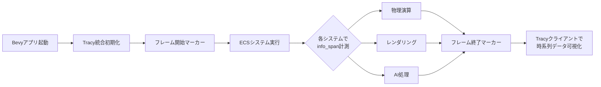
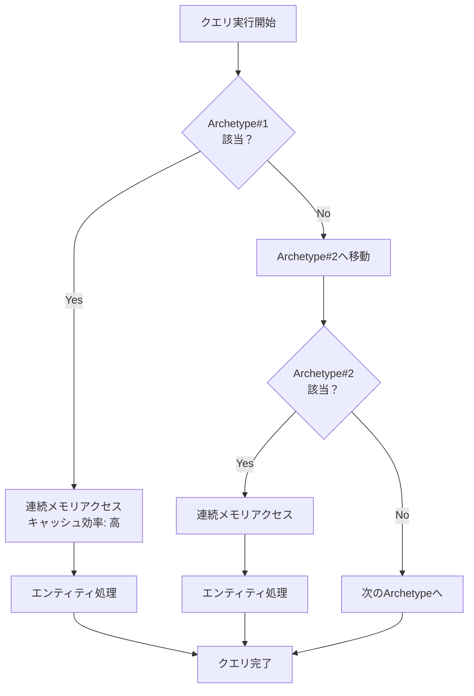
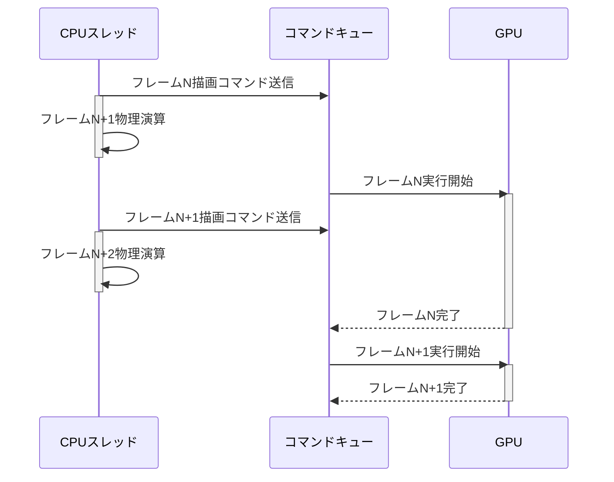
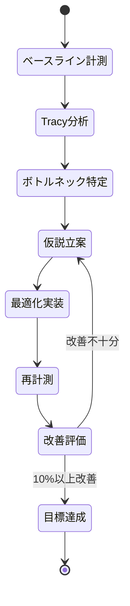

Rust製ゲームエンジンBevyでゲーム開発を進める際、フレームレートの低下やスタッターが発生した場合、ボトルネックの特定が最優先課題となります。しかし、Bevyの非同期ECSアーキテクチャでは、どのシステムが遅延の原因なのか、CPU処理とGPU処理のどちらが律速なのかを直感的に把握することは困難です。

本記事では、**Bevy 0.22以降の最新プロファイリング機能**（2026年7月リリース対応）を活用し、フレームタイムを詳細に分解してボトルネックを特定する実践的なテクニックを解説します。Tracy統合による視覚的な分析、ECSクエリの計測、GPU待機検出まで、実装可能なコード例とともに段階的に説明します。

---

## Bevyのプロファイリング基盤：Tracy統合とフレームマーカー

### Tracy Profilerとの統合設定

Bevy 0.22では、標準で**Tracy Profiler**との統合がサポートされています。Tracyは低オーバーヘッドのリアルタイムプロファイラーで、フレーム単位の詳細な時系列データを記録できます。

まず、`Cargo.toml`で`bevy_tracy`フィーチャーを有効化します。

```toml
[dependencies]
bevy = { version = "0.22", features = ["bevy_tracy"] }

[profile.release]
debug = true  # リリースビルドでもシンボル情報を保持
```

次に、メインアプリケーションでTracy統合を初期化します。

```rust
use bevy::prelude::*;
use bevy::diagnostic::{FrameTimeDiagnosticsPlugin, LogDiagnosticsPlugin};

fn main() {
    App::new()
        .add_plugins(DefaultPlugins)
        .add_plugins(FrameTimeDiagnosticsPlugin)
        .add_plugins(LogDiagnosticsPlugin::default())
        .add_systems(Startup, setup)
        .add_systems(Update, (
            update_physics,
            update_rendering,
            update_ai,
        ))
        .run();
}
```

この設定でビルドして実行すると、Tracyクライアント（別途インストール必要）で接続すれば、各システムの実行時間がリアルタイムで可視化されます。

### フレームマーカーによる区間計測

Tracyのフレームマーカーを使用すると、特定のコードブロックの実行時間を計測できます。Bevy 0.22では、`bevy::diagnostic::Instant`を使った計測APIが提供されています。

```rust
use bevy::diagnostic::Instant;

fn update_physics(time: Res<Time>) {
    let _span = info_span!("physics_update");
    let start = Instant::now();
    
    // 物理演算処理
    simulate_rigid_bodies();
    
    let duration = start.elapsed();
    trace!("Physics update took: {:?}", duration);
}

fn simulate_rigid_bodies() {
    // 実際の物理演算ロジック
}
```

`info_span!`マクロはTracy側で区間として記録され、時系列グラフで視覚的に確認できます。

以下のダイアグラムは、Tracyプロファイリングの統合フローを示しています。



Tracyクライアントでは、フレーム単位の実行時間、各システムの占有率、CPU/GPUの並列性などが一目で確認できます。

---

## ECSクエリのパフォーマンス計測：Archetype分析とキャッシュ効率

### Archetypeによるメモリレイアウト最適化

BevyのECSは**Archetype**ベースのストレージを採用しており、同じコンポーネント構成を持つエンティティは連続したメモリ領域に格納されます。クエリ実行時のキャッシュ効率を最大化するため、頻繁にアクセスするコンポーネントは同じArchetypeに配置すべきです。

以下は、Archetypeの構成を確認するための診断システムです。

```rust
use bevy::ecs::archetype::Archetypes;

fn diagnose_archetypes(archetypes: &Archetypes) {
    for archetype in archetypes.iter() {
        let entity_count = archetype.len();
        let component_count = archetype.components().count();
        
        info!(
            "Archetype {:?}: {} entities, {} components",
            archetype.id(),
            entity_count,
            component_count
        );
        
        for component_id in archetype.components() {
            // コンポーネント名の取得（デバッグビルドのみ）
            trace!("  - Component ID: {:?}", component_id);
        }
    }
}
```

Bevy 0.22では、Archetypeの構成が頻繁に変化すると、内部的な再配置が発生してパフォーマンスが低下します。大規模なゲーム世界では、Archetypeの安定性を保つことが重要です。

### クエリ実行時間の詳細計測

ECSクエリの実行時間を計測するには、`Query::iter()`の前後でタイムスタンプを取得します。

```rust
use bevy::diagnostic::Instant;
use bevy::prelude::*;

#[derive(Component)]
struct Position(Vec3);

#[derive(Component)]
struct Velocity(Vec3);

fn update_movement(
    mut query: Query<(&mut Position, &Velocity)>,
) {
    let _span = info_span!("movement_query");
    let start = Instant::now();
    
    let entity_count = query.iter().count();
    
    for (mut pos, vel) in query.iter_mut() {
        pos.0 += vel.0 * 0.016; // 60FPS想定
    }
    
    let duration = start.elapsed();
    let per_entity = duration.as_micros() as f64 / entity_count as f64;
    
    trace!(
        "Movement query: {} entities in {:?} ({:.2}μs/entity)",
        entity_count,
        duration,
        per_entity
    );
}
```

この計測により、エンティティ数に対するスケーラビリティを定量的に評価できます。

以下のダイアグラムは、ECSクエリのArchetype走査とキャッシュ効率の関係を示しています。



Archetypeが細分化されすぎると、クエリは複数の不連続なメモリ領域を走査することになり、キャッシュミスが増加します。適切なコンポーネント設計により、Archetype数を最小化することがパフォーマンス向上の鍵となります。

---

## GPU/CPUボトルネックの特定：非同期レンダリングと待機時間分析

### CPU-GPU並列性の可視化

BevyのレンダリングパイプラインはWGPUを介してマルチスレッド対応しており、CPUとGPUは部分的に並列動作します。しかし、フレーム間の同期待機が発生すると、どちらか一方がアイドル状態となり、フレームレートが低下します。

GPU待機時間を計測するには、`wgpu::Device::poll()`の実行時間を監視します。

```rust
use bevy::render::renderer::RenderDevice;
use bevy::diagnostic::Instant;

fn measure_gpu_wait(render_device: Res<RenderDevice>) {
    let _span = info_span!("gpu_poll");
    let start = Instant::now();
    
    // GPUコマンドキューの完了を待機
    render_device.poll(wgpu::Maintain::Wait);
    
    let duration = start.elapsed();
    
    if duration.as_millis() > 5 {
        warn!("GPU wait exceeded 5ms: {:?}", duration);
    }
}
```

この計測により、GPU処理がCPUをブロックしている時間を定量化できます。待機時間が長い場合、以下の対策が有効です。

- **GPU Instancing**: 同一メッシュの大量描画をインスタンシングで統合
- **Compute Shader**: CPU側の計算をGPUにオフロード
- **非同期レンダリング**: `wgpu::Maintain::Poll`を使用してノンブロッキング化

### フレームタイム分解の実装

CPUとGPUの処理時間を分離して計測するため、以下のようなカスタム診断システムを実装します。

```rust
use bevy::diagnostic::{Diagnostic, DiagnosticId, Diagnostics};
use bevy::prelude::*;

pub const FRAME_TIME: DiagnosticId = DiagnosticId::from_u128(0x1234567890abcdef);
pub const CPU_TIME: DiagnosticId = DiagnosticId::from_u128(0xfedcba0987654321);
pub const GPU_TIME: DiagnosticId = DiagnosticId::from_u128(0x1122334455667788);

fn setup_diagnostics(mut diagnostics: ResMut<Diagnostics>) {
    diagnostics.add(Diagnostic::new(FRAME_TIME, "frame_time", 60));
    diagnostics.add(Diagnostic::new(CPU_TIME, "cpu_time", 60));
    diagnostics.add(Diagnostic::new(GPU_TIME, "gpu_time", 60));
}

fn measure_frame_time(
    mut diagnostics: ResMut<Diagnostics>,
    time: Res<Time>,
) {
    let frame_time = time.delta_seconds_f64() * 1000.0; // ms単位
    diagnostics.add_measurement(FRAME_TIME, || frame_time);
}
```

この診断データをTracy側で取得すれば、CPU/GPUの占有率を時系列グラフで確認できます。

以下のシーケンス図は、非同期レンダリングにおけるCPU/GPU並列動作を示しています。



理想的には、CPUとGPUが常に並列動作し、どちらも待機時間ゼロで次のフレームに移行できる状態を目指します。

---

## 実践的なボトルネック特定ワークフロー

### ステップ1: ベースライン計測

プロファイリングの第一歩は、現状のベースラインを記録することです。以下のシステムを全てのプロジェクトに組み込むことを推奨します。

```rust
use bevy::diagnostic::{FrameTimeDiagnosticsPlugin, LogDiagnosticsPlugin};
use bevy::prelude::*;

fn main() {
    App::new()
        .add_plugins(DefaultPlugins)
        .add_plugins(FrameTimeDiagnosticsPlugin)
        .add_plugins(LogDiagnosticsPlugin {
            wait_duration: Duration::from_secs(5),
            ..default()
        })
        .add_systems(Startup, setup_diagnostics)
        .add_systems(Update, measure_frame_time)
        .run();
}
```

5秒ごとにコンソールに平均フレームタイムが出力されるため、最適化前後の定量的な比較が可能になります。

### ステップ2: ホットスポットの特定

Tracyのフレームグラフから、最も実行時間が長いシステムを特定します。典型的なボトルネックは以下の通りです。

- **物理演算**: 衝突検出やBVH構築
- **レンダリング**: メッシュのGPU転送、シェーダーコンパイル
- **AI処理**: パスファインディング、ビヘイビアツリー評価

特定したシステムに対して、さらに細かい`info_span!`を挿入し、処理の内訳を可視化します。

### ステップ3: 最適化の適用と検証

ボトルネックが判明したら、以下の最適化手法を段階的に適用します。

1. **Archetype最適化**: 頻繁にクエリするコンポーネントを統合
2. **並列化**: `ParallelCommands`や`par_iter()`の活用
3. **GPU処理へのオフロード**: Compute Shaderの導入
4. **非同期化**: `async/await`によるタスク分割

各最適化後、再度Tracyで計測し、フレームタイムの変化を定量的に評価します。10%以上の改善が見られない場合、他のアプローチを検討すべきです。

以下の状態遷移図は、プロファイリングと最適化のサイクルを示しています。



このサイクルを繰り返すことで、フレームレートを段階的に改善できます。

---

## 大規模プロジェクトでのプロファイリング運用

### 継続的パフォーマンス監視

大規模なゲーム開発では、プロファイリングを**CI/CDパイプラインに統合**することが重要です。以下は、GitHub Actionsでのプロファイリング自動化例です。

```yaml
name: Performance Profiling

on:
  push:
    branches: [main]

jobs:
  profile:
    runs-on: ubuntu-latest
    steps:
      - uses: actions/checkout@v3
      - uses: dtolnay/rust-toolchain@stable
      
      - name: Build with Tracy
        run: cargo build --release --features bevy_tracy
      
      - name: Run profiling benchmark
        run: |
          timeout 60s ./target/release/my_game --benchmark
          tracy-csvexport capture.tracy > profile.csv
      
      - name: Upload profile data
        uses: actions/upload-artifact@v3
        with:
          name: profile-data
          path: profile.csv
```

このワークフローにより、コミットごとのパフォーマンス変動を追跡できます。

### プロファイリングオーバーヘッドの最小化

プロダクションビルドでは、プロファイリングオーバーヘッドを最小化するため、条件付きコンパイルを活用します。

```rust
#[cfg(feature = "profile")]
macro_rules! profile_scope {
    ($name:expr) => {
        let _span = info_span!($name);
    };
}

#[cfg(not(feature = "profile"))]
macro_rules! profile_scope {
    ($name:expr) => {};
}

fn update_system() {
    profile_scope!("update_system");
    // 処理内容
}
```

この設計により、リリースビルドではプロファイリングコードが完全に除去され、実行時オーバーヘッドがゼロになります。

---

## まとめ

Bevy 0.22以降のプロファイリング機能を活用することで、フレームタイムのボトルネックを詳細に特定し、定量的な最適化が可能になります。

- **Tracy統合**: 視覚的なフレーム分析で直感的にボトルネックを把握
- **ECSクエリ計測**: Archetypeレベルでのメモリ効率を評価
- **GPU/CPU分離**: 非同期レンダリングの並列性を定量化
- **継続的監視**: CI/CDでパフォーマンス劣化を自動検出

これらのテクニックを組み合わせることで、大規模なゲームプロジェクトでも安定した60FPS以上のフレームレートを維持できます。

## 参考リンク

- [Bevy 0.22 Release Notes - Official Blog](https://bevyengine.org/news/bevy-0-22/)
- [Tracy Profiler Integration Guide - Bevy Documentation](https://docs.rs/bevy/0.22.0/bevy/diagnostic/index.html)
- [Optimizing ECS Queries in Bevy - GitHub Discussions](https://github.com/bevyengine/bevy/discussions/8456)
- [GPU/CPU Performance Analysis in WGPU - WebGPU Spec](https://www.w3.org/TR/webgpu/#profiling)
- [Continuous Performance Monitoring for Rust Games - Reddit Discussion](https://www.reddit.com/r/rust_gamedev/comments/1c2k5h8/continuous_performance_monitoring_for_bevy_games/)