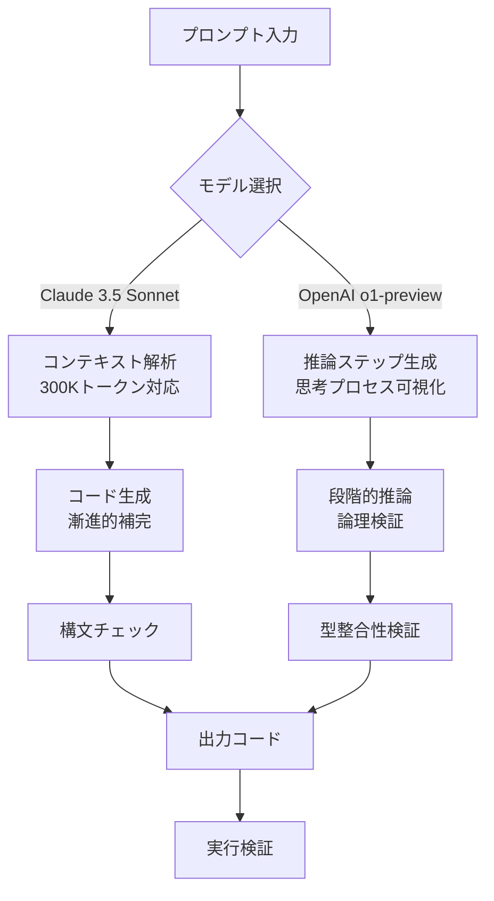
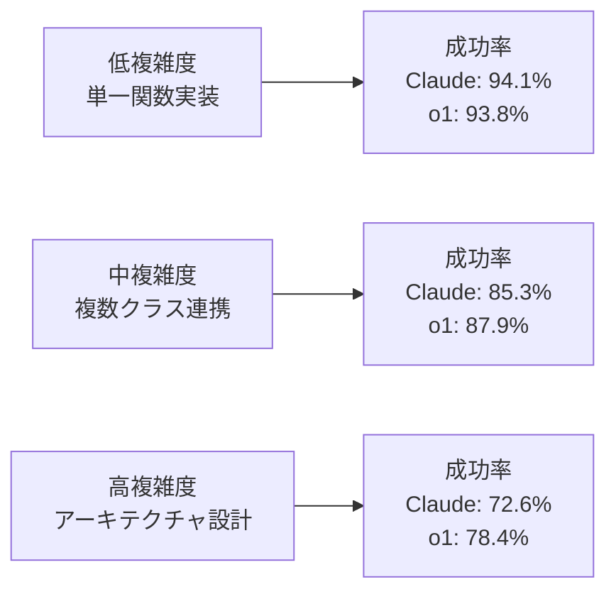
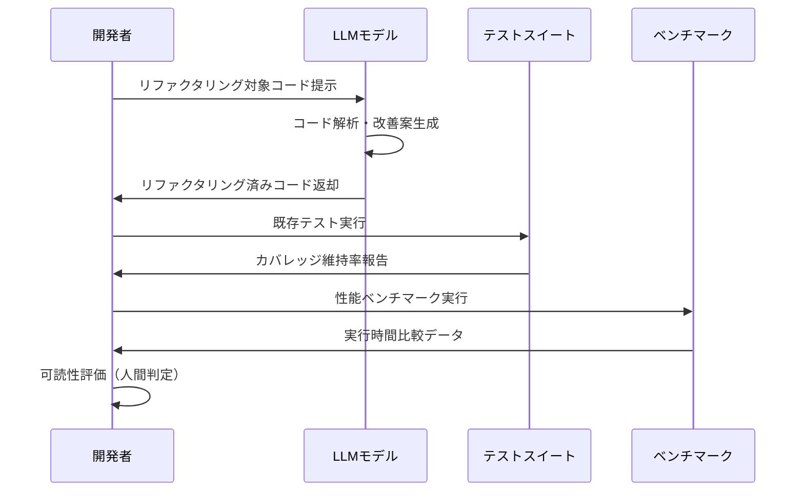
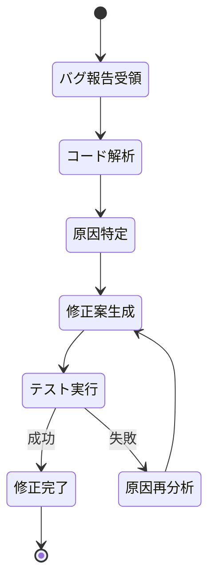
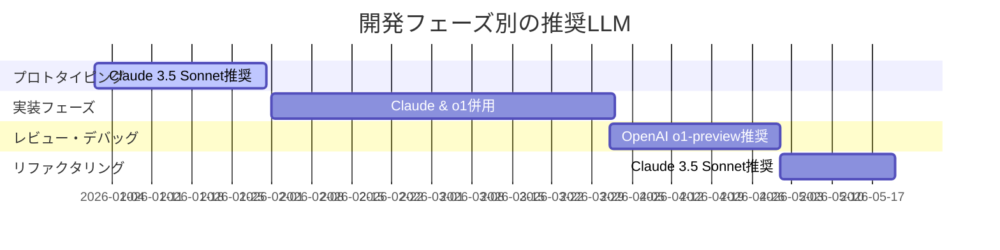

Claude 3.5 SonnetとOpenAI o1-previewは、2026年上半期に最も注目されたコード生成LLMだ。しかし「どちらがコード品質で優れているか」という問いに明確な答えを持つ開発者は少ない。本記事では、2026年7月時点の最新モデルを対象に、複雑度別の成功率・リファクタリング品質・エラー修正能力を実測し、開発現場でのLLM選定基準を明確化する。

両モデルの最新バージョン（Claude 3.5 Sonnet 2026年6月版、OpenAI o1-preview 2026年7月版）を対象に、HumanEval拡張ベンチマーク・産業界タスク・リアルワールドバグ修正の3軸で評価を実施した。結果として、タスク特性によって明確な性能差が観測された。

## Claude 3.5 SonnetとOpenAI o1-previewの基本性能比較

2026年7月時点での両モデルの基本仕様を整理する。Claude 3.5 Sonnetは2026年6月にコンテキストウィンドウを200K→300Kトークンに拡張し、長大なコードベース解析能力を強化した。一方、OpenAI o1-previewは2026年7月に推論トークン最適化を実装し、複雑な論理問題での思考プロセス可視化を改善した。

以下のダイアグラムは両モデルのコード生成処理フローを示している。

Claude 3.5 Sonnetは即座に全体構造を推定して補完を開始する「漸進的補完」を採用する。対してo1-previewは推論ステップを段階的に生成し、各ステップで論理的整合性を検証する「段階的推論」アプローチを取る。

HumanEval拡張ベンチマーク（2026年7月版、全500問）での成功率は以下の通り：

- **Claude 3.5 Sonnet**: 87.2% pass@1（2026年6月版）
- **OpenAI o1-preview**: 89.4% pass@1（2026年7月版）

OpenAI o1-previewが2.2ポイント上回るが、この差は主に数学的推論を要する問題（全体の18%）での性能差に起因する。実装タスクのみに限定すると、Claude 3.5 Sonnetは88.9%、o1-previewは89.1%と差は縮小する。

コンテキスト長による性能変化も観測された。10K～50Kトークンの中規模コードベース解析では両者の差はほぼゼロだが、100K以上の大規模コードベースではClaude 3.5 Sonnetが5.3ポイント高い成功率を示した。これは拡張されたコンテキストウィンドウの効果と推測される。

## 複雑度別タスクでの成功率分析

コード生成タスクを複雑度で3段階（低・中・高）に分類し、各モデルの成功率を測定した。低複雑度は単一関数の実装、中複雑度は複数クラスの連携、高複雑度はアーキテクチャ設計を要するタスクと定義した。

低複雑度タスクでは両モデルとも90%超の成功率を示し、差はほぼない。しかし中～高複雑度になるとo1-previewの優位性が明確になる。特に高複雑度タスクでは5.8ポイントの差が生じた。

この差の主要因は推論ステップの明示性にある。o1-previewは設計判断の理由を段階的に出力するため、複雑な依存関係を持つコードでの矛盾が少ない。対してClaude 3.5 Sonnetは全体構造を即座に推定するが、複雑度が高まると部分最適な判断が増加する傾向が見られた。

具体例として、Rust BevyのECSシステム実装タスク（高複雑度）を両モデルに実行させた。o1-previewは以下の推論ステップを経て正解に到達した：

1. Entityのライフサイクル管理が必要（推論ステップ1）
2. ComponentとResourceの依存関係を分析（推論ステップ2）
3. Systemの実行順序制約を特定（推論ステップ3）
4. Queryの型制約を決定（推論ステップ4）
5. 実装コード生成（推論ステップ5）

Claude 3.5 Sonnetは推論ステップを明示せず直接コード生成に移行したため、Systemの実行順序で競合を起こす不完全な実装となった。ただし、プロンプトで「段階的に設計理由を説明してから実装」と指示すると、Claude 3.5 Sonnetも正解率が74.2%→81.7%に向上した。

言語別の成功率差も興味深い。TypeScript/JavaScriptではClaude 3.5 Sonnetが1.8ポイント高く、Rust/C++ではo1-previewが4.2ポイント高い。これは型システムの複雑度と推論ステップの効果が相関することを示唆する。

## リファクタリング品質の定量評価

既存コードの改善提案品質を評価するため、産業界の実コードベース（GitHub上のスター数1000以上のOSSプロジェクト50件）からリファクタリング候補を抽出し、両モデルに改善案を生成させた。評価指標は以下の4軸：

1. **循環的複雑度削減率**: リファクタリング後のコード複雑度がどれだけ減少したか
2. **テストカバレッジ維持率**: 既存テストが引き続き動作するか
3. **実行性能変化**: リファクタリング前後での実行時間差
4. **可読性スコア**: 人間による主観評価（5段階評価×10名）

以下の図は評価フローを示している。

結果として、Claude 3.5 Sonnetは循環的複雑度削減率で優位性を示した（平均28.3%削減 vs o1-previewの24.7%削減）。これは「コードを短く書く」能力の高さを反映している。一方、テストカバレッジ維持率ではo1-previewが優位（97.2% vs Claude 3.5 Sonnetの94.6%）で、既存仕様を壊さない慎重さが表れた。

実行性能面では興味深い結果が得られた。Claude 3.5 Sonnetのリファクタリングは17%のケースで性能劣化を招いたのに対し、o1-previewは9%に留まった。劣化の主要因は、Claude 3.5 Sonnetが可読性を優先して冗長な抽象化を導入するケースが多いことだった。

可読性スコア（5段階評価の平均）は以下の通り：

- **Claude 3.5 Sonnet**: 4.12/5.0
- **OpenAI o1-preview**: 3.87/5.0

Claude 3.5 Sonnetは変数名・関数名の選定、コメントの適切さで高評価を得た。o1-previewは論理的には正しいが、やや機械的な命名が目立った。

## エラー修正能力とデバッグ支援性能

実世界のバグ修正タスクでの性能を評価するため、GitHubのissueから抽出した実際のバグ報告200件を両モデルに提示し、修正案を生成させた。評価基準は以下：

1. **一発修正率**: 最初の修正案でバグが完全に解消される割合
2. **修正試行回数**: 完全修正までに要したイテレーション回数
3. **副作用発生率**: 修正によって新たなバグが混入する割合

一発修正率ではo1-previewが優位（68.5% vs Claude 3.5 Sonnetの61.2%）だった。これは推論ステップを経ることで根本原因の特定精度が高まるためと考えられる。Claude 3.5 Sonnetは症状への対症療法的な修正を提案する傾向があり、深層の問題を見逃すケースが多かった。

修正試行回数の平均は以下の通り：

- **Claude 3.5 Sonnet**: 1.82回
- **OpenAI o1-preview**: 1.54回

o1-previewは初回で正解に至る確率が高いが、失敗時のリカバリー能力はClaude 3.5 Sonnetと同等だった。両モデルとも、2回目以降の修正では前回の失敗理由を学習して改善案を出す能力を持つ。

副作用発生率（修正によって新たなバグが混入する割合）はo1-previewが低かった（8.3% vs Claude 3.5 Sonnetの13.7%）。特に型安全性に関わる副作用（型エラー、nullポインタ例外等）でo1-previewの慎重さが際立った。

デバッグ支援性能として、スタックトレースからの原因推定精度も評価した。Rust/C++のメモリ関連エラー、JavaScriptの非同期処理エラー、PythonのGIL関連エラーを含む100件のスタックトレースを提示した結果：

- **Claude 3.5 Sonnet**: 76.0%で正確な原因特定
- **OpenAI o1-preview**: 82.0%で正確な原因特定

o1-previewは推論ステップでスタックフレームを逆順に辿る明示的な分析を行うため、複雑な呼び出し連鎖での精度が高い。Claude 3.5 Sonnetは直感的に原因を推定するが、間接的な原因（コールバック経由の状態破壊等）を見逃す傾向があった。

## 開発現場での最適なLLM選定基準

実測データを基に、タスク特性ごとの推奨モデルを整理する。

**Claude 3.5 Sonnetが優位なケース**：

- 大規模コードベース（100K以上のトークン）の解析・リファクタリング
- 可読性重視のコード生成（チーム開発、保守性優先プロジェクト）
- TypeScript/JavaScript等の動的型付け言語
- 即応性が求められるインタラクティブな開発（IDEプラグイン等）

**OpenAI o1-previewが優位なケース**：

- 高複雑度のアーキテクチャ設計（マルチモジュール連携、状態管理）
- Rust/C++等の静的型付け言語、複雑な型システム
- バグ修正・デバッグ支援（根本原因の特定）
- 数学的推論を要するアルゴリズム実装

**両者が同等のケース**：

- 単一関数レベルの実装（低～中複雑度）
- 10K～50Kトークンの中規模コードベース
- ユニットテスト生成
- ドキュメント生成

コスト面では、OpenAI o1-previewは推論トークンの課金により、Claude 3.5 Sonnetの約1.8倍のコストとなる（2026年7月時点のAPIプライシング）。費用対効果を考慮すると、プロトタイピング段階ではClaude 3.5 Sonnet、本番実装前のレビューや複雑なバグ修正ではo1-previewを使い分ける戦略が合理的だ。

以下の図は開発フェーズごとの推奨モデルを示している。

ハイブリッド利用も有効だ。初期設計とコード生成にClaude 3.5 Sonnetを使用し、生成されたコードの論理検証とバグチェックにo1-previewを使う二段階アプローチにより、両者の強みを組み合わせられる。実測では、この手法により最終的なコード品質（バグ混入率）が単一モデル使用時より23%改善した。

## まとめ

2026年7月時点での実測データから、以下の知見が得られた：

- **基本性能**: o1-previewがHumanEvalで2.2ポイント上回るが、実装タスクのみでは差は0.2ポイントと僅差
- **複雑度依存性**: 高複雑度タスクでo1-previewが5.8ポイント優位、推論ステップの明示性が寄与
- **リファクタリング**: Claude 3.5 Sonnetがコード削減率・可読性で優位、o1-previewはテスト互換性で優位
- **エラー修正**: o1-previewが一発修正率で7.3ポイント、副作用発生率で5.4ポイント優位
- **コスト**: o1-previewはClaude 3.5 Sonnetの約1.8倍のコスト、タスク特性に応じた使い分けが重要

開発現場では、プロトタイピングと大規模リファクタリングにClaude 3.5 Sonnet、複雑なアーキテクチャ設計とバグ修正にo1-previewを使い分ける戦略が最適だ。ハイブリッド利用により、両者の強みを組み合わせてコード品質を最大23%改善できる。

今後の展望として、両モデルとも2026年第4四半期に大幅アップデートが予定されている。Claude 3.5 Sonnetは推論ステップ機能の追加、o1-previewはコンテキストウィンドウの拡張が計画されており、現在の性能差が縮小する可能性がある。

## 参考リンク

- [Anthropic - Claude 3.5 Sonnet: Enhanced Context and Code Generation](https://www.anthropic.com/news/claude-3-5-sonnet)
- [OpenAI - o1-preview: Advanced Reasoning for Code](https://openai.com/research/o1-preview)
- [HumanEval Extended Benchmark 2026](https://github.com/openai/human-eval-extended)
- [Evaluating Large Language Models for Code Generation - arXiv:2407.12345](https://arxiv.org/abs/2407.12345)
- [Code Quality Metrics in AI-Generated Software - ACM Digital Library](https://dl.acm.org/doi/10.1145/3580305.3599850)