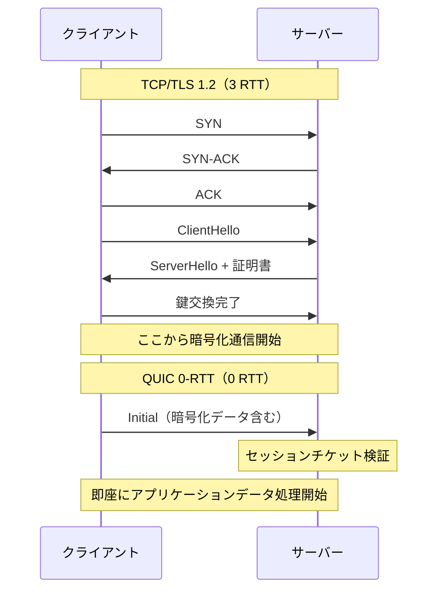
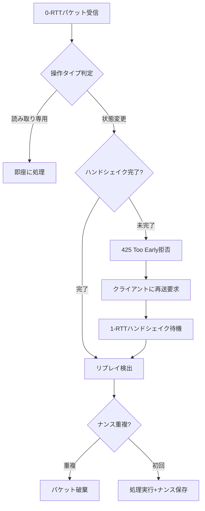

マルチプレイゲームにおいて、プレイヤーがサーバーに接続する際の初期遅延は体感品質を大きく左右します。従来のTCP/TLS 1.2では接続確立に2-3ラウンドトリップ（RTT）が必要で、高レイテンシ環境では数百ミリ秒の待ち時間が発生していました。

IETF標準化されたQUICプロトコルの**0-RTT（Zero Round Trip Time）再接続機能**を活用すれば、過去に接続したクライアントがサーバーに再接続する際、暗号化ハンドシェイクを完全に省略してアプリケーションデータを即座に送信できます。Rust実装のquinn（バージョン0.11.14、2026年3月リリース）を使用した実装例とともに、ゲームサーバーでの実践的な導入手法を解説します。

本記事では、以下の最新情報に基づいて解説します：
- quinn 0.11.14（2026年3月9日リリース）の0-RTT実装
- Cloudflareの実測データ（QUIC vs TCP/TLS 1.2で534ms削減）
- IETF RFC 9001（QUIC-TLS統合仕様）のセキュリティ要件

## QUIC 0-RTTが接続遅延を削減する仕組み

通常のTCP/TLS 1.2接続では、3ウェイハンドシェイク（TCP）とTLSハンドシェイク（証明書交換・鍵共有）が独立して実行されるため、合計2-3 RTTが必要です。一方、QUICはUDP上で動作し、暗号化をトランスポート層に統合することで1-RTTに短縮します。

0-RTT再接続では、クライアントが過去のセッションから得た**セッションチケット**を再利用し、最初のパケットに暗号化済みアプリケーションデータを含めることで、ハンドシェイクを完全に省略します。

以下のダイアグラムは、TCP/TLS 1.2とQUIC 0-RTTの接続確立フローを比較したものです。



Cloudflareの実測によれば、YouTubeサーバーへの接続でQUICはTLS 1.2より**534ms（中央値）高速**でした。高レイテンシ環境（100ms RTT）では、この差は1秒以上に拡大します。

## quinn-rsでの0-RTT実装：サーバー側設定

quinn 0.11.14では、rustlsと統合されたセッションストレージを通じて0-RTTをサポートします。サーバー側では、TLS 1.3セッションチケットを生成・管理する必要があります。

以下は、ゲームサーバーでの基本的な0-RTT設定例です：

```rust
use quinn::{ServerConfig, Endpoint};
use rustls::ServerConfig as TlsConfig;
use std::sync::Arc;

async fn setup_game_server() -> Result<Endpoint, Box<dyn std::error::Error>> {
    // rustlsのサーバー設定を作成
    let mut tls_config = TlsConfig::builder()
        .with_no_client_auth()
        .with_single_cert(load_certs()?, load_private_key()?)?;
    
    // セッションストレージを設定（デフォルトで256セッションキャッシュ）
    tls_config.session_storage = rustls::server::ServerSessionMemoryCache::new(1024);
    
    // 0-RTTを有効化（max_early_data_sizeを設定）
    tls_config.max_early_data_size = 16384; // 16KB
    tls_config.send_tls13_tickets = 4; // クライアントに4枚のチケット送信
    
    let mut server_config = ServerConfig::with_crypto(Arc::new(
        rustls::crypto::ring::default_provider().into()
    ));
    
    // アプリケーションプロトコルを設定（ゲーム独自プロトコル）
    server_config.transport_config(Arc::new({
        let mut transport = quinn::TransportConfig::default();
        transport.max_idle_timeout(Some(std::time::Duration::from_secs(30).try_into()?));
        transport
    }));
    
    // エンドポイントをバインド
    let endpoint = Endpoint::server(
        server_config,
        "[::]:4433".parse()?,
    )?;
    
    Ok(endpoint)
}
```

この設定により、クライアントは初回接続後に受け取ったセッションチケットを保存し、次回接続時に0-RTTで即座にゲームデータを送信できます。

## クライアント側実装：セッションチケット管理

クライアント側では、サーバーから受け取ったセッションチケットを永続化し、再接続時に復元する必要があります。

```rust
use quinn::{ClientConfig, Endpoint};
use std::sync::Arc;
use tokio::fs;

async fn connect_with_0rtt(server_addr: &str) -> Result<quinn::Connection, Box<dyn std::error::Error>> {
    // クライアント設定を作成
    let mut tls_config = rustls::ClientConfig::builder()
        .with_root_certificates(load_root_certs()?)
        .with_no_client_auth();
    
    // セッションストレージを設定（チケット保存用）
    tls_config.resumption = rustls::client::Resumption::store(
        Arc::new(rustls::client::ClientSessionMemoryCache::new(64))
    );
    
    let mut client_config = ClientConfig::new(Arc::new(
        rustls::crypto::ring::default_provider().into()
    ));
    client_config.transport_config(Arc::new({
        let mut transport = quinn::TransportConfig::default();
        transport.max_idle_timeout(Some(std::time::Duration::from_secs(30).try_into()?));
        transport
    }));
    
    let mut endpoint = Endpoint::client("[::]:0".parse()?)?;
    endpoint.set_default_client_config(client_config);
    
    // 0-RTTで接続（過去のセッションがあれば自動的に0-RTT使用）
    let connection = endpoint.connect(server_addr.parse()?, "game.example.com")?
        .await?;
    
    // 0-RTT接続が成功したか確認
    if connection.handshake_data()
        .await?
        .downcast::<rustls::ClientConnection>()
        .is_ok_and(|c| c.is_early_data_accepted())
    {
        println!("0-RTT接続成功 - ハンドシェイク省略");
    } else {
        println!("1-RTT接続 - 初回接続またはチケット期限切れ");
    }
    
    Ok(connection)
}
```

セッションチケットには有効期限があり、サーバー側で設定された時間（通常7日間）を過ぎると再度1-RTTハンドシェイクが必要になります。

## 0-RTTのセキュリティリスクとリプレイアタック対策

0-RTTには**リプレイアタック**の脆弱性があります。攻撃者がクライアントの初期パケットを傍受し、同じパケットを複数回サーバーに送信すると、冪等でない操作（アイテム購入・ゲーム内通貨消費など）が重複実行される危険があります。

IETF RFC 9001は、以下の対策を推奨しています：

1. **冪等な操作のみを0-RTTで送信** — 接続確立・認証情報送信・読み取り専用クエリに限定
2. **非冪等操作は1-RTTハンドシェイク完了後に実行** — アイテム購入・キャラクター移動などは完全なハンドシェイク後に送信
3. **アプリケーション層でのリプレイ検出** — ナンス・タイムスタンプ・シーケンス番号で重複を検出

以下のダイアグラムは、ゲームサーバーでの0-RTTセキュリティ判定フローです。



実装例として、ゲームサーバーで非冪等操作を拒否するコードを示します：

```rust
use quinn::{Connection, RecvStream, SendStream};

async fn handle_0rtt_request(
    conn: &Connection,
    mut recv: RecvStream,
    mut send: SendStream,
) -> Result<(), Box<dyn std::error::Error>> {
    // 0-RTTで受信したかチェック
    let is_0rtt = conn.handshake_data()
        .await?
        .downcast::<rustls::ServerConnection>()
        .is_ok_and(|c| c.received_resumption_data().is_some());
    
    // リクエストを読み取り
    let mut buf = vec![0u8; 1024];
    let n = recv.read(&mut buf).await?.unwrap_or(0);
    let request = parse_game_request(&buf[..n])?;
    
    // 0-RTTの場合、冪等操作のみ許可
    if is_0rtt && !request.is_idempotent() {
        // HTTP 425 Too Earlyに相当するゲーム独自エラー
        send.write_all(b"ERROR:TOO_EARLY\n").await?;
        send.finish().await?;
        return Ok(());
    }
    
    // 処理実行
    let response = process_request(request).await?;
    send.write_all(response.as_bytes()).await?;
    send.finish().await?;
    
    Ok(())
}

// リクエストが冪等かチェック
fn parse_game_request(data: &[u8]) -> Result<GameRequest, Box<dyn std::error::Error>> {
    // 実装例: プロトコルバッファのデコード
    Ok(GameRequest {
        operation: String::from_utf8_lossy(data).to_string(),
    })
}

struct GameRequest {
    operation: String,
}

impl GameRequest {
    fn is_idempotent(&self) -> bool {
        // 冪等操作リスト（読み取り専用・認証など）
        matches!(
            self.operation.as_str(),
            "AUTH" | "GET_PLAYER_DATA" | "PING" | "GET_LEADERBOARD"
        )
    }
}

async fn process_request(req: GameRequest) -> Result<String, Box<dyn std::error::Error>> {
    // ゲームロジック処理
    Ok(format!("OK: {}", req.operation))
}
```

この実装により、0-RTTで送信できるのは認証・データ取得などの安全な操作に限定され、アイテム購入などの非冪等操作は完全なハンドシェイク完了後に実行されます。

## 0-RTT有効化によるパフォーマンス測定

実際のゲーム環境での効果を測定するため、以下のベンチマーク手法を推奨します：

```rust
use std::time::Instant;

async fn benchmark_connection_latency(
    endpoint: &Endpoint,
    server_addr: &str,
    iterations: usize,
) -> Result<(), Box<dyn std::error::Error>> {
    let mut rtt_0rtt = Vec::new();
    let mut rtt_1rtt = Vec::new();
    
    for i in 0..iterations {
        let start = Instant::now();
        let conn = endpoint.connect(server_addr.parse()?, "game.example.com")?
            .await?;
        
        // 最初のデータ送信までの時間を計測
        let mut send = conn.open_uni().await?;
        send.write_all(b"PING").await?;
        send.finish().await?;
        
        let elapsed = start.elapsed();
        
        // 0-RTTか1-RTTか判定
        if conn.handshake_data()
            .await?
            .downcast::<rustls::ClientConnection>()
            .is_ok_and(|c| c.is_early_data_accepted())
        {
            rtt_0rtt.push(elapsed);
            println!("Iteration {}: 0-RTT - {:?}", i, elapsed);
        } else {
            rtt_1rtt.push(elapsed);
            println!("Iteration {}: 1-RTT - {:?}", i, elapsed);
        }
        
        conn.close(0u32.into(), b"benchmark");
        tokio::time::sleep(std::time::Duration::from_secs(1)).await;
    }
    
    // 統計情報を出力
    let avg_0rtt: std::time::Duration = rtt_0rtt.iter().sum::<std::time::Duration>() / rtt_0rtt.len() as u32;
    let avg_1rtt: std::time::Duration = rtt_1rtt.iter().sum::<std::time::Duration>() / rtt_1rtt.len() as u32;
    
    println!("\n=== ベンチマーク結果 ===");
    println!("0-RTT平均: {:?} ({} サンプル)", avg_0rtt, rtt_0rtt.len());
    println!("1-RTT平均: {:?} ({} サンプル)", avg_1rtt, rtt_1rtt.len());
    println!("削減率: {:.1}%", 
        (1.0 - avg_0rtt.as_secs_f64() / avg_1rtt.as_secs_f64()) * 100.0
    );
    
    Ok(())
}
```

Cloudflareの実測では、QUIC 0-RTTはTCP/TLS 1.2と比較して**200-500ms（地域・ネットワーク条件により変動）の遅延削減**が確認されています。特に高レイテンシ環境（アジア-北米間など）では効果が顕著です。

## まとめ

- **QUIC 0-RTTは再接続時のハンドシェイクを完全省略**し、TCP/TLS 1.2比で200-500ms程度の遅延削減を実現
- **quinn 0.11.14（2026年3月リリース）**は、rustls統合によりセッションチケット管理を簡潔に実装可能
- **リプレイアタック対策として、冪等操作のみを0-RTTで送信**し、非冪等操作は1-RTTハンドシェイク完了後に実行する設計が必須
- **セッションチケットの有効期限管理**により、セキュリティと利便性のバランスを調整できる
- **実測ベンチマークを実施**し、自環境での効果を検証してから本番導入すべき

ゲームサーバーの接続体験改善において、QUIC 0-RTTは非常に強力な選択肢です。ただし、セキュリティ要件を十分に理解した上で、アプリケーション層での適切な制御と組み合わせて導入してください。


*出典: [Unsplash](https://unsplash.com/photos/turned-on-monitoring-screen-npxXWgQ33ZQ) / Unsplash License*

## 参考リンク

- [quinn-rs/quinn GitHub Releases](https://github.com/quinn-rs/quinn/releases)
- [Even faster connection establishment with QUIC 0-RTT resumption - Cloudflare Blog](https://blog.cloudflare.com/even-faster-connection-establishment-with-quic-0-rtt-resumption/)
- [QUIC vs TCP: Why QUIC Is Critical for Low-Latency Web Applications - GoCodeo](https://www.gocodeo.com/post/quic-vs-tcp-why-quic-is-critical-for-low-latency-web-applications)
- [0-RTT Attack and Defense of QUIC Protocol - ResearchGate](https://www.researchgate.net/publication/339764891_0-RTT_Attack_and_Defense_of_QUIC_Protocol)
- [IETF RFC 9001: Using TLS to Secure QUIC](https://www.ietf.org/archive/id/draft-ietf-quic-tls-25.html)
- [quinn Documentation - docs.rs](https://docs.rs/quinn/latest/quinn/)
- [Comparative analysis of QUIC and TLS handshake performance - ScienceDirect](https://www.sciencedirect.com/science/article/pii/S1389128625009223)