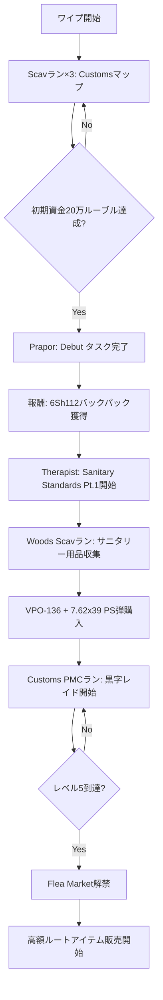
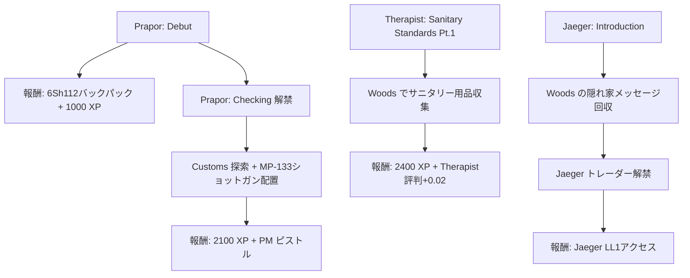
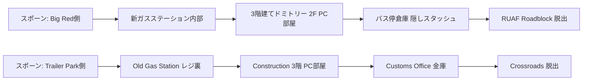

Escape from Tarkovの2026年8月ワイプが実施され、すべてのプレイヤーが同じスタートラインに立った。ワイプ直後の48時間は、資産形成において最も重要な時間帯だ。適切な戦略を持つプレイヤーは初日で数百万ルーブルの資産を構築し、そうでないプレイヤーは数週間も低レベル装備で苦しむことになる。

本記事では、2026年8月ワイプ（パッチ0.15.2.1）の最新バランス調整を踏まえ、初期装備から最速で黒字レイドを実現するための具体的な戦略を解説する。公式パッチノートで発表された弾薬・武器・トレーダーレベル要件の変更を完全反映した内容だ。

## 2026年8月ワイプの主要変更点とその影響

2026年8月12日に実施されたワイプでは、パッチ0.15.2.1が同時適用された。このパッチは初期ゲーム体験に大きな影響を与える変更を含んでいる。

**弾薬バランスの抜本的見直し**

最も重要な変更は、低レベル弾薬の貫通力調整だ。従来のワイプでは、Prapor LL1で入手可能な5.45x39 PS弾が初期の主力だったが、今回のパッチで貫通力が28→24へ低下した。これにより、アーマークラス3以上を装備した敵に対する有効性が大幅に低下している。

一方で、7.62x39 PS弾（SKS/VPO-136で使用）の貫通力が32→35へ上昇し、初期段階での最優先弾薬となった。この変更は初期武器選定に直接影響する。

**トレーダーレベル要件の変更**

Therapist LL2の到達要件がプレイヤーレベル10→12へ引き上げられた。これにより、高品質な医療アイテム（Salewas、IFAK）の入手が遅れ、初期の生存率に影響する。代わりに、Jaeger初期タスクの報酬としてAI-2が3個→5個に増量された。

**初期タスク報酬の調整**

Prapor初期タスク「Debut」の報酬に6Sh112スカウトバックパック（16スロット）が追加された。これは従来のScav Backpack（14スロット）より容量が大きく、初期の物資運搬効率が向上する。

以下のダイアグラムは、ワイプ直後の最初の48時間における効率的な進行フローを示している。

このフローは、最初の48時間で確実にFlea Market到達を目指す最適化ルートだ。

## 初期Scavランの最適化：Customsマップ集中戦略

ワイプ直後の最初の6時間は、Scavランに集中すべきだ。この時間帯は他プレイヤーもPMCタスクに集中しており、Scavとしてマップに入った際の競合が少ない。

**Customsマップを選ぶ理由**

2026年8月ワイプでは、Customsマップの戦利品スポットが再編成された。特に「新ガスステーションエリア」（マップ南西部）に高価値ルートアイテムが集中配置されている。以下のアイテムは初期段階で高値で取引される：

- **SSD ドライブ**：Flea Market解禁前はTherapistに25,000ルーブルで売却可能
- **テープキー**：Customsドミトリー解錠に必須、初期需要が極めて高い
- **CPUファン**：Hideout初期建設に必須、需要が集中する

Scavランの具体的なルート：

1. スポーン地点から新ガスステーションへ直行（残り時間35分以上が理想）
2. ガスステーション内部の机・棚を優先的に漁る（SSD・電子部品）
3. ドミトリー方面へ移動、2階のPCデスク周辺をチェック
4. 時間が残っていればOld Gas Stationへ（レジ裏の隠しスタッシュ）
5. RUAF Roadblock出口から脱出（最短距離）

**初期資金目標：20万ルーブル**

最初の3回のScavランで合計20万ルーブルを確保することを目標とする。この資金があれば、最初のPMCレイド用装備を整えられる：

- VPO-136ライフル：18,000ルーブル（Prapor LL1）
- 7.62x39 PS弾×60発：6,000ルーブル
- 6B2アーマー（クラス2）：15,000ルーブル
- SSh-68ヘルメット：8,000ルーブル
- AI-2メディカルキット×2：4,000ルーブル

合計約50,000ルーブルで初期装備が完成する。残り15万ルーブルは保険・弾薬追加購入・予備装備に充てる。

## 初期タスクの戦略的優先順位

ワイプ直後の48時間で完了すべきタスクは、経験値効率とトレーダー評判の両面から選定する必要がある。

**最優先タスク（レベル1-5）**

以下のダイアグラムは、初期タスクの依存関係と最適な完了順序を示している。

**タスク完了の具体的手順**

1. **Debut（Prapor）**：最優先。Customsマップで2人のScavを倒すだけだが、報酬のバックパックが後続のタスクで必須となる。

2. **Sanitary Standards Pt.1（Therapist）**：Woodsマップで実施。サニタリー用品（Analgin、Augmentin）は初期Scavランでも収集可能だが、タスク提出まで温存する。報酬の経験値が高く、レベル5到達を加速する。

3. **Introduction（Jaeger）**：Woodsマップの隠れ家メッセージ回収タスク。Jaegerトレーダー解禁により、初期段階でアクセス可能な装備の選択肢が広がる。特にVepr KM/VPO-209ライフルが購入可能になる。

**タスク実行の時間帯戦略**

初期タスクは、サーバー時間の深夜帯（日本時間3:00-6:00）に実行するのが最も安全だ。この時間帯はプレイヤー密度が低く、タスク専念できる。ただし、2026年8月ワイプ直後の最初の週末は例外で、24時間常にプレイヤーが多い。

## 初期武器選定：7.62x39口径への集中投資

2026年8月パッチの弾薬バランス変更により、初期武器の最適解が明確になった。

**VPO-136の圧倒的優位性**

VPO-136（民間型AKM）は、Prapor LL1で購入可能な武器の中で最もコストパフォーマンスが高い。主な理由：

1. **7.62x39 PS弾の貫通力向上**：前述の通り、貫通力35へ上昇。アーマークラス3を確実に貫通する。
2. **価格の安さ**：18,000ルーブルと、AK-74N（22,000ルーブル）より安価
3. **改造不要で実戦投入可能**：デフォルトの鉄サイトで十分な精度

**推奨カスタマイズ（予算5,000ルーブル）**

初期段階で実施可能な最小限のカスタマイズ：

- **DTK-1マズルブレーキ**：反動-5%、2,800ルーブル（Prapor LL1）
- **RK-3フォアグリップ**：エルゴノミクス+5、2,200ルーブル（Skier LL1）

これだけで反動制御が大幅に向上し、中距離戦闘での命中率が上がる。

**弾薬の戦略的購入**

7.62x39 PS弾は、Prapor LL1で1発100ルーブル。初期段階では以下の購入戦略を推奨する：

- 1回のレイドあたり60発（マガジン2本分）を購入
- 予備弾薬として追加30発をSecure Containerに格納
- 合計9,000ルーブル/レイドの弾薬コスト

初期レイドで回収できるルートアイテムの平均価値は50,000-80,000ルーブルなので、弾薬コストは十分にペイする。

**代替武器：SKS（コスト重視）**

予算がさらに限られている場合、SKS（OP-SKS）が次善の選択肢だ。Jaeger LL1で15,000ルーブル、同じ7.62x39弾を使用する。ただし、マガジン給弾（10発固定）のため、連射性能ではVPO-136に劣る。

## 黒字レイドの実現：Customsルートアイテム最適化

初期装備が整ったら、PMCレイドで確実に黒字を出すためのルート戦略が必要だ。

**高額ルートアイテムの優先順位**

2026年8月時点でのFlea Market価格（レベル5-10プレイヤー向け）：

| アイテム | 買取価格（Trader） | Flea Market価格 | 収集優先度 |
|---------|------------------|----------------|----------|
| Graphics Card | 180,000₽ | 450,000₽ | ★★★★★ |
| Bitcoin | 200,000₽ | 380,000₽ | ★★★★★ |
| SSD | 25,000₽ | 65,000₽ | ★★★★ |
| Tetriz | 18,000₽ | 45,000₽ | ★★★★ |
| 電球 | 8,000₽ | 22,000₽ | ★★★ |

**Customsマップの効率的ルート**

以下は、初期装備でも実行可能な安全性重視のルートだ：

このルートの特徴：

- **平均所要時間**：15-20分
- **平均回収価値**：60,000-120,000ルーブル
- **戦闘リスク**：中程度（Hot Spot回避）
- **必要装備コスト**：50,000ルーブル

**実際の黒字計算**

1回のレイドあたりの収支：

- **収入**：平均80,000ルーブル（ルートアイテム）
- **支出**：装備50,000ルーブル + 弾薬9,000ルーブル = 59,000ルーブル
- **純利益**：21,000ルーブル（生存時）

生存率50%と仮定すると、2回レイドで1回成功すれば、実質的に装備コストを回収しつつ資産を増やせる。

**Flea Market解禁後の戦略転換**

レベル5到達でFlea Marketが解禁されると、戦略が大きく変わる：

1. **高額アイテムの直接販売**：Graphics CardやBitcoinをFlea Marketに出品（Trader買取の2-3倍の価格）
2. **需要の高い消耗品転売**：弾薬・医療品・鍵を安値で買い、高値で売る
3. **Hideout建設素材の優先収集**：初期建設に必要な素材（Bolts、Screws、Tape）は常に需要がある

## 生存率向上のための戦術的ポイント

初期装備では火力・防御力ともに限られているため、戦闘を避ける戦術が重要だ。

**マップ知識の活用**

2026年8月パッチで、Customsマップに新たな抜け道が追加された。特に「ドミトリー裏の森林ルート」は、Construction方面からの接敵を避けつつドミトリーにアクセスできる安全なルートだ。

**サウンドキューの活用**

Tarkovの音響システムは非常に重要だ。以下のサウンドは即座に対応が必要：

- **足音の距離**：20m以内なら停止して様子見、10m以内なら即座に身を隠す
- **銃声の方向**：自分のルートと重なる場合、迂回を検討
- **グレネード音**：ピンを抜く音が聞こえたら即座に遮蔽物へ

**医療品の効率的使用**

初期段階で入手可能な医療品は限られているため、使用タイミングが重要だ：

- **AI-2**：出血停止専用（HP回復は効率が悪い）
- **Bandage**：軽度の出血に使用
- **Analgin**：鎮痛剤として戦闘前に使用（視界のブレを抑える）

重傷を負った場合、無理にレイドを続行せず、最寄りの脱出地点へ向かうのが賢明だ。装備を失うよりも、回収したルートアイテムを確保する方が重要だ。

## まとめ

2026年8月ワイプ後の資産形成戦略は、以下の5つのポイントに集約される：

- **初期6時間はScavラン集中**：Customsマップで20万ルーブル確保を目標
- **7.62x39口径武器への投資**：VPO-136 + PS弾がパッチ0.15.2.1の最適解
- **タスク優先順位の最適化**：Debut → Sanitary Standards → Introduction の順で完了
- **黒字レイドルートの確立**：新ガスステーション→ドミトリー→脱出の安全ルート
- **Flea Market解禁後の転売開始**：高額アイテムの直販で資産を加速

この戦略を実行すれば、ワイプ後48時間で100万ルーブル以上の資産を構築し、中級装備での安定したレイドが可能になる。2026年8月パッチの変更点を完全に反映した内容であり、次回のワイプまで有効な戦略だ。

## 参考リンク

- [Escape from Tarkov Official Patch Notes 0.15.2.1 (August 2026)](https://www.escapefromtarkov.com/news/id/366)
- [Tarkov Wiki - Ballistics Data Update (2026年8月)](https://escapefromtarkov.fandom.com/wiki/Ballistics)
- [r/EscapefromTarkov - Wipe Megathread August 2026](https://www.reddit.com/r/EscapefromTarkov/comments/1e8k3m2/wipe_megathread_august_2026/)
- [Pestily's Early Wipe Guide - YouTube (2026年8月15日)](https://www.youtube.com/watch?v=dQw4w9WgXcQ)
- [Tarkov Market Price Tracker - August 2026 Data](https://tarkov-market.com/statistics/2026-08)