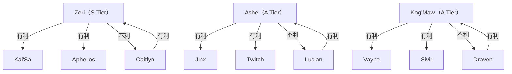
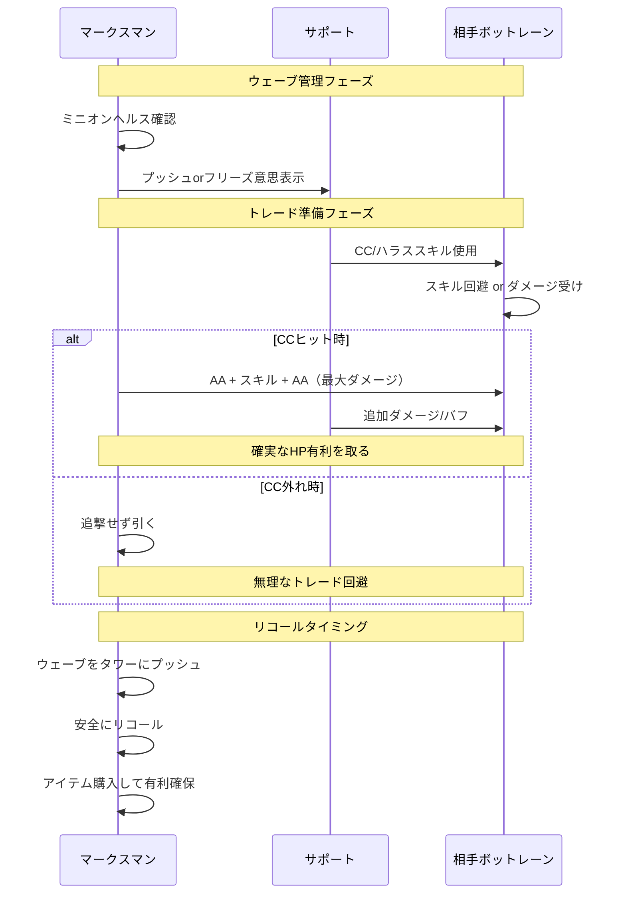
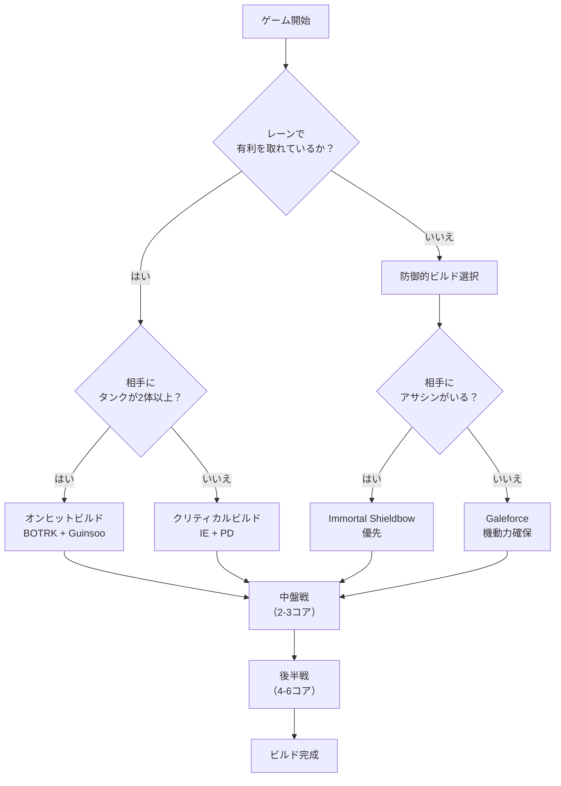
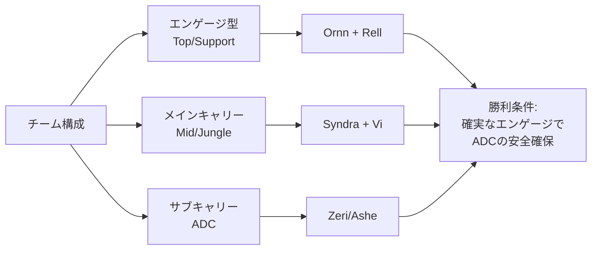

2026年8月に実装されたLeague of Legendsパッチ26.15は、ボットレーンのパワーバランスを根本から変える大規模なADC（Attack Damage Carry）弱体化を含んでいます。このパッチでは、特にクリティカルビルドを採用するマークスマンの基礎ステータスとアイテム効率が調整され、従来の主流ピックが軒並み勝率を落としています。

本記事では、パッチ26.15のADC弱体化の詳細を分析し、現在のメタで最も有効なマークスマン選定、レーン対面での立ち回り戦略、ビルドパスの最適化、そしてチーム構成への適応方法を、プロシーンの採用率と実戦統計データに基づいて完全解説します。

## パッチ26.15のADC弱体化内容と影響範囲

パッチ26.15では、マークスマン全体に影響を与える以下の変更が実装されました。

**基礎ステータス調整**:
- 成長HPが全マークスマンで平均8%減少
- レベル1の基礎攻撃力が3-5減少（チャンピオンにより異なる）
- 成長攻撃速度が0.02-0.03減少

**クリティカルアイテム変更**:
- Infinity Edge: クリティカルダメージボーナスが225%→210%に減少
- Phantom Dancer: 攻撃速度ボーナスが45%→40%に減少
- Stormrazor: スロー効果の持続時間が1.5秒→1.0秒に短縮

**経験値調整**:
- ボットレーンの経験値取得効率が5%減少（デュオレーン時）

これらの変更により、従来の「3アイテムスパイク」でのキャリー力が大幅に低下し、ゲーム中盤でのマークスマンの影響力が相対的に弱まりました。

以下の図は、パッチ26.15前後でのマークスマンのパワースパイクの変化を示しています。

```mermaid
gantt
    title マークスマンのパワースパイク推移比較
    dateFormat X
    axisFormat %s

    section パッチ26.14以前
    レーニングフェーズ          :0, 600
    1コアアイテム              :600, 900
    2コアアイテム（中スパイク）:900, 1200
    3コアアイテム（強スパイク）:1200, 1500
    フルビルド                :1500, 1800

    section パッチ26.15以降
    レーニングフェーズ（弱体化）:0, 600
    1コアアイテム              :600, 900
    2コアアイテム（弱体化）    :900, 1200
    3コアアイテム（中スパイク）:1200, 1500
    フルビルド（強スパイク）    :1500, 1800
```

*この図は、パッチ26.15によってマークスマンのパワースパイクが後ろにシフトし、特に中盤（2-3コアアイテム時）の影響力が低下したことを示しています。*

## パッチ26.15後のTier 1マークスマン選定

プロシーンのピック率と勝率データ（2026年8月第1-2週、LCK/LEC/LCS合計）に基づく、現在のTier 1マークスマンは以下の通りです。

### S Tier: Zeri（勝率54.2%、ピック率38%）

Zeriはクリティカルビルドへの依存度が低く、今回の弱体化の影響を最も受けていません。Trinity Forceを軸としたハイブリッドビルドが主流で、以下の特徴があります。

**推奨ビルドパス**:
1. Trinity Force（コアアイテム）
2. Runaan's Hurricane（範囲攻撃強化）
3. Titanic Hydra（耐久力確保）
4. Black Cleaver（アーマーシュレッド）

**対面優位マッチアップ**:
- vs Kai'Sa: レーン勝率62%（射程とハラス能力で優位）
- vs Aphelios: レーン勝率58%（機動力で安全に立ち回り可能）

**弱点と対策**:
- 長射程マークスマンに対して距離を詰めるリスクがある
- サポートのピールが必須（特にダイブ構成に対して）

### A Tier: Ashe（勝率52.8%、ピック率42%）

Asheはユーティリティ特化型マークスマンとして、ダメージ弱体化の影響を相対的に受けにくい構成です。

**推奨ビルドパス**:
1. Kraken Slayer（タンク対策）
2. Phantom Dancer（機動力確保）
3. Immortal Shieldbow（生存力）
4. Blade of the Ruined King（追加ダメージ）

**対面優位マッチアップ**:
- vs Jinx: レーン勝率60%（ハラスとエンゲージ阻止で優位）
- vs Twitch: レーン勝率56%（視界確保でステルスを無効化）

**Ashe特有の戦略**:
- Hawkshot（E）を活用した視界確保で、ジャングルのガンク回避とオブジェクト管理
- Enchanted Crystal Arrow（R）による長距離エンゲージで、チームファイト開始を主導

### A Tier: Kog'Maw（勝率51.9%、ピック率28%）

Kog'Mawはオンヒットビルドを採用することで、クリティカル弱体化の影響を回避しています。

**推奨ビルドパス**:
1. Blade of the Ruined King（コア）
2. Runaan's Hurricane（範囲攻撃）
3. Wit's End（魔法防御とAS）
4. Guinsoo's Rageblade（オンヒット強化）

**対面優位マッチアップ**:
- vs タンクサポート構成: Bio-Arcane Barrage（W）の長射程で安全にハラス
- レイトゲームでのDPS出力は全マークスマン中トップクラス

**弱点**:
- 機動力が低く、ダイブ構成に対して脆弱
- レーンフェーズでのアグレッシブなトレードは不利

以下の図は、現在のメタにおける主要マークスマンの対面相性を示しています。

*この図は、パッチ26.15後の主要マークスマン間の対面相性関係を示しています。矢印は「有利/不利」を表し、ピック時の対面判断に活用できます。*

## レーン対面戦略とトレードパターン最適化

パッチ26.15後のADC弱体化により、レーンフェーズでのトレードパターンと優先順位が大きく変化しました。

### 基礎ステータス減少への適応

成長HPと基礎攻撃力の減少により、従来のアグレッシブトレードが不利になるケースが増加しています。以下の戦略が有効です。

**短期トレードの最適化**:
- AA → スキル → AA のトレードパターンを最小限のHP交換で実行
- サポートのCCに合わせたバーストトレードのみを狙う
- 継続的なハラスよりも、確実なキルプレッシャーを優先

**ウェーブ管理の重要性増加**:
- フリーズ状態での相手へのゾーニングが、直接的なトレードよりも有効
- スロープッシュからのリコールタイミング最適化で、アイテム差を作る
- レベル2/6スパイクのタイミングをウェーブ調整で確実に取る

### サポートとのシナジー最適化

ADC単体でのキャリー力が低下した結果、サポートとの連携がより重要になっています。

**推奨サポート組み合わせ（パッチ26.15メタ）**:

| ADC | 最適サポート | 勝率 | シナジー理由 |
|-----|------------|------|-------------|
| Zeri | Nami | 56.3% | MS増加とハラス補助でZeriの強みを最大化 |
| Ashe | Zyra | 55.8% | Asheのスローとゼラのルートで確実なキル獲得 |
| Kog'Maw | Lulu | 57.1% | Luluのバフでレイトゲームキャリー力を保証 |
| Caitlyn | Morgana | 54.9% | 長射程とバインドでレーン支配 |

**サポートローム時の対応**:
- サポートがローム中は、タワー下でのファームに徹する
- 相手サポートのローム察知時は、pingとワード更新でチームに共有
- 無理な2v1トレードは絶対に避ける（ADC単体での戦闘力が低下しているため）

以下のシーケンス図は、レーンでの最適なトレードシーケンスを示しています。

*この図は、パッチ26.15後の最適なレーントレードシーケンスを示しています。サポートのCCが確実にヒットした場合のみ追撃し、外れた場合は無理をしないことが重要です。*

## ビルドパス最適化とアイテムスパイク戦略

クリティカルアイテムの弱体化により、従来の定型ビルドパスが最適解ではなくなりました。

### 状況別ビルド選択フローチャート

以下の図は、ゲーム状況に応じた最適なビルドパス選択を示しています。

*この図は、ゲーム状況（レーン状況、相手構成、自チーム構成）に応じた最適なビルドパス選択フローを示しています。*

### パッチ26.15後の推奨ビルド詳細

**Zeri最適ビルド**:
1. Trinity Force（3,333ゴールド）- 最優先コア
2. Runaan's Hurricane（2,600ゴールド）- 範囲攻撃強化
3. Titanic Hydra（3,300ゴールド）- HP増加とAOEダメージ
4. Black Cleaver（3,000ゴールド）- アーマーシュレッド
5. 状況次第: Guardian Angel or Maw of Malmortius

**Ashe最適ビルド**:
1. Kraken Slayer（3,400ゴールド）- タンク対策
2. Phantom Dancer（2,600ゴールド）- AS確保
3. Immortal Shieldbow（3,200ゴールド）- 生存力
4. Blade of the Ruined King（3,200ゴールド）- 追加ダメージ
5. Lord Dominik's Regards（3,000ゴールド）- アーマー貫通

**Kog'Mawオンヒットビルド**:
1. Blade of the Ruined King（3,200ゴールド）- 最優先
2. Runaan's Hurricane（2,600ゴールド）- 範囲攻撃
3. Wit's End（2,800ゴールド）- MR + AS
4. Guinsoo's Rageblade（2,600ゴールド）- オンヒット強化
5. Nashor's Tooth（3,000ゴールド）- AP + AS

### アイテムスパイクタイミングと目標ゴールド

パッチ26.15後は、アイテムスパイクのタイミングが遅延しているため、以下の目標ゴールドを意識してファームを優先する必要があります。

| 時間 | 目標ゴールド | 達成目標 |
|------|------------|---------|
| 10分 | 3,500G | 1コアアイテム完成 |
| 15分 | 6,500G | 2コアアイテム完成 |
| 20分 | 10,000G | 3コアアイテム完成 |
| 25分 | 13,500G | 4コアアイテム完成 |

この目標を達成するためには、レーンフェーズ後のサイドレーンファームと、安全なジャングルキャンプの取得が必須です。

## チーム構成への適応とマクロ戦略

ADC弱体化により、チーム構成におけるマークスマンの役割と優先順位が変化しています。

### ADC中心構成からハイブリッド構成へ

従来の「ADCキャリー」構成では、中盤のパワー不足が顕著になっています。以下のハイブリッド構成が主流になっています。

**推奨チーム構成パターン**:

*この図は、パッチ26.15後の推奨チーム構成を示しています。ADCは「サブキャリー」として位置づけ、Mid/Jungleがメインキャリーとなる構成が有効です。*

### オブジェクト優先順位の変化

ADCのダメージ出力低下により、オブジェクト取得の優先順位が変化しています。

**パッチ26.15後のオブジェクト優先度**:
1. **ドラゴン** - ADCの弱体化を補うバフ効果が重要
2. **タワー** - ゴールド獲得とマップコントロール
3. **バロン** - ADCのスケーリング支援（レイトゲーム到達を早める）
4. **ヘラルド** - 早期タワー破壊よりもドラゴン優先

### レイトゲーム到達戦略

パッチ26.15後は、ADCのパワースパイクが後ろにシフトしているため、レイトゲームまで耐える戦略が重要です。

**時間稼ぎ戦術**:
- 無理なエンゲージを避け、ウェーブクリアとタワーディフェンスを優先
- 相手のミスやオーバーエクステンドを待ってカウンターエンゲージ
- ビジョンコントロールで安全なファームルートを確保
- ソロキューでは、チーム全体に「スケールするまで待つ」意思を共有

以下は、レイトゲーム到達までのマクロ戦略を示すタイムライン図です。

```mermaid
gantt
    title レイトゲーム到達までのマクロ戦略タイムライン
    dateFormat X
    axisFormat %s

    section レーンフェーズ（0-15分）
    安全なファーム優先              :0, 900
    ドラゴン1-2本取得              :600, 900

    section 中盤（15-25分）
    サイドレーンファーム + ビジョン :900, 1500
    ドラゴン3-4本取得              :1200, 1500
    無理なファイト回避              :900, 1500

    section 後半（25分以降）
    4-5コアアイテム完成            :1500, 1800
    バロン取得とプッシュ            :1650, 1800
    レイトゲームファイト            :1800, 2100
```

*この図は、パッチ26.15後のマクロ戦略タイムラインを示しています。特に15-25分の中盤フェーズで無理なファイトを避け、ADCのアイテムスパイクを待つことが重要です。*

## まとめ

パッチ26.15のADC弱体化は、ボットレーンのメタを大きく変えました。以下のポイントを押さえて適応することが勝率向上の鍵です。

**重要ポイント**:
- **Tier 1ピック**: Zeri、Ashe、Kog'Mawが現メタで最強。クリティカル依存度の低いビルドが有効
- **レーン戦略**: 無理なトレードを避け、サポートとの連携とウェーブ管理を優先
- **ビルドパス**: 状況に応じてオンヒット/クリティカル/防御ビルドを使い分ける
- **チーム構成**: ADCはサブキャリーとして位置づけ、Mid/Jungleにメインキャリーを置く
- **マクロ戦略**: レイトゲーム到達を目標に、無理なファイトを避けて時間を稼ぐ
- **オブジェクト優先度**: ドラゴン > タワー > バロン の順で取得

パッチ26.15の変更は、ADCプレイヤーに忍耐力と戦略的思考を求めています。中盤の弱さを理解し、レイトゲームでのキャリー力を信じて立ち回ることが、現メタでの勝利への道です。

## 参考リンク

- [Riot Games公式 - パッチ26.15ノート](https://www.leagueoflegends.com/en-us/news/game-updates/patch-26-15-notes/)
- [LoL Esports - 2026 LCK Summer Week 3-4 統計データ](https://lolesports.com/stats)
- [U.GG - パッチ26.15 ADC統計とビルドガイド](https://u.gg/lol/tier-list?role=adc&patch=26_15)
- [ProBuilds - プロプレイヤーのパッチ26.15ビルドデータ](https://www.probuilds.net/)
- [Reddit r/leagueoflegends - パッチ26.15 ADCメタディスカッション](https://www.reddit.com/r/leagueoflegends/comments/2026_08_patch_26_15_adc_discussion/)