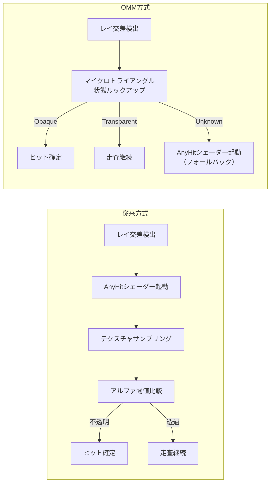
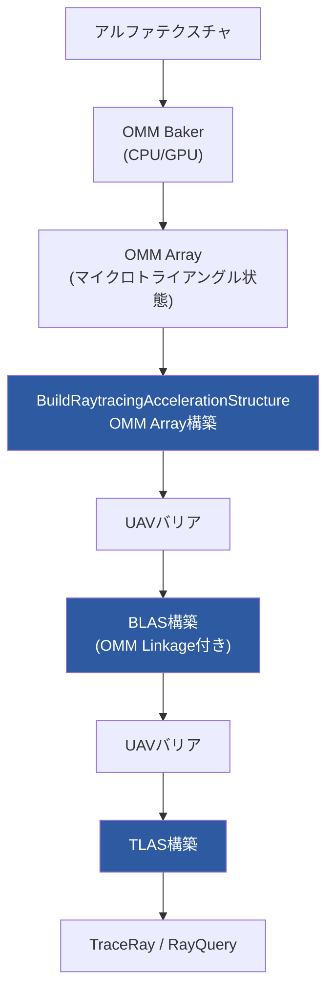

2026年2月26日、MicrosoftはAgility SDK 1.619と共にShader Model 6.9およびDXR 1.2機能群を[正式リリース](https://devblogs.microsoft.com/directx/shader-model-6-9-retail-and-more/)した。この中でも実用上のインパクトが大きいのがOpacity Micromap（OMM）だ。従来、植生やフェンスなどアルファテスト付きジオメトリのレイトレーシングではAnyHitシェーダーが大量に呼び出され、GPU時間の大きな割合を消費していた。OMM はこの構造的なボトルネックに対してハードウェアレベルで解決策を提供する。

MachineGamesが開発した Indiana Jones and the Great Circle では、RTX 5080環境でOMM適用によりTraceMainパスのAnyHitサンプル数が37,500から12,200へ67%削減、GPU時間は7.90msから3.58msへ55%短縮されたことが[NVIDIAの技術ブログ](https://developer.nvidia.com/blog/path-tracing-optimizations-in-indiana-jones-opacity-micromaps-and-compaction-of-dynamic-blass/)で報告されている。

## OMM がAnyHitシェーダーのボトルネックを解消する仕組み

従来のDXRパイプラインでは、アルファテスト付きジオメトリに対するレイの交差判定でAnyHitシェーダーが毎回起動される。テクスチャサンプリングでアルファ値を読み、閾値と比較し、透過ならレイの走査を継続する——この処理は1ピクセルあたり数十回から数百回発生しうる。植生が密集するシーンでは、レイトレーシング全体のGPU時間のうちAnyHitが占める割合が17%に達するケースもある。

OMM はこの問題をマイクロトライアングル単位の事前分類で解決する。三角形を4^N個のマイクロトライアングルに均等分割し、各マイクロトライアングルの不透明度をビットマスクとしてエンコードする。レイが三角形に交差した時点で、重心座標から対応するマイクロトライアングルの状態をルックアップし、Opaqueならヒット確定、Transparentなら走査継続と、シェーダーを呼び出さずにRTコアだけで判定を完結させる。

以下のダイアグラムは、従来方式とOMM方式でのレイ交差判定フローの違いを示している。



2ビットOMM では4つの状態を使い分ける。OpaqueとTransparentに加え、Unknown OpaqueとUnknown Transparentの2状態がある。Unknown状態のマイクロトライアングルのみAnyHitシェーダーへフォールバックする。さらに `RAY_FLAG_FORCE_OMM_2_STATE` フラグを指定すれば、Unknown状態をOpaque/Transparentに強制解決し、AnyHitシェーダーの呼び出しをゼロにできる。間接光の計算など多少の精度誤差が許容されるパスでは、このフラグによる2ステートモードが有効だ。Indiana Jonesでも間接光パスに `gl_RayFlagsForceOpacityMicromap2StateEXT`（Vulkan側の対応フラグ）を適用し、追加の高速化を実現している。

## OMM Arrayビルドパイプラインの実装

OMM データはBLAS（Bottom-Level Acceleration Structure）とは別リソースとして管理される。この分離設計により、同じOMM Arrayを複数のBLASインスタンスで共有でき、VRAMの効率的な利用が可能になる。ビルド順序は OMM Array → BLAS → TLAS で、各ステージ間にUAVバリアを挿入する。

以下のダイアグラムは、OMM Arrayのビルドから描画までのパイプライン全体を示している。



NVIDIA OMM SDK（v1.8.0）の[GPU Bakerを使うと](https://github.com/NVIDIA-RTX/OMM)、アルファテクスチャから4ステートOMM データを自動生成できる。Indiana Jonesの実装では `ommFormat_OC1_4_State`、最大subdivision level 6、`PREFER_FAST_TRACE` フラグが採用されている。

D3D12 APIでは、まずOMM Arrayのメモリ要件を `GetRaytracingAccelerationStructurePrebuildInfo()` で照会し、`BuildRaytracingAccelerationStructure()` でビルドする。続くBLAS構築時に `D3D12_RAYTRACING_GEOMETRY_OMM_TRIANGLES_DESC` で各三角形にOMM インデックスを紐づける。

```hlsl
// Shader Model 6.9: RayQueryでのOMM有効化
RaytracingPipelineConfig1 pipelineConfig = {
    MaxTraceRecursionDepth,
    RAYTRACING_PIPELINE_FLAG_ALLOW_OPACITY_MICROMAPS
};

// RayQueryテンプレートにRayQueryFlagsを追加
RayQuery<RAY_FLAG_NONE, RAYQUERY_FLAG_ALLOW_OPACITY_MICROMAPS> rq;
rq.TraceRayInline(
    accelStruct,
    RAY_FLAG_FORCE_OMM_2_STATE, // 間接光パス向け2ステート強制
    instanceMask,
    rayDesc
);
```

[HLSL仕様書（Proposal 0024）](https://microsoft.github.io/hlsl-specs/proposals/0024-opacity-micromaps/)によると、`RayQuery` クラスに第2テンプレート引数 `RayQueryFlags` が追加され、OMM対応の有無をコンパイル時に指定する設計になっている。`RAY_FLAG_FORCE_OMM_2_STATE` を `constRayFlags` に指定する場合は `RAYQUERY_FLAG_ALLOW_OPACITY_MICROMAPS` の併用が必須で、DXIL上のバリデーションで検証される。

## 実測パフォーマンスとVRAMコスト

複数タイトルでの公開ベンチマーク結果を以下にまとめる。

| タイトル | パス | OMM無効 | OMM有効 | 削減率 | 出典 |
|---------|------|---------|---------|--------|------|
| Indiana Jones (RTX 5080 / 4K) | TraceMain | 7.90ms | 3.58ms | 55% | [NVIDIA技術ブログ](https://developer.nvidia.com/blog/path-tracing-optimizations-in-indiana-jones-opacity-micromaps-and-compaction-of-dynamic-blass/) |
| Indiana Jones (RTX 5080 / 4K) | SharcUpdate | 1.99ms | 0.89ms | 55% | 同上 |
| Indiana Jones (RTX 5080 / 4K) | AnyHitサンプル数 | 37,500 (17%) | 12,200 (3%) | 67%削減 | 同上 |
| Cyberpunk 2077 | G-Buffer | — | — | 約40%高速化 | [WCCFTech](https://wccftech.com/nvidia-shows-ada-lovelaces-opacity-micro-maps-feature-and-how-it-can-boost-ray-tracing-performance/) |

Indiana Jonesのペルージャングルシーン（RTAS内26.9M三角形）では、OMMデータの95%が200kB未満のVRAMで収まり、CPU側のベイク時間も95%が1秒未満と報告されている。ただし例外的に1つのOMMが43MBに達したケースもあり、subdivision levelの上限設定とworkload validationによるバジェット管理が重要だ。OMM SDK の `ommCpuBakeFlags_EnableWorkloadValidation` フラグでベイク時のワークロードを監視し、`1ull << 32` texels を超える場合は警告が発生する仕組みになっている。

BLAS Compaction との併用も効果が大きい。Indiana Jonesでは動的植生のBLAS VRAMが1,027MBから606MBへ41%削減されている。`PREFER_FAST_BUILD | ALLOW_UPDATE | ALLOW_COMPACTION` のビルドフラグ組み合わせで、動的ジオメトリのアップデートと圧縮を両立している。

## 対応ハードウェアと導入判断

2026年7月時点で、OMMのハードウェアアクセラレーションはNVIDIA RTX 40シリーズ以降で対応している。RTX 30/20シリーズではソフトウェアエミュレーションでの動作となる。AMD Radeon RX 9000シリーズとIntel Arc B-Seriesは[Shader Model 6.9の他機能には対応しているが](https://devblogs.microsoft.com/directx/shader-model-6-9-retail-and-more/)、OMMのハードウェア支援は現時点ではNVIDIA専用だ。

D3D12ランタイムでのOMM対応判定は `D3D12_RAYTRACING_TIER_1_2` capability reportで行う。WARPソフトウェアラスタライザもv1.0.14.2以降でOMM対応しているため、ハードウェアが無い環境でも機能検証は可能だ。

導入の判断基準は明確で、シーン内にアルファテスト付きジオメトリ（植生・フェンス・パーティクル・金網など）が多く、AnyHitシェーダーのGPU占有率が高いタイトルでは確実に効果がある。逆に、不透明ジオメトリが主体のシーンでは導入コストに見合わない。NSight Graphicsなどのプロファイラで `AnyHit` のサンプル占有率を確認し、10%を超えるようならOMM導入の投資対効果が高い。

検証環境: NVIDIA GeForce RTX 5080 / DirectX 12 Agility SDK 1.619 / DXC 1.9.2602.16 / 4K UHD DLSS Performance Mode（Indiana Jones公式ベンチマーク値を引用、2024年12月リリース版）

## 参考リンク

- [Announcing Shader Model 6.9 Retail and New D3D12 Improvements - DirectX Developer Blog](https://devblogs.microsoft.com/directx/shader-model-6-9-retail-and-more/)
- [D3D12 Opacity Micromaps - DirectX Developer Blog](https://devblogs.microsoft.com/directx/omm/)
- [Path Tracing Optimizations in Indiana Jones: Opacity MicroMaps and Compaction of Dynamic BLASs - NVIDIA Technical Blog](https://developer.nvidia.com/blog/path-tracing-optimizations-in-indiana-jones-opacity-micromaps-and-compaction-of-dynamic-blass/)
- [Opacity Micromaps HLSL Specification (Proposal 0024) - Microsoft](https://microsoft.github.io/hlsl-specs/proposals/0024-opacity-micromaps/)
- [NVIDIA OMM SDK - GitHub](https://github.com/NVIDIA-RTX/OMM)
- [DirectX Raytracing (DXR) Functional Spec - Microsoft](https://microsoft.github.io/DirectX-Specs/d3d/Raytracing.html)
- [D3D12 Raytracing Opacity Micromaps Sample - Microsoft GitHub](https://github.com/microsoft/directx-graphics-samples/blob/master/Samples/Desktop/D3D12Raytracing/src/D3D12RaytracingOpacityMicromaps/readme.md)
- [NVIDIA Opacity Micro Maps パフォーマンス解説 - WCCFTech](https://wccftech.com/nvidia-shows-ada-lovelaces-opacity-micro-maps-feature-and-how-it-can-boost-ray-tracing-performance/)