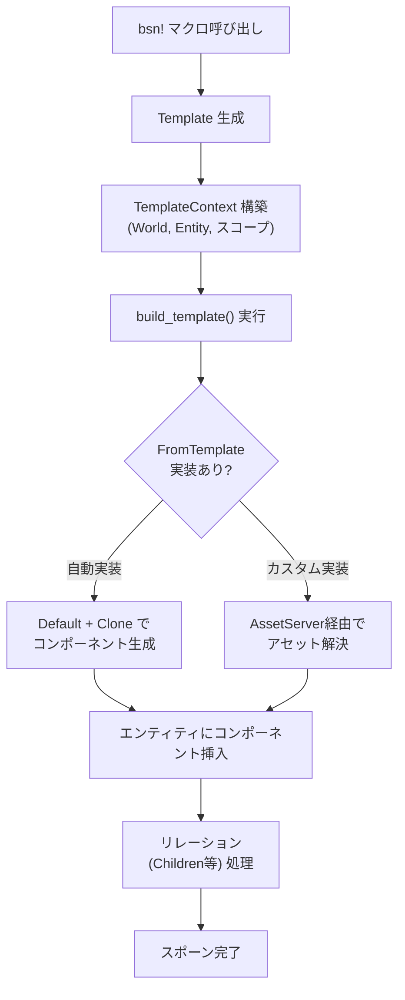
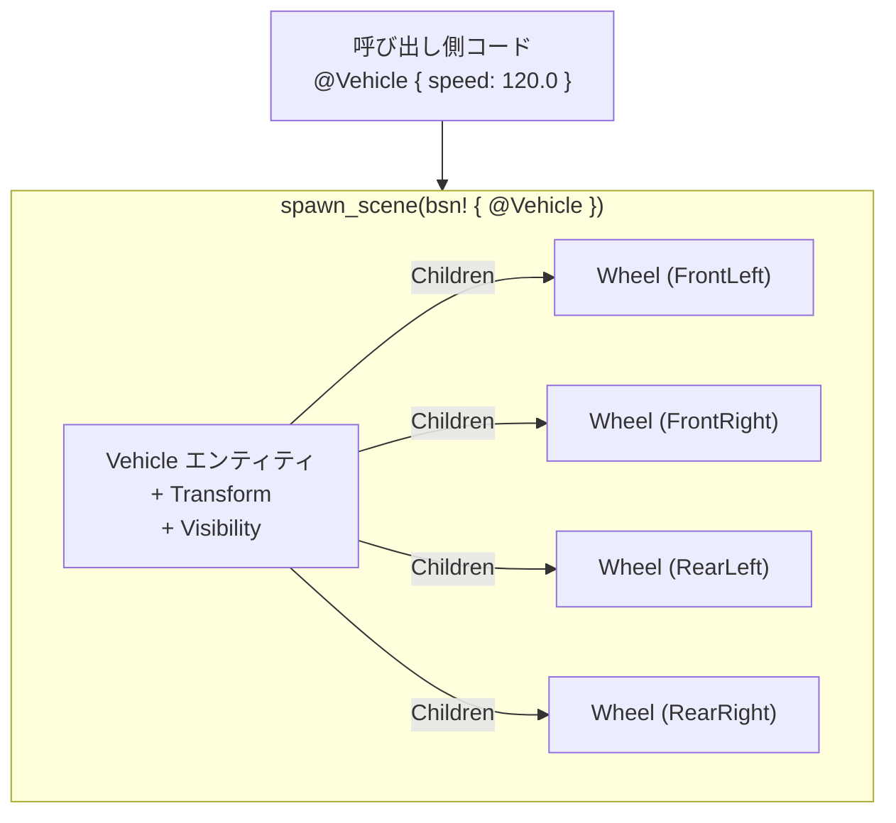

2026年6月19日、Bevy 0.19が261名のコントリビューターによる1,185本のPRを経てリリースされた。最大の目玉は**BSN（Bevy Scene Notation）**——ECSベースのゲームエンジンにおいて、エンティティ階層の構築を宣言的に記述する新しいシーンシステムだ。従来のBevyでは`commands.spawn()`にコンポーネントのタプルを渡し、アセットの読み込みには`AssetServer`を手動で注入する必要があった。BSNはこのボイラープレートを`bsn!`マクロと`Template`トレイトの設計で根本から解消する。

本稿ではBSNの構文規則、合成（Composition）とパッチ（Patching）の仕組み、`SceneComponent`によるプロップス設計、そして旧シーンシステムからの移行パスを、[公式リリースノート](https://bevy.org/news/bevy-0-19/)と[PR #23413](https://github.com/bevyengine/bevy/pull/23413)の一次情報に基づいて解説する。

## `bsn!`マクロの構文規則とテンプレートアーキテクチャ

BSNの中核は`bsn!`マクロだ。Rust風の構文でエンティティのコンポーネント構成を記述し、Rust Analyzerの補完・定義ジャンプ・セマンティックハイライトがそのまま動作する。まず基本構文を見る。

```rust
use bevy::prelude::*;

#[derive(Component, Default, Clone)]
struct Player {
    score: usize,
    coins: usize,
}

// スコアだけ指定し、coinsはDefaultで0になる
commands.spawn_scene(bsn! {
    Player { score: 10 }
    Team::Blue
});
```

`Player`の`coins`フィールドは省略されている。BSNでは`Default + Clone`を実装した型に対して`Template`と`FromTemplate`トレイトが自動的にブランケット実装されるため、未指定フィールドはデフォルト値で埋まる。明示的にすべてのフィールドを書く必要はない。

以下のダイアグラムはBSNの`bsn!`マクロからエンティティがスポーンされるまでの処理フローを示している。



ここで重要なのは、`Template`トレイトが単なるファクトリではなく、`TemplateContext`を通じて`World`とエンティティ参照にアクセスできる点だ。これにより、アセットパスの文字列から`Handle<Image>`への変換を`FromTemplate`のカスタム実装内で自動処理できる。

```rust
// FromTemplateをderiveすると、imageフィールドに文字列パスを渡すだけで
// AssetServer::loadが自動的に呼ばれる
#[derive(Component, FromTemplate)]
struct Sprite {
    image: Handle<Image>,
}

// BSN内では文字列リテラルを渡すだけでよい
commands.spawn_scene(bsn! {
    Sprite { image: "textures/player.png" }
});
```

従来は以下のように`AssetServer`を関数引数で受け取る必要があった。

```rust
// 0.18以前の書き方
fn spawn_player(commands: &mut Commands, asset_server: Res<AssetServer>) {
    commands.spawn((
        Player { score: 10, coins: 0 },
        Sprite {
            image: asset_server.load("textures/player.png"),
            ..default()
        },
    ));
}
```

BSNでは依存リソースの注入が不要になり、シーン定義が純粋なデータ記述に近づく。

## シーン合成とパッチ——コンポーネント単位の差分適用

BSNの設計思想の核は「シーンはパッチの重ね合わせ」という概念だ。複数のシーン定義を合成する際、同一コンポーネントの同一フィールドは「後勝ち（last write wins）」で上書きされるが、異なるフィールドは個別にマージされる。

```rust
fn base_node() -> impl Scene {
    bsn! {
        Node {
            width: px(200),
            height: px(50),
        }
        BackgroundColor(Color::srgb(0.2, 0.2, 0.2))
    }
}

fn highlighted_node() -> impl Scene {
    bsn! {
        // base_node()の上にパッチを適用
        base_node()
        // heightだけ上書き、widthはbase_nodeの200pxが残る
        Node { height: px(80) }
        BackgroundColor(Color::srgb(0.8, 0.3, 0.1))
    }
}
```

この例では`highlighted_node`が`base_node`を呼び出し、その上に`Node`の`height`と`BackgroundColor`をパッチしている。`width`は`base_node`の`px(200)`がそのまま保持される。これはCSSのカスケードに似た仕組みだが、型安全なRust構造体のフィールドレベルで動作する。

`Children`リレーションを使ったUI階層の合成も同様に宣言的に書ける。公式の[BSNサンプル](https://bevy.org/examples/scene/bsn/)から引用した実用的なUI構築例を示す。

```rust
fn ui() -> impl Scene {
    bsn! {
        Node {
            width: percent(100),
            height: percent(100),
            align_items: AlignItems::Center,
            justify_content: JustifyContent::Center,
            column_gap: px(5),
        }
        Children [
            (
                button("OK")
                on(|_: On<Pointer<Press>>| println!("OK pressed"))
            ),
            (
                button("Cancel")
                on(|_: On<Pointer<Press>>| println!("Cancel pressed"))
                BackgroundColor(Color::srgb(0.4, 0.15, 0.15))
            ),
        ]
    }
}

fn button(label: &str) -> impl Scene {
    bsn! {
        Button
        Node {
            width: px(150),
            height: px(65),
            border: px(5),
            border_radius: BorderRadius::MAX,
            justify_content: JustifyContent::Center,
            align_items: AlignItems::Center,
        }
        BorderColor::from(Color::BLACK)
        BackgroundColor(Color::srgb(0.15, 0.15, 0.15))
        Children [(
            Text(label)
            TextFont {
                font: FontSourceTemplate::Handle("fonts/FiraSans-Bold.ttf"),
                font_size: px(33.0),
            }
            TextColor(Color::srgb(0.9, 0.9, 0.9))
        )]
    }
}
```

注目すべき点が3つある。第一に、`button`関数はシーン定義を返す通常のRust関数であり、引数`label`で文字列を受け取ってパラメータ化している。第二に、`on()`でイベントオブザーバーをシーン定義内に直接埋め込める。第三に、`Children []`構文がエンティティの親子関係をインラインで表現している。

## `SceneComponent`とエンティティ参照——複合シーンの設計

ゲーム開発では単一コンポーネントではなく、複数のコンポーネントとリレーションを持つ「意味のある単位」をスポーンしたい場面が多い。BSNの`SceneComponent`はこの要件に応える。

```rust
#[derive(SceneComponent, Default, Clone)]
struct Vehicle {
    speed: f32,
    boost: f32,
}

impl Vehicle {
    fn scene() -> impl Scene {
        bsn! {
            Transform::default()
            Visibility::default()
            Children [
                Wheel { position: WheelPos::FrontLeft },
                Wheel { position: WheelPos::FrontRight },
                Wheel { position: WheelPos::RearLeft },
                Wheel { position: WheelPos::RearRight },
            ]
        }
    }
}
```

`SceneComponent`をスポーンする際は`@`プレフィクスを使う。

```rust
commands.spawn_scene(bsn! {
    @Vehicle { speed: 120.0, boost: 50.0 }
});
```

`@Vehicle`と書くことで、`Vehicle`コンポーネント自体に加えて`Vehicle::scene()`が定義する`Transform`、`Visibility`、4つの`Wheel`子エンティティが一括でスポーンされる。呼び出し側はプロップス（`speed`、`boost`）だけ気にすればよく、内部構造の詳細を知る必要がない。

`#`プレフィクスによるエンティティ参照は、同一スコープ内でエンティティ間のリレーションを作る際に使う。

```rust
commands.spawn_scene(bsn! {
    #Boss
    Name("Boss")
    Children [
        #Minion1 FollowTarget(#Boss),
        #Minion2 FollowTarget(#Boss),
    ]
});
```

以下のダイアグラムは`SceneComponent`のスポーン時にBSNが構築するエンティティ階層を示している。



`SceneComponent`のプロップスはパッチとしても適用可能で、`Vehicle::scene()`の内部で定義されたデフォルト値を呼び出し側から部分的に上書きできる。

## 旧シーンシステムからの移行パス

Bevy 0.19では旧`bevy_scene`クレートが`bevy_world_serialization`にリネームされ、`bevy_scene`の名前空間がBSNに譲渡された。[移行ガイド](https://bevy.org/learn/migration-guides/0-18-to-0-19/)に従い、主要な型名を更新する必要がある。

| 0.18 | 0.19 |
|------|------|
| `Scene` | `WorldAsset` |
| `SceneRoot` | `WorldAssetRoot` |
| `DynamicScene` | `DynamicWorld` |
| `DynamicSceneBuilder` | `DynamicWorldBuilder` |
| `ScenePlugin` | `WorldSerializationPlugin` |

GLTFシーンのスポーンは以下のように変わる。

```rust
// 0.18
commands.spawn(SceneRoot(asset_server.load("level.gltf#Scene0")));

// 0.19
commands.spawn(WorldAssetRoot(asset_server.load("level.gltf#Scene0")));
```

現時点でGLTFローダーはまだBSNにポートされていないため、旧システムの`WorldAsset`系APIがGLTFスポーンに必要だ。また、Worldの双方向シリアライズ（保存→読み込み）もBSN側では未サポートのため、`DynamicWorld`（旧`DynamicScene`）を使う。将来的にはBSNアセットファイル（`.bsn`）ローダーが実装され、ディスク上のシーンファイルをアセットとして読み込むワークフローが完成する予定だ。

シーン関数を`Startup`システムとして登録する際は`.spawn()`ヘルパーを使う。

```rust
fn level() -> impl SceneList {
    bsn_list![
        Camera2d,
        @Player { score: 0 },
        Sprite { image: "textures/background.png" },
    ]
}

app.add_systems(Startup, level.spawn());
```

BSNのリリースはコードドリブンワークフローに焦点を絞った第一段階であり、アセットドリブンワークフロー（`.bsn`ファイル）は次のリリースサイクルで追加される予定だ。現時点でBSNを採用する場合、`bsn!`マクロによるコード内シーン定義がメインの使い方となる。レンダリング面では同リリースでGPU駆動クラスタリング（ライト・プローブ・デカール）が導入され、`many_cubes`ベンチマークで0.18の49.47ms/frameから0.19の18.77ms/frameへ約2.6倍の高速化が実測されている。BSNによるシーン構築の効率化と、レンダリングパイプラインの高速化が同時に提供されたBevy 0.19は、Rustゲーム開発のワークフローを大きく前進させるリリースとなった。

検証環境: Bevy 0.19.0 / Rust 1.82 / NVIDIA RTX 4090 Mobile（公式ブログ記載のベンチマーク値を引用） / 2026年6月

## 参考リンク

- [Bevy 0.19 公式リリースノート](https://bevy.org/news/bevy-0-19/)
- [PR #23413: Next Generation Scenes: Core scene system, bsn! macro, Templates](https://github.com/bevyengine/bevy/pull/23413)
- [Bevy 0.18 to 0.19 Migration Guide](https://bevy.org/learn/migration-guides/0-18-to-0-19/)
- [BSN公式サンプルコード](https://bevy.org/examples/scene/bsn/)
- [Bevy Scene Notation (BSN) | Tainted Coders](https://taintedcoders.com/bevy/bsn)
- [Bevy 0.19 brings next-gen scenes, faster rendering, contact shadows | AlternativeTo](https://alternativeto.net/news/2026/6/bevy-0-19-brings-next-gen-scenes-faster-rendering-contact-shadows-and-new-feathers-widgets/)