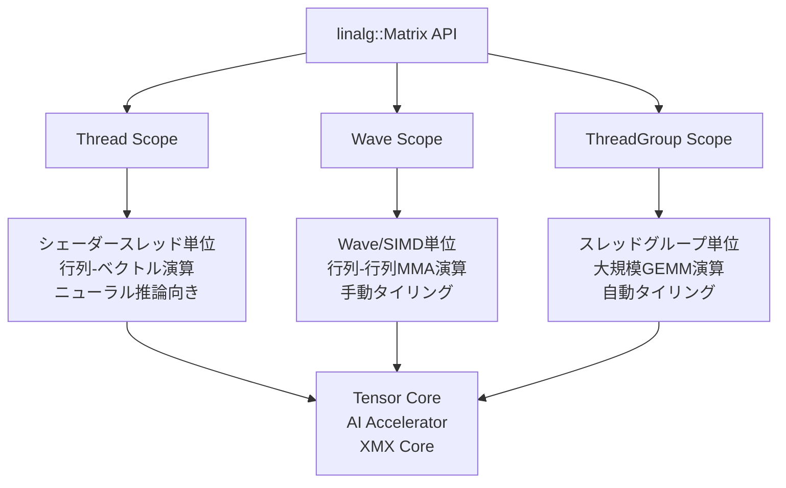
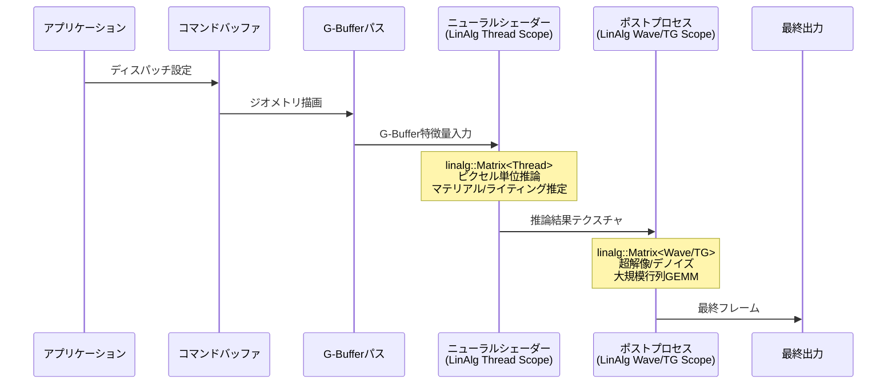

2026年4月27日、MicrosoftはShader Model 6.10のプレビューを[AgilitySDK 1.720-preview](https://devblogs.microsoft.com/directx/shader-model-6-10-agilitysdk-720-preview/)としてリリースした。目玉機能はLinAlg（Linear Algebra）APIだ。NVIDIA Tensor Core、AMD AI Accelerator、Intel XMX Coreといったベンダー固有の行列演算ハードウェアに、`linalg::Matrix`という単一のHLSLクラスからアクセスできるようになる。これにより、ニューラルレンダリング技術がベンダーロックインから解放され、DirectX標準機能として組み込める時代が始まった。

## LinAlg APIの設計思想――3つのMatrixスコープ

LinAlg APIの核心は、GPU上の行列演算を3つの「スコープ」で階層化した点にある。従来のCooperative VectorsやWaveMMAといった個別機能を統合し、用途に応じた抽象度で行列演算を記述できる。

**Thread Scope**は、個々のシェーダースレッドが独立に行列・ベクトル演算を実行するモードだ。ニューラルネットワークの推論をレンダリングパイプライン内で直接行うケース、つまり古典的な物理ベースシェーディングをニューラルネットワークで置き換える場面を想定している。行列データは`ByteAddressBuffer`から読み取り専用でロードし、ベクトルとの乗算（`Multiply`、`MultiplyAdd`）や外積（`OuterProduct`）を実行する。

**Wave Scope**は、SIMD実行ユニット全体で1つの行列を協調的に処理する。GPU内蔵のMMA（Matrix Multiply-Accumulate）ハードウェアに直接マッピングされ、手動でタイリングしたGEMM演算に使う。画像処理やMLワークロードで最大帯域幅を引き出す場面に適している。

**ThreadGroup Scope**は、スレッドグループ全体で大規模な行列演算を行う新しいモードだ。LLMスタイルの大規模ネットワーク層を扱うために設計されており、タイリングの分割方法はドライバが自動的に判断する。開発者はハードウェア固有のタイルサイズを意識する必要がない。

以下のダイアグラムは、3つのスコープがGPUハードウェア上でどのように対応するかを示している。



Thread Scopeが推論特化、Wave Scopeが中規模行列の高スループット処理、ThreadGroup Scopeが大規模行列の自動最適化という棲み分けになっている。

## linalg::Matrixの実装パターン――Thread Scope推論の実装例

実装の起点は`dx::linalg::Matrix`テンプレートクラスだ。[HLSL仕様書0035](https://microsoft.github.io/hlsl-specs/proposals/0035-linalg-matrix/)に定義されたAPIは、5つのテンプレートパラメータを取る。

```hlsl
// Matrix型テンプレート
// ComponentTy: 要素型（F16, BFloat16, F8_E4M3FN等）
// M, N: 行列の行数・列数
// Use: MatrixUse::A, B, Accumulator
// Scope: MatrixScope::Thread, Wave, ThreadGroup
dx::linalg::Matrix<ComponentTy, M, N, Use, Scope>
```

Thread Scopeでのニューラルネットワーク推論は、以下のようなパターンで記述する。まず重み行列をバッファからロードし、入力ベクトルと乗算して活性化関数を適用する流れだ。

```hlsl
#include "dx/linalg.h"

ByteAddressBuffer weights : register(t0);
ByteAddressBuffer biases  : register(t1);

// Thread Scope行列によるニューラルネットワーク推論
float4 NeuralShading(float3 inputFeatures, uint2 pixelPos) {
    // 入力ベクトルの構築
    dx::linalg::InterpretedVector<float, 8> inputVec =
        dx::linalg::MakeInterpretedVector<float>(
            float8(inputFeatures.x, inputFeatures.y, inputFeatures.z,
                   pixelPos.x, pixelPos.y, 0, 0, 0));

    // 重み行列のロード（Thread Scope, 読み取り専用）
    // 128バイトアライメント必須
    dx::linalg::Matrix<dx::linalg::F16, 16, 8,
        dx::linalg::MatrixUse::A,
        dx::linalg::MatrixScope::Thread> layer1;
    layer1.Load(weights, 0, 16,
        dx::linalg::MatrixLayout::MUL_OPTIMAL);

    // 行列-ベクトル乗算 + バイアス加算
    dx::linalg::InterpretedVector<float, 16> hidden =
        dx::linalg::MultiplyAdd(layer1, inputVec,
            biases, /*biasOffset=*/0);

    // ReLU活性化
    [unroll]
    for (int i = 0; i < 16; i++) {
        hidden[i] = max(0.0f, hidden[i]);
    }

    // 出力層（16→4）
    dx::linalg::Matrix<dx::linalg::F16, 4, 16,
        dx::linalg::MatrixUse::A,
        dx::linalg::MatrixScope::Thread> layer2;
    layer2.Load(weights, 512, 32,
        dx::linalg::MatrixLayout::MUL_OPTIMAL);

    dx::linalg::InterpretedVector<float, 4> output =
        dx::linalg::Multiply(layer2, hidden);

    return float4(output[0], output[1], output[2], output[3]);
}
```

ここで注意すべきは、Thread Scope行列は読み取り専用であり、バッファからのロードのみ許可される点だ。`MUL_OPTIMAL`レイアウトを指定すると、デバイスが最も効率的に行列-ベクトル乗算を実行できるメモリ配置をドライバが選択する。メモリアライメントは厳格で、ロード・ストアには128バイト境界、ストライドには16バイト境界が要求される。

## Wave Scope GEMMとThreadGroup自動タイリングの使い分け

Wave ScopeとThreadGroup Scopeは、行列同士の乗算（GEMM）を行う場面で使う。両者の違いはタイリング戦略にある。

Wave Scopeでは、開発者が明示的にタイルサイズを指定してループを構成する。

```hlsl
// Wave Scope GEMM: 開発者が手動タイリング
[numthreads(128, 1, 1)]
void WaveGEMM(uint3 dtid : SV_DispatchThreadID,
              uint3 gid  : SV_GroupID) {

    const uint TILE_M = 16, TILE_N = 16, TILE_K = 16;

    // アキュムレータ初期化
    dx::linalg::Matrix<float, TILE_M, TILE_N,
        dx::linalg::MatrixUse::Accumulator,
        dx::linalg::MatrixScope::Wave> accum;
    accum.Fill(0.0f);

    // K方向のタイルループ
    for (uint k = 0; k < K; k += TILE_K) {
        dx::linalg::Matrix<dx::linalg::F16, TILE_M, TILE_K,
            dx::linalg::MatrixUse::A,
            dx::linalg::MatrixScope::Wave> tileA;
        tileA.Load(bufA, /*offset*/ ..., strideA,
            dx::linalg::MatrixLayout::RowMajor);

        dx::linalg::Matrix<dx::linalg::F16, TILE_K, TILE_N,
            dx::linalg::MatrixUse::B,
            dx::linalg::MatrixScope::Wave> tileB;
        tileB.Load(bufB, /*offset*/ ..., strideB,
            dx::linalg::MatrixLayout::ColMajor);

        // MMA: accum += tileA * tileB
        accum.MultiplyAccumulate(tileA, tileB);
    }

    // 結果の書き出し
    accum.Store(bufOut, /*offset*/ ..., strideOut,
        dx::linalg::MatrixLayout::RowMajor);
}
```

一方、ThreadGroup Scopeでは同じGEMM演算をよりシンプルに記述できる。タイリングの分割はドライバに委ねられるため、ハードウェアごとのチューニングが不要だ。

```hlsl
// ThreadGroup Scope GEMM: ドライバ自動タイリング
[numthreads(256, 1, 1)]
void ThreadGroupGEMM(uint3 gid : SV_GroupID) {

    dx::linalg::Matrix<float, M, N,
        dx::linalg::MatrixUse::Accumulator,
        dx::linalg::MatrixScope::ThreadGroup> result;
    result.Fill(0.0f);

    dx::linalg::Matrix<dx::linalg::F16, M, K,
        dx::linalg::MatrixUse::A,
        dx::linalg::MatrixScope::ThreadGroup> matA;
    matA.Load(bufA, offsetA, strideA,
        dx::linalg::MatrixLayout::RowMajor);

    dx::linalg::Matrix<dx::linalg::F16, K, N,
        dx::linalg::MatrixUse::B,
        dx::linalg::MatrixScope::ThreadGroup> matB;
    matB.Load(bufB, offsetB, strideB,
        dx::linalg::MatrixLayout::ColMajor);

    result.MultiplyAccumulate(matA, matB);
    result.Store(bufOut, offsetOut, strideOut,
        dx::linalg::MatrixLayout::RowMajor);
}
```

以下のダイアグラムは、ニューラルレンダリングパイプラインにおけるLinAlg APIの組み込み位置を示している。



Thread Scopeはピクセル単位の軽量な推論（ニューラルマテリアルやライティング推定）に、Wave/ThreadGroup Scopeはフルスクリーンの超解像やデノイズといった大規模行列演算に対応する。

## ベンダー横断のハードウェア対応状況と導入手順

LinAlg APIの実用化で最も重要な点は、GPU行列演算ハードウェアへのアクセスがベンダー非依存になったことだ。従来、NVIDIAのTensor CoreにはCUDAやOptiXのVendor Extension経由でしかアクセスできず、AMDのAI Acceleratorには独自のHIP/ROCm APIが必要だった。LinAlgはこれらを1つのHLSLヘッダーに統合する。

| ベンダー | 対応GPU | LinAlg対応 | ドライバ状況 |
|---------|---------|-----------|------------|
| NVIDIA | RTX 20/30/40/50シリーズ | 全RTXハードウェア | 開発者プレビュー提供中 |
| AMD | Radeon RX 9000シリーズ | RDNA 4のみ | AgilitySDK Developer Preview 25.30.41.02 |
| Intel | Arc B-Series | 今後対応予定 | XMXコアサポート開発中 |

導入に必要なセットアップ手順は以下の通りだ。

```cpp
// 1. 実験的シェーダーモデルの有効化
UUID experimentalFeatures[] = { D3D12ExperimentalShaderModels };
D3D12EnableExperimentalFeatures(1, experimentalFeatures, nullptr, nullptr);

// 2. LinAlgサポートの確認
D3D12_FEATURE_DATA_LINEAR_ALGEBRA_SUPPORT laSupport = {};
device->CheckFeatureSupport(
    D3D12_FEATURE_LINEAR_ALGEBRA_SUPPORT,
    &laSupport, sizeof(laSupport));

// Tier 1サポートの確認
if (laSupport.Tier >= D3D12_LINEAR_ALGEBRA_TIER_1) {
    // LinAlg APIが利用可能
    // Thread/Wave/ThreadGroup全スコープ対応
}

// 3. groupsharedメモリ上限の照会（SM6.10新機能）
D3D12_FEATURE_DATA_SHADER_MODEL smData = {};
smData.HighestShaderModel = D3D_SHADER_MODEL_6_10;
device->CheckFeatureSupport(
    D3D12_FEATURE_SHADER_MODEL,
    &smData, sizeof(smData));
```

コンパイル時には、DXC 1.10.2605.2以降を使用し、ターゲットプロファイルに`cs_6_10`（Compute Shader）や`ps_6_10`（Pixel Shader）を指定する。LinAlgヘッダーは`#include "dx/linalg.h"`で取り込む。

## ニューラルレンダリングの実用シナリオと既存技術との関係

LinAlg APIが解決する根本的な課題は、「GPU内蔵の行列演算ハードウェアがゲーム開発者にとって事実上アクセス不能だった」という問題だ。DLSS、FSR、XeSSといったアップスケーリング技術は各ベンダーがクローズドに実装しており、ゲーム開発者が独自のニューラルレンダリング手法を組み込むには、ベンダーごとに異なるAPIを使い分ける必要があった。

LinAlgにより、以下のようなシナリオが標準的なHLSLコードで実現可能になる。

- **ニューラルマテリアル**: 従来のPBRシェーダーを小規模ニューラルネットワークで置換し、フォトリアリスティックな外観を実現（Thread Scope）
- **ニューラルラジアンスキャッシュ**: シーンの間接照明を学習済みネットワークで近似し、リアルタイムGIのコストを削減（Thread Scope）
- **カスタム超解像**: DLSS/FSRに依存しない独自の超解像アルゴリズムをゲームエンジンに統合（Wave/ThreadGroup Scope）
- **リアルタイムデノイジング**: レイトレーシング出力のノイズ除去を行列演算で高速化（ThreadGroup Scope）

SM6.9で導入されたLong VectorsとNative DXIL VectorsがLinAlgの基盤技術であり、SM6.10はこれらを高水準APIとして包み直した形になる。SM6.10ではさらにgroupsharedメモリの32KB制限が撤廃され、`[GroupSharedLimit(<bytes>)]`属性でハードウェアの最大容量まで利用できるようになった。大規模なニューラルネットワーク層の中間結果をgroupsharedメモリに保持し、スレッドグループ内で共有するワークフローが現実的になっている。

現時点ではプレビュー段階であり、本番利用には秋以降に予定されているAgilitySDKの安定版リリースを待つ必要がある。だが、LinAlg APIの設計は[HLSL仕様として公開](https://microsoft.github.io/hlsl-specs/proposals/0035-linalg-matrix/)されており、先行してアーキテクチャ設計やシェーダー試作に着手するには十分な情報が揃っている。GPU行列演算ハードウェアへの統一アクセスは、ニューラルレンダリングをゲーム開発の標準ツールキットに組み込む転換点となる。

検証環境: Windows 11 24H2 / AgilitySDK 1.720.1-preview / DXC 1.10.2605.2 / NVIDIA RTX 4090（開発者プレビュードライバ） / 2026年7月検証

## 参考リンク

- [Announcing Shader Model 6.10 Preview and AgilitySDK 720 Preview - DirectX Developer Blog](https://devblogs.microsoft.com/directx/shader-model-6-10-agilitysdk-720-preview/)
- [D3D12 LinAlg Matrix Preview - DirectX Developer Blog](https://devblogs.microsoft.com/directx/d3d12-linalg-preview/)
- [HLSL Specification 0035 - Linear Algebra Matrix](https://microsoft.github.io/hlsl-specs/proposals/0035-linalg-matrix/)
- [Microsoft's Shader Model 6.10 Opens Direct Access to GPU AI Engines - TechPowerUp](https://www.techpowerup.com/348601/microsofts-shader-model-6-10-opens-direct-access-to-gpu-ai-engines)
- [Microsoft Shader Model 6.10 & AgilitySDK 720 Preview - WCCFTech](https://wccftech.com/microsoft-shader-model-6-10-agilitysdk-720-preview-now-available-dx12-neural-rendering/)
- [Microsoft previews Shader Model 6.10 with a matrix math API - TweakTown](https://www.tweaktown.com/news/111351/microsoft-previews-shader-model-6-10-with-a-matrix-math-api-making-neural-rendering-a-standard-directx-feature/index.html)
- [DirectXShaderCompiler Releases - GitHub](https://github.com/microsoft/DirectXShaderCompiler/releases)