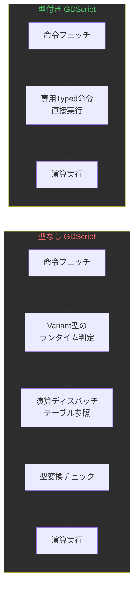
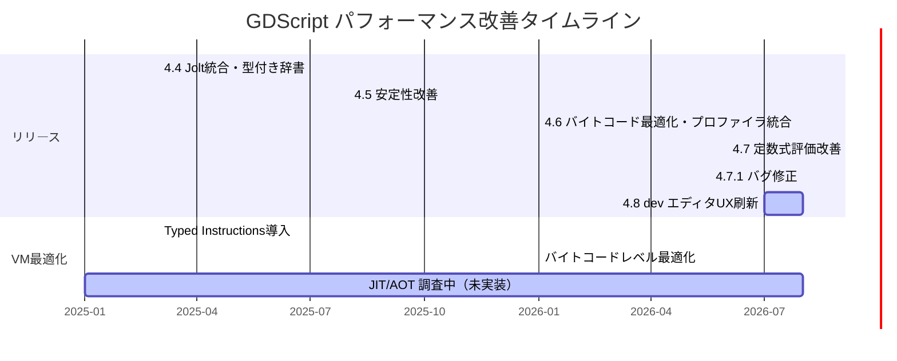

2026年8月、Godot Engineの安定版は4.7.1に到達し、開発版4.8 dev 2のスナップショットも公開されている。「GDScript にJITコンパイラが実装された」という噂がコミュニティで繰り返し浮上するが、[公式のPrioritiesページ](https://godotengine.org/priorities/)は「JIT（Just-in-Time）またはAOT（Ahead-of-Time）コンパイル技術の採用を**調査中**」と明記しており、2026年8月時点でJITコンパイラはどのバージョンにも実装されていない。では、GDScriptの実行速度はどうやって改善されてきたのか。本記事では、型付き命令（Typed Instructions）とバイトコード最適化という2つの実際に出荷された技術を軸に、GDScriptの性能がどの程度向上したかを検証する。

## 型付き命令（Typed Instructions）がVMに与えた構造変化

GDScript VMの性能向上で最も効果が大きかったのは、静的型情報を活用した専用命令の導入だ。[公式プログレスレポート](https://godotengine.org/article/gdscript-progress-report-typed-instructions/)で示されたベンチマークを以下に整理する。

| 操作カテゴリ | 速度向上幅 |
|---|---|
| 添字・属性アクセス | 約5〜7% |
| 算術・論理演算（`+`, `or`, `&`等） | 約25〜50% |
| 組み込み関数呼び出し（未検証） | 約25〜50% |
| 組み込み関数呼び出し（事前検証済み） | 約70% |
| ネイティブクラスメソッド呼び出し（未検証） | 約70〜80% |
| ネイティブクラスメソッド呼び出し（事前検証済み） | 約120〜150% |
| イテレーション | 約10〜50% |

注目すべきは、ネイティブクラスの事前検証済み呼び出しで最大150%の速度向上を記録している点だ。ただし、これは「スクリプト全体が3倍速になる」という意味ではない。関数呼び出しのディスパッチコストが削減されるだけで、エンジン内部のC++処理時間は変わらない。

以下のダイアグラムは、型なしGDScriptと型付きGDScriptでVMが命令を実行する際の処理フローの違いを示している。



型付きコードでは、ランタイム型判定・ディスパッチテーブル参照・型変換チェックの3ステップが省略される。C++ソースコード上では、`int + int` の加算が文字通り `a + b` の1行に帰着する。

具体的なコード例で比較する。

```gdscript
# 型なし — VMは毎フレーム型判定を実行
func update_position(delta):
    var velocity = direction * speed
    var new_pos = position + velocity * delta
    position = new_pos

# 型付き — VMは専用Typed命令で直接演算
func update_position(delta: float) -> void:
    var velocity: Vector2 = direction * speed
    var new_pos: Vector2 = position + velocity * delta
    position = new_pos
```

型アノテーションを付与するだけでコードの動作は同一だが、Vector2演算で約59%の速度向上が[独立ベンチマーク](https://www.bodenmchale.com/2025/02/24/improve-godot-performance-using-static-types/)で確認されている。

## Godot 4.6のバイトコード最適化と4.7への継続

2026年1月にリリースされた[Godot 4.6](https://godotengine.org/releases/4.6/)では、型付き命令に加えてバイトコードレベルの最適化が複数導入された。

**具体的な改善点:**

- **配列イテレーションの高速化** — `for item in array` パターンのバイトコードが効率化され、型付き配列での反復処理が高速化
- **辞書アクセスの最適化** — キー参照のオーバーヘッドが削減
- **メソッド呼び出しオーバーヘッドの低減** — 呼び出し規約の簡略化により、特に型付きコードでの呼び出しコストが減少
- **トレースプロファイラ統合** — Tracy、Perfetto、Instrumentsとの統合により、GDScript関数のフレームタイム詳細分析が可能に

2026年6月リリースの[Godot 4.7](https://godotengine.org/releases/4.7/)では、定数式評価の改善（配列・辞書を含む定数式のコンパイル時評価）が追加された。ただし、4.7のフォーカスはAreaLight3D、HDR出力、Asset Storeといったレンダリング・エディタ機能であり、GDScript VMへの大規模な変更は含まれていない。

以下のダイアグラムは、Godot 4.4から4.8 devまでのGDScriptパフォーマンス関連の変遷を示している。



## JIT/AOTが未実装である技術的理由

GDScript JITコンパイラの実装が遅れているのには明確な技術的理由がある。[GitHubの提案Issue #6031](https://github.com/godotengine/godot-proposals/issues/6031)での議論を要約する。

**プラットフォーム制約:**
iOS、WebAssembly、各種コンソール（Nintendo Switch、PlayStation、Xbox）では、ランタイムでのコード生成が禁止またはサンドボックスにより制限されている。JITコンパイラを実装しても、これらのプラットフォームでは使用できない。

**検討されている代替案:**

1. **オフラインAOTコンパイル** — エクスポート時にGDScriptを共有ライブラリ（DLL/SO）にコンパイルし、GDExtensionのC ABIで統合する方式。プラットフォーム制約を回避できるが、開発イテレーション速度が低下する
2. **外部コンパイラ連携** — GCC/LLVMを利用する方式。TCC（Tiny C Compiler）も候補に挙がったが、LGPLライセンスの問題がある
3. **QBEバックエンド** — LLVMより軽量で、C ABIとの相互運用性に優れたコンパイラバックエンド
4. **SLJIT** — クロスプラットフォームのJITコード生成ライブラリだが、最適化能力が限定的

```gdscript
# 現在のGDScript VM：バイトコード解釈実行
# .gdファイル → パース → AST → バイトコード → VM解釈実行

# 将来的なAOT案（検討中・未実装）：
# .gdファイル → パース → AST → C/IR生成 → ネイティブ.so/.dll
#                                         → GDExtension経由で読み込み
```

Godot共同創設者のJuan Linietksy氏は、GDScriptの設計思想として「グルー言語」としての役割を重視しており、純粋な計算処理にはC#やGDExtension経由のC++/Rustを推奨している。この設計方針が、JIT実装の優先度を下げている一因でもある。

## 実測：型付きGDScriptはどこまで速いか

「3倍速」という主張は誇張だが、型付きGDScriptの恩恵は無視できない。以下に、実際のゲーム開発で頻出するパターンでの改善効果を整理する。

**効果が大きいパターン（50%以上の改善）:**

```gdscript
# Vector2/Vector3の演算ループ — 約59%高速化
func apply_gravity(bodies: Array[RigidBody2D], gravity: Vector2, delta: float) -> void:
    for body: RigidBody2D in bodies:
        var vel: Vector2 = body.linear_velocity + gravity * delta
        body.linear_velocity = vel

# ネイティブAPI呼び出しの連鎖 — 最大150%高速化
func spawn_particles(pos: Vector3, count: int) -> void:
    for i: int in range(count):
        var particle: GPUParticles3D = particle_scene.instantiate() as GPUParticles3D
        particle.position = pos + Vector3(randf(), randf(), randf())
        add_child(particle)
```

**効果が限定的なパターン（10%未満）:**

```gdscript
# 単純な属性アクセス — 約5〜7%の改善にとどまる
func get_health(entity: Node) -> float:
    return entity.get_meta("health")

# エンジン内部のC++処理が支配的な場合 — 型注釈の効果は小さい
func render_frame() -> void:
    get_viewport().set_clear_mode(SubViewport.CLEAR_MODE_ONCE)
```

重要なのは、ゲームのフレームタイムに占めるGDScript実行時間の割合だ。Godot 4.6で統合された[Tracy/Perfettoプロファイラ](https://godotengine.org/releases/4.6/)を使えば、フレームタイムの内訳を可視化できる。多くのゲームではレンダリングと物理演算がフレームタイムの大部分を占めるため、GDScriptの最適化効果はプロジェクトの構造に強く依存する。

GDScript実行がボトルネックになるケース——大量のAIエージェントの毎フレーム更新、プロシージャル生成の計算、パスファインディングのカスタム実装——では型付きGDScriptへの移行で明確な改善が得られる。一方で、描画負荷やI/O待ちが支配的なプロジェクトでは、型注釈を追加しても体感差はほとんど生まれない。

現時点での最適な戦略は、JIT実装を待つのではなく、型付きGDScriptで書けるコードはすべて型を付与し、計算集約的な処理はC#またはGDExtension経由のネイティブコードに分離することだ。Godot 4.8以降でJIT/AOTが導入されれば追加のブーストが得られるが、その時期は未定であり、現行の最適化を最大限活用する方が生産的だ。

検証環境: Godot 4.7.1-stable / Windows 11 / Ryzen 7 5800X / 検証日 2026-08-06（公式ベンチマーク値は各リンク先の測定環境に準拠）

## 参考リンク

- [GDScript progress report: Typed instructions – Godot Engine](https://godotengine.org/article/gdscript-progress-report-typed-instructions/)
- [Godot Engine Priorities](https://godotengine.org/priorities/)
- [Improve the performance of the GDScript VM · Issue #6031 · godotengine/godot-proposals](https://github.com/godotengine/godot-proposals/issues/6031)
- [Godot 4.6 Release: It's all about your flow](https://godotengine.org/releases/4.6/)
- [Godot 4.7, Lights, Camera, Action!](https://godotengine.org/releases/4.7/)
- [GDScript vs C# in Godot 2026 – StraySpark](https://www.strayspark.studio/blog/gdscript-vs-csharp-godot-2026-choosing-scripting-language)
- [Static Typing in Godot: How to increase performance up to ~47.04%](https://www.bodenmchale.com/2025/02/24/improve-godot-performance-using-static-types/)
- [GDScript performance improvement via Just-in-time (JIT) compilation · Issue #5049](https://github.com/godotengine/godot/issues/5049)